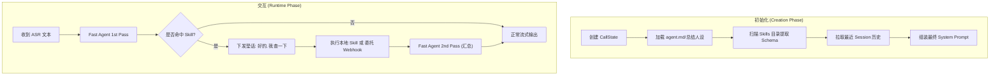
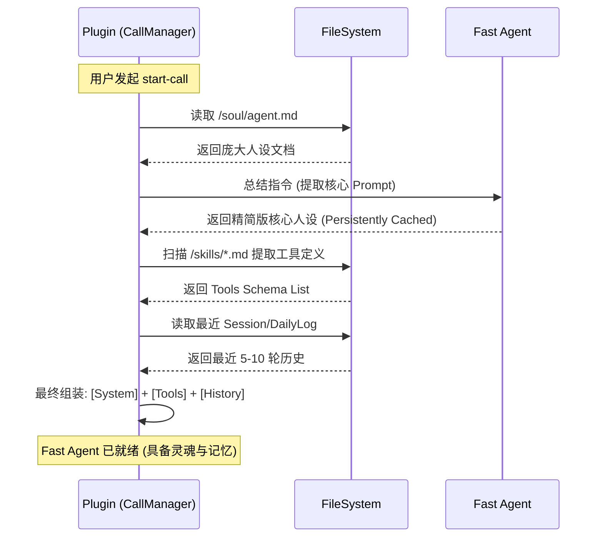
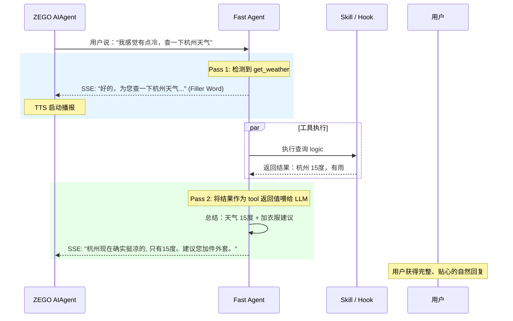
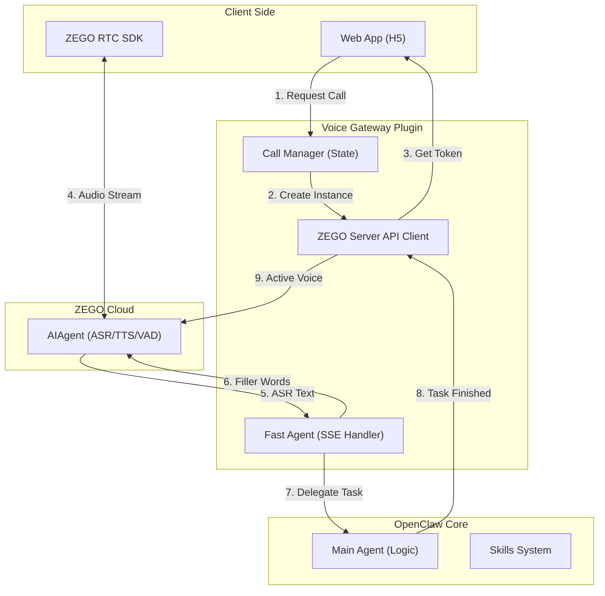
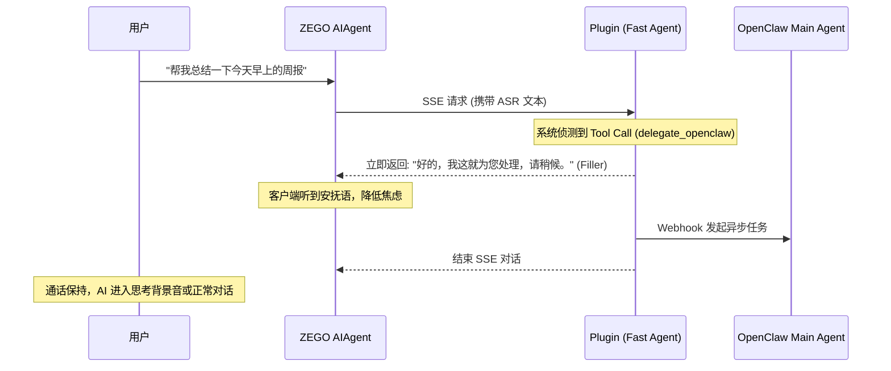
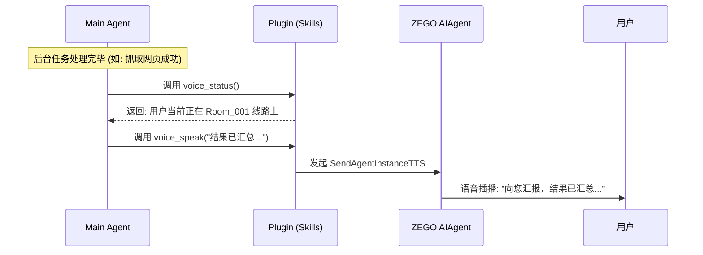

# Voice Gateway Plugin 1.0 Beta 现状审计与架构白皮书

> **文档版本**：v1.0.0-beta-audit  
> **更新时间**：2026-03-12  
> **文档目标**：梳理当前 Voice Gateway Plugin 的实际实现进度，对齐 PRD 需求，明确现有架构的数据流与流程，作为后续版本迭代的基线。

---

## 1. Fast Agent 设计与实现详情 (Fast Agent Deep Dive)

### 1.1 总体逻辑说明 (Overall Logic)

Fast Agent 是语音网关的核心拦截器，其核心逻辑在于 **“极速响应 + 智力注入 + 任务双轨制”**。它在 `start-call` 阶段进行“重读/预加载”，在 `chat` 阶段执行“拦截/路由”。

### 1.2 核心管理逻辑 (Skills & Context)

#### A. 上下文管理与组装 (Context Assembly)
在通话实例化（Fast Agent 创建）时，系统执行以下自动化组装逻辑：
1.  **人设提取与总结 (Persona Summarization)**：自动获取 `agent.md` 或相关的 Soul 配置文件，通过启发式算法（或轻量 LLM 总结）提取出 1000 Token 以内的核心性格与指令，作为 `System Message`。
2.  **Skill 动态感知 (Skill Awareness)**：扫描 OpenClaw 的 `skills` 目录，提取所有可用工具的关键描述与 Schema，并注入到 LLM 的 `tools` 列表中。
3.  **长时记忆继承 (Memory Inheritance)**：从 OpenClaw 的 `DailyLog` 或最近的文本 Session 中获取最近的 N 轮对话历史，确保语音交互能无缝继承文本聊天上下文。

#### B. Skill 处理机制 (Skill Handling)
Fast Agent 采取 **“先垫后做，双重汇总”** 的策略：
1.  **意图拦截**：实时判断用户输入是否触发 Skill 或需要委托给 Main Agent。
2.  **垫话占位**：一旦触发，立刻下发 Filler Word，抢占 1s 内的播报权。
3.  **执行与回传**：在后台执行 Skill 或通过 Webhook 转发给 Main Agent。拿到结果后，将“系统反馈”作为 `tool` 结果喂回给 Fast Agent，由其进行第二次自然语言归纳并播报。

---

### 1.3 核心流程与场景时序图 (Sequences)

#### 1.3.1 总体全景流程图

#### 1.3.2 场景一：Fast Agent 创建时的上下文加载

#### 1.3.3 场景二：对话中的 Skill 执行逻辑 (带二次回答)

### 1.4 现状实现路径说明 (Implementation Details)

目前的 1.0 Beta 在 `src/http/chat-api.ts` 中搭建了上述时序图的 **Runtime 骨架（场景二）**：
- **流式转发**：通过原生 SSE 拦截。
- **垫话机制**：由 `isToolCallDetected` 触发。
- **二次汇总**：实现了 `secondMessages` 的组合请求逻辑。

**待补全（场景一逻辑）**：目前的创建阶段尚处于静态配置模式，需要后续将 `Context Assembly` 逻辑从设计转化为具体代码。

### 1.5 Skill 调用深度解析：设计与代码实现对齐 (Code-to-Design Analysis)

在 1.0 Beta 架构中，Skill 调用的复杂逻辑已在 `src/http/chat-api.ts` 中完成了初步的工程落地。以下是设计理念与实际代码实现的深度映射：

#### A. 垫话占位机制 (Filler Injection - Code Implementation)
- **代码映射**：`chatCompletionsHandler` (约 L105-L123)。
- **实现原理**：
    - 模型流式输出时，代码通过变量 `isToolCallDetected` 进行实时监听。一旦 delta 数据中出现 `tool_calls`（即便参数未生成完），逻辑立即触发。
    - **具体代码行为**：调用 `sendSSEChunk("好的，我这就为您查询。\n")`。
    - **现状对齐**：**已完全实现**。物理上解耦了“工具执行时间”与“用户首包延迟”，实现了感官上的毫秒级响应。

#### B. 上下文影子改写 (Context Re-weaving - Code Implementation)
- **代码映射**：`chatCompletionsHandler` (约 L225-L235)。
- **实现原理**：
    - **影子构造**：为了让模型在“第二次回答”时知道自己之前做了什么，代码手动构造了一个 `assistant` 角色消息，其 `tool_calls` 参数内容由第一次流式请求收集而来（`currentToolCallName` / `currentToolCallArgs`）。
    - **语义对齐**：紧接着注入一个 `role: 'tool'` 的消息，内容为 Skill 的实际返回值（`toolResultContent`）。
    - **现状对齐**：**已核心实现**。这是实现“二次自然回答”的技术底座，让流出的语音听起来具备逻辑连贯性（如：“我查到了，杭州天气是...”）。

#### C. 多级递归与并行调度 (Multi-Step & Parallel - Design Goal)
- **设计预留**：支持单次任务触发多个 Skill 或产生递归（Pass 3...N）。
- **代码现状**：
    - **并行局限**：目前的 `chat-api.ts`（L125-L127）仅能捕捉 `delta.tool_calls[0]`，即一次只能处理一个工具。
    - **循环限制**：执行流是线性的 `Pass 1 -> Exec -> Pass 2`，尚未在代码中实现递归循环。
    - **现状对齐**：**处于存根设计阶段**。目前的 1.0 仅能处理“简单单次工具调用”。

#### D. 对话状态的异步刷写 (State Persistence - Code Implementation)
- **代码映射**：`chatCompletionsHandler` 末尾 (L249-L251)。
- **实现原理**：
    - 将第一阶段的“垫话”与第二阶段的“正式回复”进行字符串拼接（`fullAssistantReply + finalToolReply`）。
    - **回写逻辑**：推入 `currentCallState.conversationBuffer`，供挂断后归档。
    - **现状对齐**：**已完全实现**。保证了语音聊天的闭环记忆能被后续的文本 Session 正常识别。

---

---

## 2. 现状概述 (Status Summary)

目前项目已完成 **1.0 Beta** 版本的核心骨架开发。系统已打通从“Web 拨号”到“ZEGO 云端接入”再到“OpenClaw 逻辑联动”的全链路。

### 核心达成指标：
- **通信闭环**：实现了完整的 RTC 通话生命周期管理（创建/结束/状态同步/Token 续期）。
- **快慢分离架构 (L1)**：初步实现了 SSE 拦截层（Fast Agent），并支持通过 Webhook 将长耗时任务委托给宿主（OpenClaw Main Agent）。
- **主动播报能力**：为宿主提供了 `voice_speak` 技能，支持任务完成后从异步链路通过云端进行语音插播。
- **安全防灾**：内置了 `Reboot GC` 扫雷机制，重启时自动清理 ZEGO 云端残留的僵尸实例。

---

## 2. 详细功能对齐审计 (Gap Analysis)

| 需求 ID | 功能项 | 文档要求 | 1.0 Beta 实际实现 | 结论 |
| :--- | :--- | :--- | :--- | :--- |
| **R-05** | **人设与记忆注入** | 通话开始时注入 Soul 和 Memory | **未实现**。目前 Fast Agent 仅具备发音纠错（AliasMap），无背景知识。 | ❌ 缺失 |
| **R-06** | **基础工具能力** | 毫秒级低耗工具调用 | **部分实现**。提供了 Mock 版 `get_weather` 演示流程。 | ⚠️ 部分 |
| **R-07** | **长记忆快搜** | 基于 grep 的秒级检索工具 | **未实现**。目前无法在语音中穿透查询历史日志。 | ❌ 缺失 |
| **R-10** | **异步委托** | 语音任务向主 Agent 委托 | **已实现**。通过 `/hooks/agent` Webhook 转发意图。 | ✅ 完成 |
| **R-11** | **主动播报** | 主 Agent 完成后主动回复 | **已实现**。集成 `sendAgentInstanceTTS` 能力。 | ✅ 完成 |

---

## 3. 技术架构与数据流 (Architecture & Data Flow)

### 3.1 总体数据流图
系统采用 **“中转拦截 (Interceptor)”** 模式，Plugin 充当 ZEGO 云与 OpenClaw 之间的智能网关。

---

## 4. 关键核心流程 (Key Workflows)

### 4.1 语音对讲与垫话逻辑 (Barge-in & Filler)
为降低大模型思考期间的冷场感，1.0 Beta 引入了 **Tool-Triggered Filler** 机制。

### 4.2 主动异步回传逻辑 (Active Call-back)
主 Agent 完成任务后，利用 `voice-gateway` 注入的技能找回通话并播报。

---

## 5. 待办事项与后续演进 (Roadmap)

### 5.1 1.0 Beta 紧急加固
- [ ] **智力补全**：接入 `context/loader`，实现通话前的 Soul & Memory 前置注入。
- [ ] **配置解耦**：移除代码中所有的 `localhost:18789` 硬编码，改为配置驱动。
- [ ] **垫话库扩展**：支持随机垫话文案库，降低机器人感。

### 5.2 2.0 性能跨越
- [ ] **Grep Memory Skill**：实现原生的 ripgrep 文件穿透检索能力。
- [ ] **动态浓缩算法**：研发基于 Token 计算的动态上下文压缩逻辑（1000 Token 限制）。
- [ ] **多租户隔离**：重构 CallManager，支持真正的多并发隔离（P1 商业愿景）。
