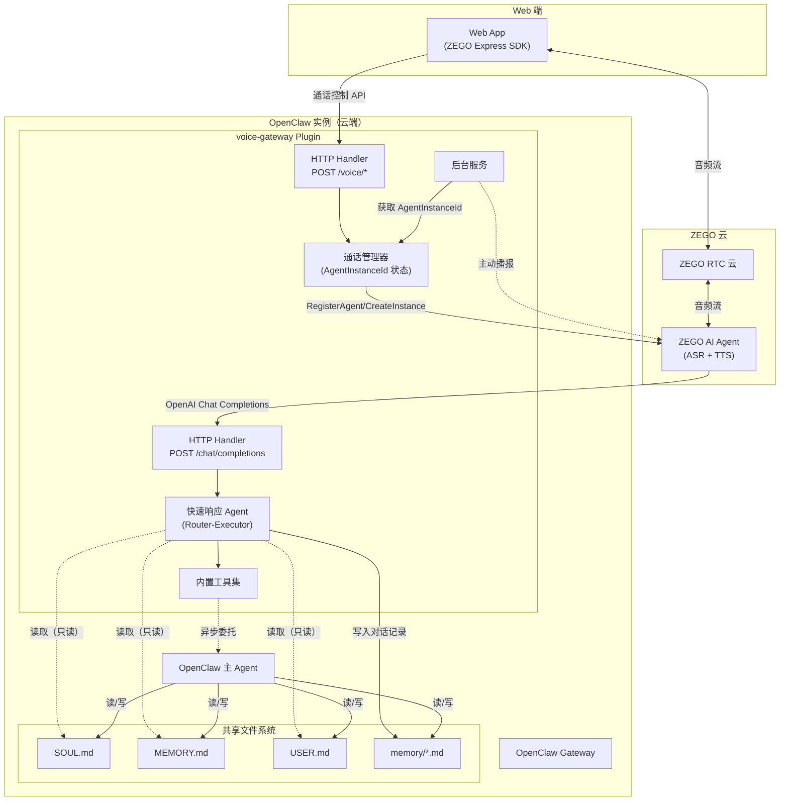
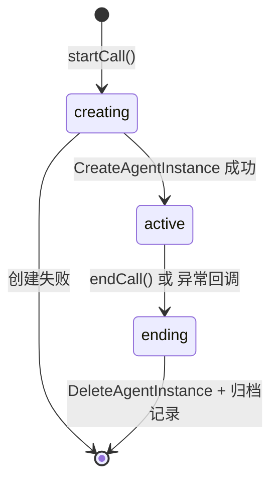
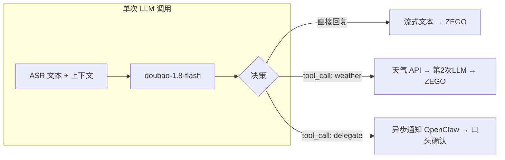
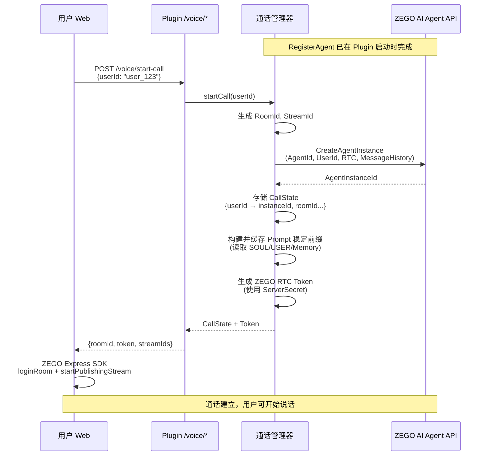
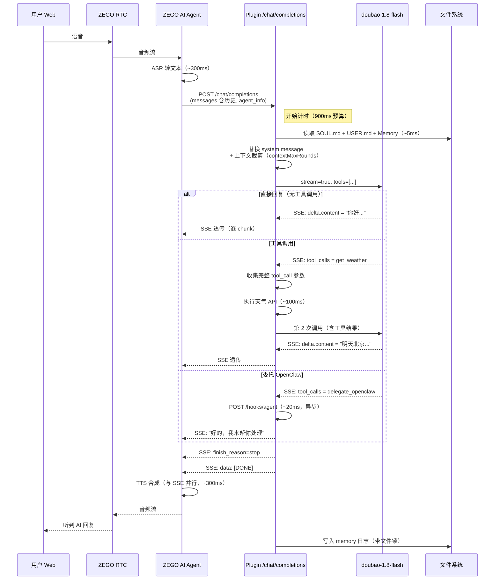
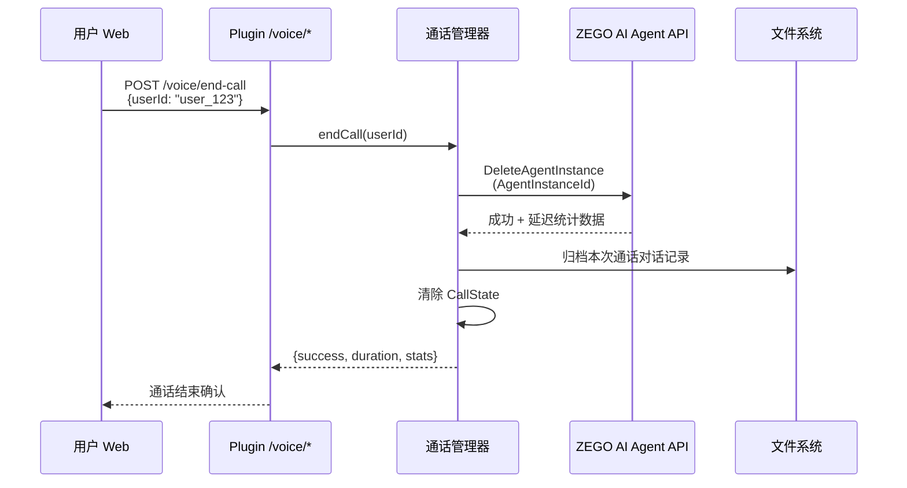
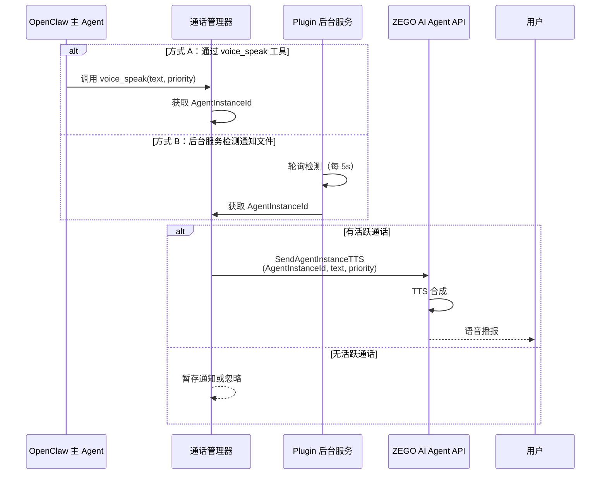
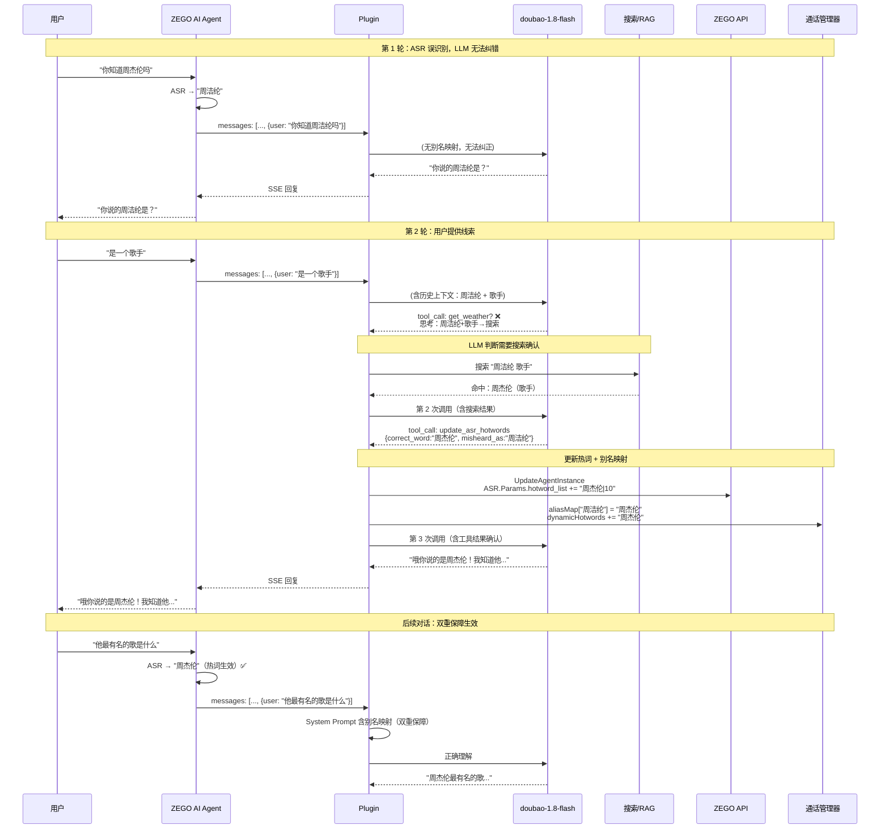
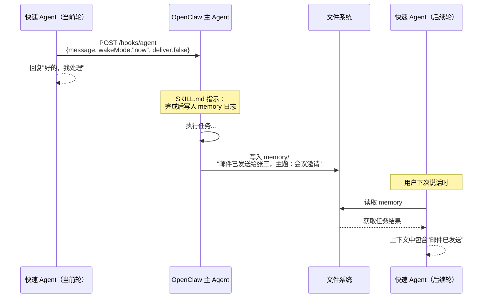
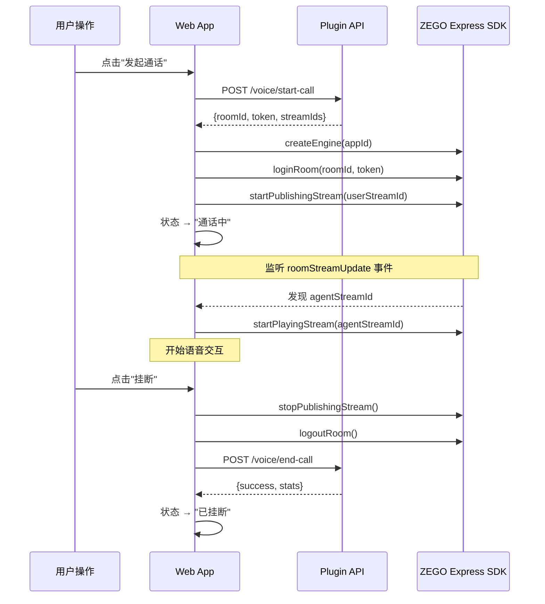

# Voice Gateway Plugin 初步功能设计方案

> OpenClaw 语音通话插件 — 技术设计文档

---

## 1. 设计概述

Voice Gateway Plugin 是一个 OpenClaw Plugin，以 TypeScript 模块形式运行在 OpenClaw Gateway 进程内。它在 ZEGO AI Agent（语音链路）和 OpenClaw（Agent 运行时）之间架起桥梁，内嵌一个快速响应 Agent 处理实时语音交互。

**设计原则：**
- **零额外部署**：作为 OpenClaw Plugin 运行，不需要独立的服务进程
- **协议透传**：doubao-1.8-flash 原生输出 OpenAI SSE 格式，直接转发给 ZEGO，无需格式转换
- **共享文件系统**：通过 OpenClaw 的 Memory 文件系统实现上下文共享，无需专门同步机制
- **延迟优先**：所有设计决策以控制 1s 延迟预算为第一优先级

---

## 2. 整体架构

### 2.1 系统架构图



### 2.2 组件职责

| 组件 | 职责 | 技术要点 |
|------|------|---------|
| **通话管理器** | 维护通话状态（AgentInstanceId、RoomId），处理通话创建/销毁 | `Map<userId, CallState>` 内存状态 |
| **HTTP Handler `/chat/completions`** | 接收 ZEGO AI Agent 的 LLM 代理请求 | `api.registerHttpRoute`，Token 认证 |
| **HTTP Handler `/voice/*`** | 暴露通话管理 API 供 Web 前端调用 | start-call / end-call / status |
| **快速响应 Agent** | 实时语音对话的意图判断、工具调用、回复生成 | Router-Executor 架构，直连 doubao-1.8-flash |
| **内置工具集** | 天气查询、ZEGO API 调用、委托 OpenClaw | 每个工具 ≤ 200ms |
| **后台服务** | 监控通知事件，触发主动播报 | Background Service 注册 |
| **上下文加载器** | 读取 SOUL/USER/MEMORY 文件 | Node.js `fs` 模块 |

---

## 3. Plugin 目录结构

```
voice-gateway/
├── package.json                 # openclaw.extensions 声明入口
├── config.schema.json           # 配置项 JSON Schema
├── SKILL.md                     # 教 OpenClaw 主 Agent 使用语音工具
├── src/
│   ├── index.ts                 # Plugin 主入口，注册所有组件
│   │
│   ├── http/
│   │   ├── chat-completions.ts  # HTTP Handler: POST /chat/completions
│   │   └── call-api.ts          # HTTP Handler: POST /voice/start-call, end-call, status
│   │
│   ├── call/
│   │   ├── call-manager.ts      # 通话状态管理器
│   │   └── zego-agent-api.ts    # ZEGO AI Agent 服务端 API 封装
│   │
│   ├── agent/
│   │   ├── fast-agent.ts        # 快速响应 Agent 核心逻辑
│   │   ├── prompt-builder.ts    # System Prompt 动态构建
│   │   ├── context-trimmer.ts   # 多轮对话上下文裁剪
│   │   └── timeout-guard.ts     # 超时降级控制
│   │
│   ├── tools/
│   │   ├── get-weather.ts       # 天气查询
│   │   ├── delegate-openclaw.ts # 异步委托 OpenClaw
│   │   └── speak-proactive.ts   # 主动播报
│   │
│   ├── context/
│   │   ├── soul-loader.ts       # SOUL.md / USER.md 加载
│   │   ├── memory-reader.ts     # Memory 日志读取
│   │   └── memory-writer.ts     # 对话记录写入（带文件锁）
│   │
│   ├── background/
│   │   └── notification.ts      # 定时通知后台服务
│   │
│   └── types/
│       ├── config.ts            # 配置类型定义
│       └── zego.ts              # ZEGO API 类型定义
│
└── web/                         # 配套 Web 前端
    ├── index.html
    ├── style.css
    └── app.js                   # ZEGO Express SDK 集成
```

---

## 4. 使用方式

### 4.1 安装与配置

**第 1 步：安装 Plugin**
```bash
cd ~/.openclaw/plugins
npm install voice-gateway
```

**第 2 步：配置 Plugin**

在 OpenClaw 配置文件中添加：

```yaml
plugins:
  voice-gateway:
    # ZEGO 配置（必填）
    zego:
      appId: 123456789
      appSign: "your_app_sign"
      serverSecret: "your_server_secret"    # 用于生成 ZEGO Token 和 API 签名
      aiAgentBaseUrl: "https://aigc-aiagent-api.zegotech.cn"
    
    # 快速 LLM 配置（必填）
    llm:
      provider: "volcengine"
      apiKey: "your_ark_api_key"
      model: "doubao-1-8-flash"
      baseUrl: "https://ark.cn-beijing.volces.com/api/v3"
    
    # TTS 配置（必填）
    tts:
      vendor: "ByteDance"
      appId: "your_tts_app_id"
      token: "your_tts_token"
      voiceType: "zh_female_wanwanxiaohe_moon_bigtts"

    # ASR 配置（可选）
    asr:
      vendor: "Tencent"                     # 可选: Tencent / AliyunParaformer / AliyunGummy / Microsoft
      params:                               # 厂商扩展参数
        hotword_list: "OpenClaw|10,ZEGO|10"  # 热词格式: 词汇|权重
      vadSilenceSegmentation: 500           # 断句停顿阈值(ms)，默认 500
    
    # 高级配置（可选）
    advanced:
      httpAuthToken: "auto"                 # HTTP Handler 认证 Token，auto=自动生成
      maxResponseTimeMs: 900                # 超时降级阈值
      memoryMaxTokens: 500                  # 注入 Memory 的最大 token 数
      soulMaxTokens: 500                    # 注入 SOUL.md 的最大 token 数（截取前 N 行）
      contextMaxRounds: 10                  # ZEGO messages 保留最近 N 轮（超出裁剪）
      messageWindowSize: 20                 # ZEGO 侧 WindowSize 配置（默认 20）
```

**第 3 步：启动 OpenClaw**

Plugin 启动时自动执行：
1. 读取配置，校验必填项
2. 调用 ZEGO `RegisterAgent` API **一次性注册**智能体模板（后续通话仅需 `CreateAgentInstance`）
3. 注册 HTTP Routes、Agent Tools、Background Service

**第 4 步：部署 Web 前端**

将 `web/` 目录部署为静态页面，或通过 Plugin 暴露的 HTTP 路由直接访问。

### 4.2 通话管理 API

Plugin 暴露以下 HTTP 接口供 Web 前端调用，**替代原来需要独立"业务后台"的角色**：

| 接口 | 方法 | 说明 |
|------|------|------|
| `/voice/start-call` | POST | 创建 ZEGO Agent 实例，返回 RoomId、Token、流 ID 等 |
| `/voice/end-call` | POST | 删除 Agent 实例，清理资源，归档对话记录 |
| `/voice/status` | GET | 查询当前通话状态 |

**`POST /voice/start-call` 请求/响应：**

```json
// 请求
{ "userId": "user_123" }

// 响应
{
  "roomId": "room_abc",
  "token": "zego_rtc_token_xxx",      // Plugin 使用 ServerSecret 生成
  "agentInstanceId": "inst_abc",
  "agentUserId": "agent_user_abc",
  "agentStreamId": "agent_stream_abc",
  "userStreamId": "user_stream_abc"
}
```

**`POST /voice/end-call` 请求/响应：**

```json
// 请求
{ "userId": "user_123" }

// 响应
{
  "success": true,
  "duration": 300,                      // 通话时长(秒)
  "stats": {                            // ZEGO 返回的延迟统计
    "llmFirstTokenMs": 250,
    "llmTokensPerSec": 45,
    "ttsFirstFrameMs": 300
  }
}
```

### 4.3 Plugin 注册清单

```typescript
import { Type } from '@sinclair/typebox';

export function register(api: PluginAPI) {
  const callManager = new CallManager(api, config);

  // 0. 一次性注册 ZEGO 智能体模板（启动时执行，后续通话只需 CreateAgentInstance）
  callManager.registerAgent({
    llmUrl: config.httpEndpoint + '/chat/completions',
    asr: config.asr,
    tts: config.tts,
    llm: config.llm
  });

  // 1. HTTP Route：接收 ZEGO 的 LLM 代理请求
  api.registerHttpRoute({
    path: '/chat/completions',
    auth: 'token',
    handler: chatCompletionsHandler(callManager)
  });

  // 2. HTTP Route：通话管理 API（供 Web 前端调用）
  api.registerHttpRoute({
    path: '/voice/start-call',
    auth: 'token',
    handler: startCallHandler(callManager)
  });
  api.registerHttpRoute({
    path: '/voice/end-call',
    auth: 'token',
    handler: endCallHandler(callManager)
  });
  api.registerHttpRoute({
    path: '/voice/status',
    auth: 'token',
    handler: statusHandler(callManager)
  });

  // 3. Agent Tool：让 OpenClaw 主 Agent 可以触发语音播报
  api.registerTool({
    name: 'voice_speak',
    description: '通过语音通话向用户播报一段文本',
    parameters: Type.Object({
      text: Type.String({ description: '播报内容' }),
      priority: Type.Optional(Type.String({ description: '优先级: high/medium/low' }))
    }),
    execute: async (executionId, params) => {
      return voiceSpeakExecutor(callManager, params);
    }
  });

  // 4. Agent Tool：查询通话状态
  api.registerTool({
    name: 'voice_status',
    description: '查询当前语音通话状态',
    parameters: Type.Object({}),
    execute: async (executionId, params) => {
      return voiceStatusExecutor(callManager);
    }
  });

  // 5. 后台轮询：定时通知检查
  //    注意：OpenClaw 无 registerBackgroundService API，
  //    使用 Node.js setInterval 实现。后续可迁移至 Heartbeat Hook。
  setInterval(() => {
    notificationChecker(callManager);
  }, 5000);
}
```

---

## 5. 通话状态管理器

### 5.1 数据结构

```typescript
interface CallState {
  userId: string;
  agentInstanceId: string;
  roomId: string;
  agentUserId: string;
  agentStreamId: string;
  userStreamId: string;
  startTime: Date;
  status: 'creating' | 'active' | 'ending';
  // ASR 动态热词
  dynamicHotwords: string[];            // 本次通话动态追加的热词
  aliasMap: Map<string, string>;        // ASR 别名映射 {"周洁纶":"周杰伦"}
  // Prompt 缓存
  cachedPromptPrefix: string;           // 稳定前缀（通话期间不变）
  cachedPromptSuffix: string;           // 动态后缀（memory/alias 变化时刷新）
  memoryMtime: number;                  // memory 文件最后修改时间戳
  // 对话日志
  conversationBuffer: ConversationEntry[];  // 内存缓冲，通话结束时归档
}

class CallManager {
  private activeCalls: Map<string, CallState> = new Map();  // key: userId

  async startCall(userId: string): Promise<CallState> { ... }
  async endCall(userId: string): Promise<void> { ... }
  getCallState(userId: string): CallState | undefined { ... }
  getActiveInstanceId(userId: string): string | undefined { ... }
}
```

### 5.2 生命周期



---

## 6. 快速响应 Agent 设计

### 6.1 架构：Router-Executor 单步决策

**不采用 ReAct 架构的原因：** ReAct 的多轮 Thought→Action→Observation 循环每轮增加 ~300ms LLM 调用，1s 预算内无法承受多轮。

**Router-Executor 模式：** LLM 在单次调用中完成"意图判断 + 工具选择 + 回复生成"，最多 1 次工具调用。



### 6.2 System Prompt 结构（缓存友好）

System Prompt 拆分为**稳定前缀**和**动态后缀**两段，利用 LLM Prompt Caching 降低延迟和成本。通过 API 参数显式声明缓存范围（`cached_content` / `cache_control`）。

```
┌── 稳定前缀（通话期间不变，声明为 cacheable）──────────────┐
│                                                           │
│  [1] 角色指令（固定，~100 tokens）                         │
│      "你是语音通话助手，回复简洁，1-3句话，适合语音播报。"   │
│                                                           │
│  [2] SOUL.md 精简版（通话期间不变，≤ soulMaxTokens）       │
│      截取 SOUL.md 前 N 行                                  │
│                                                           │
│  [3] USER.md（通话期间不变，≤200 tokens）                  │
│      用户画像                                              │
│                                                           │
│  [4] 工具定义（固定，~300 tokens）                         │
│                                                           │
│  [5] 行为约束（固定，~200 tokens）                         │
│      "日程/邮件等复杂任务调用 delegate_openclaw。           │
│       日常问题直接回答。                                    │
│       ASR 纠错规则：                                        │
│       - 常见同音字错误，直接基于上下文推断正确含义           │
│       - 遇到不确定的专有名词，向用户确认后搜索正确词汇      │
│       - 确认正确词汇后，调用 update_asr_hotwords 更新热词"  │
│                                                           │
│  缓存区预算：~800-1000 tokens                              │
│  ✅ LLM 缓存命中 → 首 token 延迟降低，输入计费减少          │
└───────────────────────────────────────────────────────────┘

┌── 动态后缀（按需刷新）───────────────────────────────────┐
│                                                           │
│  [6] 近期 Memory（仅变化时刷新，≤ memoryMaxTokens）        │
│      跨 Channel 上下文 + OpenClaw 任务结果                 │
│                                                           │
│  [7] 别名映射（仅新增热词时变化，通常 < 50 tokens）        │
│      "以下词汇在语音识别中可能被错误识别，请自动替换：      │
│       周洁纶 → 周杰伦"                                     │
│                                                           │
│  动态区预算：≤ 500-1000 tokens                              │
│  ⚡ 通话期间大部分请求此区域也不变 → 缓存可进一步延伸       │
└───────────────────────────────────────────────────────────┘

总注入预算：≤ 2000 tokens（不含 ZEGO 传入的 messages 历史）
```

**缓存命中条件：** 稳定前缀在通话期间只读取一次并缓存在 `CallState.cachedPromptPrefix` 中。动态后缀仅在以下事件触发时重新构建：
- Memory 文件 mtime 变化（OpenClaw 主 Agent 写入了新结果）
- 新增 ASR 别名映射（动态热词学习触发）

**在一次典型通话中：** 仅首次请求读文件构建完整 prompt。后续轮次如果没有外部 memory 变化，整个 system prompt 完全不变 → **LLM 缓存 100% 命中**。

### 6.3 多轮对话上下文裁剪

**问题：** ZEGO 每次调用自定义 LLM 时，messages 数组包含本次通话的历史消息（由 `WindowSize` 控制，默认 20 条）。Plugin 注入的 system message + ZEGO 历史消息 → 随轮次增长。

**裁剪策略（`context-trimmer.ts`）：**

```
收到 ZEGO 请求的 messages 数组：
  [0] system: ZEGO 侧配置的 SystemPrompt（被 Plugin 替换）
  [1] user: "第1轮用户消息"
  [2] assistant: "第1轮AI回复"
  ...
  [N] user: "最新一轮用户消息"

Plugin 处理：
  1. 替换 messages[0] 为 Plugin 构建的完整 System Prompt
  2. 如果 messages.length > contextMaxRounds * 2 + 1：
     → 仅保留 messages[0] + 最近 contextMaxRounds 轮
     → 在裁剪点插入一条摘要 system message（可选）
  3. 转发给 doubao-1.8-flash
```

### 6.4 工具定义

| 工具 | Schema | 延迟 | 说明 |
|------|--------|------|------|
| `get_weather` | `{ city: string, date?: string }` | ~100ms | 天气查询 |
| `delegate_openclaw` | `{ task: string, context?: string }` | ~20ms | 异步委托主 Agent |
| `speak_proactive` | `{ text: string, priority?: "high"\|"medium"\|"low" }` | ~50ms | 主动播报 |
| `update_asr_hotwords` | `{ correct_word: string, misheard_as?: string }` | ~100ms | 动态热词学习 |

**ASR 纠错两层机制：**

- **第 1 层（Prompt 工程）：** System Prompt 指令让 LLM 自动修正常见同音字错误，0ms 额外延迟
- **第 2 层（动态热词学习）：** 当 LLM 通过对话 + 搜索确认正确词汇后，调用 `update_asr_hotwords` 工具：
  1. 调用 ZEGO `UpdateAgentInstance` API 追加 ASR 热词
  2. 在 `CallState.aliasMap` 中记录别名映射
  3. 后续请求的 System Prompt 中注入别名映射表

> 静态热词（如公司名、产品名）通过配置文件 `asr.params.hotword_list` 在通话创建时加载。动态热词在通话过程中按需追加。

### 6.5 超时降级（双模式）

```
0ms      收到请求，加载上下文
5ms      转发到 doubao-1.8-flash
~250ms   首 token 到达，开始流式转发
~400ms   如有 tool_call，执行工具
~600ms   工具结果返回，第 2 次 LLM
~800ms   流式回复输出

─── 900ms 硬切线 ───
```

| 模式 | 条件 | 处理 |
|------|------|------|
| **零输出降级** | 900ms 内无任何 SSE content delta | 发送完整兜底回复 "嗯，让我想想…" + `finish_reason:stop` + `[DONE]` |
| **部分输出降级** | 900ms 内已有部分 content delta 但流中断 | 不追加兜底文本，等待 doubao 恢复或自然结束 |

两种模式都会在后台继续处理，结果暂存在内存缓冲区。

### 6.6 对话日志与 Memory 写入策略

为最大化 Prompt 缓存命中率，**本次通话的对话日志不再每轮写入 memory 文件**，改为：

```
┌─ 通话过程中 ──────────────────────────────────────────┐
│  对话记录 → CallState.conversationBuffer（内存）       │
│  本次通话的上下文由 ZEGO messages 维护（不重复存储）    │
│  memory 文件仅在以下时机被读取：                       │
│    - 通话建立时读取 1 次                               │
│    - 后台每 30s 检查 mtime，变化时刷新动态后缀          │
└──────────────────────────────────────────────────────┘
              │
              ▼ 通话结束时
┌─ 归档阶段 ───────────────────────────────────────────┐
│  conversationBuffer → memory/YYYY-MM-DD.md（一次写入）│
│  触发时机：                                          │
│    - 正常挂断（POST /voice/end-call）                │
│    - 定时持久化（每 5 分钟）作为断线保护              │
└──────────────────────────────────────────────────────┘
```

**收益：** 通话期间 memory 文件不因本次通话日志而变化 → system prompt 保持稳定 → LLM 缓存持续命中。

---

## 7. 核心流程

### 7.1 语音通话建立流程



### 7.2 单轮语音交互时序



### 7.3 通话结束流程



### 7.4 主动播报流程


### 7.5 动态热词学习流程



> **注意：** 动态热词学习涉及搜索 + 多次 LLM 调用，可能超过 900ms。此场景下超时降级仍然生效——先回复已生成的内容，热词更新在后台完成。

---

### 7.6 异步任务结果回传



**Webhook 请求格式（`POST /hooks/agent`）：**

```json
{
  "message": "[语音通话任务委托]\n时间：2026-03-04 14:30\n任务：{task}\n上下文：{context}\n要求：完成后请将结果摘要写入 memory 日志",
  "name": "voice-delegation",
  "wakeMode": "now",
  "deliver": false,
  "timeoutSeconds": 60
}
```

---

## 8. 数据流与协议

### 8.1 ZEGO → Plugin 请求格式

ZEGO AI Agent 以 OpenAI Chat Completions 格式发起请求。messages 包含历史消息（由 `WindowSize` 控制，默认 20 条）：

```json
{
  "model": "doubao-1-8-flash",
  "messages": [
    { "role": "system", "content": "（ZEGO 侧配置的 SystemPrompt）" },
    { "role": "user", "content": "第1轮：你好" },
    { "role": "assistant", "content": "第1轮：你好！" },
    { "role": "user", "content": "第2轮：明天北京天气怎么样" }
  ],
  "stream": true,
  "agent_info": {
    "room_id": "room_001",
    "agent_instance_id": "inst_abc",
    "user_id": "user_123",
    "round_id": 5,
    "time_stamp": 1709899323000
  }
}
```

### 8.2 Plugin → doubao 请求格式

Plugin 替换 system message + 裁剪历史后转发：

```json
{
  "model": "doubao-1-8-flash",
  "messages": [
    { "role": "system", "content": "（Plugin 动态构建：角色指令 + SOUL + USER + Memory + 行为约束）" },
    { "role": "user", "content": "第1轮：你好" },
    { "role": "assistant", "content": "第1轮：你好！" },
    { "role": "user", "content": "第2轮：明天北京天气怎么样" }
  ],
  "stream": true,
  "tools": [
    { "type": "function", "function": { "name": "get_weather", "parameters": { ... } } },
    { "type": "function", "function": { "name": "delegate_openclaw", "parameters": { ... } } }
  ]
}
```

### 8.3 SSE 响应格式（直接透传）

doubao 的 SSE 输出直接转发给 ZEGO（无需转换），需满足 ZEGO 格式要求：

```
data: {"id":"...","object":"chat.completion.chunk","choices":[{"delta":{"content":"明天"},"finish_reason":""}]}

data: {"id":"...","object":"chat.completion.chunk","choices":[{"delta":{"content":"北京"},"finish_reason":""}]}

data: {"id":"...","object":"chat.completion.chunk","choices":[{"delta":{"content":""},"finish_reason":"stop"}]}

data: [DONE]
```

> **ZEGO 格式要求：**
> - 每条以 `data: ` 开头（注意空格）
> - 中间数据 `finish_reason` 为空或不设置
> - 最后有效数据必须含 `"finish_reason":"stop"`
> - 最后以 `data: [DONE]` 结尾

### 8.4 Memory 文件写入格式

对话记录写入 `memory/YYYY-MM-DD.md`，使用 **`proper-lockfile`** 或独立文件避免并发写入冲突：

```markdown
## 语音通话 14:30-14:35

[用户] 明天北京天气怎么样？
[AI] 明天北京晴转多云，最高温度 15°C。
[用户] 帮我给张三发邮件
[AI] 好的，我来帮你处理。
→ 已委托 OpenClaw 主 Agent 处理邮件任务

[语音任务结果] 邮件已成功发送给张三，主题：会议邀请。
```

---

## 9. 关键技术决策

| 决策 | 选择 | 理由 |
|------|------|------|
| Agent 架构 | Router-Executor（非 ReAct） | 延迟预算 1s，不允许多轮循环 |
| LLM 调用方式 | Plugin 直连 doubao，不经过 OpenClaw Gateway | 减少一层网络跳转 |
| SSE 协议 | doubao 输出直接透传给 ZEGO | 两端均兼容 OpenAI 格式，无需转换 |
| ASR 纠错 | Prompt 工程 + 动态热词学习 + 静态热词 | 三层保障 |
| Prompt 缓存 | 稳定前缀 + API 显式声明缓存 | 降低首 token 延迟和输入 token 计费 |
| 对话日志 | 通话结束统一归档 + 内存缓冲 | 避免每轮写文件破坏 prompt 缓存命中 |
| 上下文共享 | 共享 Memory 文件系统 | 免同步，OpenClaw 原生机制 |
| 上下文裁剪 | 保留最近 N 轮 + 替换 system message | 防止多轮对话延迟膨胀 |
| 业务后台 | Plugin HTTP Route 充当 | 零额外部署，Web 直接调用 Plugin |
| 通话状态 | CallManager 内存 Map | 单机足够，不需要外部存储 |
| 复杂任务处理 | 异步 Webhook 委托 | 不阻塞语音对话 |
| 定时通知 | 后台服务 + ZEGO TTS API | 利用 ZEGO 主动播报能力 |
| Memory 写入 | 文件锁 / 独立文件 | 避免快速Agent与主Agent并发写入冲突 |

---

## 10. 延迟预算分配

```
端到端总预算：2000ms（P95）

┌─ ZEGO 侧 ──────────────────────────────────┐
│  RTC 传输                   100ms           │
│  ASR                        300ms           │
│  TTS 首包                   300ms（与LLM并行）│
│  RTC 传输                   100ms           │
│                             ────            │
│  ZEGO 侧总计               ~800ms           │
└─────────────────────────────────────────────┘

┌─ Plugin 侧（预算 1000ms）──────────────────┐
│  上下文加载（缓存命中时）    0ms  ✅         │
│  上下文加载（缓存未命中时）  5ms             │
│  上下文裁剪                  1ms             │
│  doubao 首 token           200-300ms        │
│  doubao 首 token（缓存命中）100-200ms  ✅    │
│  工具调用（如有）           100-200ms        │
│  第 2 次 LLM（如有）       200-300ms        │
│                             ────            │
│  典型总计（缓存命中）      300-600ms  ✅     │
│  典型总计（缓存未命中）    400-800ms         │
│  硬切上限                    900ms           │
└─────────────────────────────────────────────┘

TTS 与 LLM 流式并行，实际感知延迟更低。
Prompt 缓存命中时，首 token 延迟可降低 30-50%。
```

---

## 11. Web 前端设计

### 11.1 功能要求

| 功能 | 说明 |
|------|------|
| 发起通话 | 调用 `POST /voice/start-call`，获取 RTC 参数后加入房间 |
| 挂断通话 | 调用 `POST /voice/end-call`，退出 RTC 房间 |
| 通话状态 UI | 显示：待机 → 连接中 → 通话中 → 已挂断 |
| 音量指示 | 显示当前麦克风采集音量 |
| 实时字幕 | 接收 ZEGO 实时播报的文本，展示为字幕（ZEGO 内置能力，通过 RTC 房间消息下发） |

### 11.2 Web 端接口调用流程



---

## 12. SKILL.md 设计

SKILL.md 文件教 OpenClaw 主 Agent 如何与语音通话交互：

```markdown
# 语音通话技能

## 可用工具

### voice_speak
通过语音通话向用户播报一段文本。
- 参数：text (播报内容)，priority (优先级: high/medium/low)
- 仅在用户有活跃的语音通话时有效。

### voice_status
查询当前语音通话状态。
- 返回：是否有活跃通话、通话时长等。

## 约定

当你收到包含 [语音通话任务委托] 标记的消息时：
1. 这是语音通话中的用户委托给你的任务
2. 请正常执行任务
3. **完成后必须将结果摘要写入 memory 日志**，格式为：
   "[语音任务结果] {简要描述完成情况}"
4. 如果任务失败也写入：
   "[语音任务结果] 任务未完成：{失败原因}"
```

---

## 13. MVP 开发路径

建议分 3 个阶段渐进实现：

### Phase 1：核心链路（MVP）
- [ ] Plugin 骨架 + HTTP Handler 注册
- [ ] ZEGO 服务端 API 封装（RegisterAgent / CreateAgentInstance / DeleteAgentInstance）
- [ ] ZEGO 服务端签名生成 + ZEGO Token 生成
- [ ] 通话管理器（CallManager + CallState）
- [ ] 通话管理 API（start-call / end-call / status）
- [ ] RegisterAgent 启动时一次性注册
- [ ] 上下文加载（SOUL/USER/Memory → 稳定前缀 + 动态后缀）
- [ ] System Prompt 构建（Prompt 缓存友好结构）
- [ ] 快速 Agent → doubao-1.8-flash 直连（含 cache_control 参数）
- [ ] SSE 透传回 ZEGO
- [ ] 上下文裁剪（固定保留最近 N 轮，MVP 简化实现）
- [ ] 对话日志内存缓冲 + 通话结束归档
- [ ] 超时降级（双模式：零输出 / 部分输出）
- [ ] 异步委托 OpenClaw（delegate_openclaw 工具 + 结构化模板）
- [ ] Web 前端（ZEGO Express SDK 集成 + 基础 UI：发起/挂断/状态）

### Phase 2：工具扩展与联动
- [ ] 内置工具（天气查询等）
- [ ] SKILL.md 编写
- [ ] 为主 Agent 注册 voice_speak / voice_status 工具
- [ ] 配置化（config.schema.json + ASR 静态热词）
- [ ] 定时持久化（每 5 分钟断线保护）

### Phase 3：进阶能力
- [ ] 动态热词学习（update_asr_hotwords + aliasMap）
- [ ] 后台通知服务
- [ ] ZEGO 主动播报（SendAgentInstanceTTS / SendAgentInstanceLLM）
- [ ] 播报优先级控制
- [ ] 实时字幕展示
- [ ] 可观测性（延迟/降级日志 + ZEGO 延迟统计）

---

## 14. 开发备注

> 本节记录设计评审中已确认的技术决策和待开发确认的事项，供开发时参考。

### 14.1 已确认的技术决策

| 决策项 | 结论 | 来源 |
|--------|------|------|
| **ZEGO RegisterAgent 时机** | Plugin 启动时一次性注册，后续通话仅需 `CreateAgentInstance` | 用户确认 |
| **ZEGO Token 有效期** | 可设置较长值，无需刷新机制 | 用户确认 |
| **ZEGO SSE 超时** | 自定义 LLM 的 SSE 超时 >2s，工具调用期间 300-500ms 空窗不会断连 | 用户确认 |
| **MVP scope** | Phase 1 至少包含 `delegate_openclaw` 工具（与 OpenClaw 主 Agent 联动） | 用户确认 |
| **MVP 简化** | 文件锁推迟到 Phase 2；上下文裁剪简化为固定 N 轮 | 用户确认 |
| **对话日志写入** | 通话期间存内存缓冲，通话结束统一归档 + 每 5 分钟持久化兜底 | 设计决策 |
| **Prompt 缓存** | 火山方舟（doubao）通过 API 参数显式声明缓存范围 | 用户确认 |

### 14.2 OpenClaw Plugin SDK 验证结果

基于 OpenClaw 官方文档（v2026.3.2）验证：

| API | 正确用法 | 注意事项 |
|-----|----------|----------|
| **入口函数** | `export function register(api: PluginAPI)` | 非 `activate`，非 `async` |
| **registerHttpRoute** | `api.registerHttpRoute({ path, auth, match?, handler })` | v2026.3.2 废弃了旧的 `registerHttpHandler` |
| **registerTool** | `api.registerTool({ name, description, parameters: Type.Object({...}), execute })` | Schema 用 `@sinclair/typebox`；执行函数是 `execute(executionId, params)` 不是 `handler` |
| **后台定时任务** | `setInterval(() => {...}, ms)` | OpenClaw **无** `registerBackgroundService` API。内置机制为 Heartbeat（30min）和 Cron Jobs，均不适合 5s 轮询。MVP 用 `setInterval` |
| **Webhook** | `POST /hooks/agent { message, name?, wakeMode?, deliver?, timeoutSeconds? }` | `message` 必填；`deliver: false` 避免发到 Channel；`wakeMode: "now"` 立即触发 |

### 14.3 待开发时确认

| 事项 | 说明 | 建议 |
|------|------|------|
| **Workspace 路径** | Plugin 内如何获取 OpenClaw workspace 根目录（SOUL.md/USER.md/memory/ 所在路径） | 查看 OpenClaw 源码中其他 Plugin 的实现；或尝试 `api.workspacePath` / `process.cwd()` / 环境变量 |
| **registerTool required 字段** | 如何声明工具为可选（非必须暴露给 LLM） | 查看 OpenClaw registerTool 的完整类型定义 |
| **Memory 文件命名规则** | `memory/` 目录下文件的命名格式（如 `YYYY-MM-DD.md`？） | 参考 OpenClaw 现有写入的文件命名 |
| **Webhook 响应格式** | `POST /hooks/agent` 的 HTTP 响应是否包含有用信息（如 executionId） | 实际调用测试确认 |

### 14.4 外部依赖

| 依赖 | 用途 | 文档 |
|------|------|------|
| `@sinclair/typebox` | registerTool 的 schema 定义 | [npm](https://www.npmjs.com/package/@sinclair/typebox) |
| ZEGO AI Agent Server API | RegisterAgent / CreateAgentInstance / DeleteAgentInstance / UpdateAgentInstance / SendAgentInstanceTTS | [ZEGO 文档](https://doc-zh.zego.im/aiagent-server/api-reference/) |
| ZEGO Express SDK (Web) | Web 前端 RTC 音频通话 | [ZEGO 文档](https://doc-zh.zego.im/article/overview?key=ExpressVideoSDK&platform=web) |
| doubao（火山方舟） | 快速 LLM 推理（doubao-1.8-flash）| [火山方舟 API](https://ark.cn-beijing.volces.com/api/v3/chat/completions) |

### 14.5 ZEGO 服务端签名

调用 ZEGO AI Agent API 需要服务端签名。签名算法使用 `ServerSecret` 生成，所有 ZEGO 产品的服务端 API 签名机制相同。开发时通过 ZEGO MCP 工具查询签名生成文档和示例代码：

```
mcp_ZEGO_get_server_signature_doc({ language: "NODEJS" })
mcp_ZEGO_get_token_generate_doc({ language: "NODEJS" })
```

