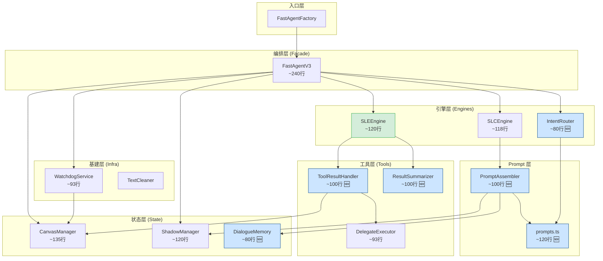

# Fast Agent V3.3 架构重构计划：原子化解耦

> **版本**: V3.3.0  
> **日期**: 2026-03-20  
> **目标**: 将 V3.2 中残留的两个"准上帝模块"（`sle.ts` 425行, `shadow-manager.ts` 364行）拆解至每文件 ≤150 行，清理全部遗留文件，集中管理 Prompt。

---

## 1. 问题诊断 (Problem Statement)

V3.2 成功将 `FastAgentV3` 从 700+ 行瘦身至 306 行 Facade，但拆分进程**止步于 Phase 3**，导致被抽出的子模块本身又成为了新的问题点：

| 模块 | 行数 | 核心问题 |
|:---|:---|:---|
| `sle.ts` | **425** | 混合了 5 种不同职责：LLM 推理、意图路由、人设提炼、结果摘要、工具执行+Canvas 状态转换 |
| `shadow-manager.ts` | **364** | 混合了 3 层关注点：WAL 存储、Prompt 组装（含 6 次无缓存磁盘 IO）、对话记忆管理 |
| 遗留文件 ×4 | **1616** | `fast-agent.ts`, `.bak`, `.v2.ts`, `shadow-manager.ts.bak` 无活跃引用，占 76KB |
| `fast-agent-v3.ts` | 306 | Watchdog 回调 `trigger` / `idle_trigger` 65 行结构重复 |
| `slc.ts` + `sle.ts` | — | ~3600 字符 Prompt 硬编码散落在 3 个 TS 文件中 |

---

## 2. 目标架构 (Target Architecture)

### 2.1 模块拆分总览



### 2.2 目标文件结构

```text
src/agent/
├── fast-agent-v3.ts         # Facade 编排中枢          (~240行, 从306行瘦身)
├── slc.ts                   # SLC 交互魂魄引擎         (~118行, 不变)
├── sle.ts                   # SLE 核心推理引擎         (~120行, 从425行瘦身)
├── intent-router.ts         # 意图路由判定器            (~80行, 🆕 从 SLE 拆出)
├── tool-result-handler.ts   # 工具结果处理+Canvas状态机  (~100行, 🆕 从 SLE 拆出)
├── result-summarizer.ts     # 结果摘要+人设提炼          (~100行, 🆕 从 SLE 拆出)
├── prompt-assembler.ts      # 分层Prompt组装(带缓存)     (~100行, 🆕 从 ShadowManager 拆出)
├── prompts.ts               # Prompt 常量集中管理        (~120行, 🆕)
├── dialogue-memory.ts       # 对话历史读写管理           (~80行, 🆕 从 ShadowManager 拆出)
├── shadow-manager.ts        # 纯WAL状态管理+恢复         (~120行, 从364行瘦身)
├── canvas-manager.ts        # 画布状态管理               (~135行, 不变)
├── watchdog.ts              # 守护进程心跳               (~93行, 不变)
├── executor.ts              # 工具委派执行器             (~93行, 不变)
├── types.ts                 # 核心类型定义               (~35行, 不变)
└── factory.ts               # 工厂入口                   (~10行, 精简)
```

### 2.3 改进指标对比

| 指标 | V3.2 现状 | V3.3 目标 | 变化 |
|:---|:---|:---|:---|
| 总活跃文件数 | 9 | 15 | +6 |
| 最大文件行数 | **425** | **~135** | -68% |
| 超过 300 行的文件 | 3 | **0** | ✅ |
| 遗留文件 | 4 (76KB) | **0** | ✅ |
| Prompt 散落文件数 | 3 | **1** | ✅ |
| ShadowManager 每请求磁盘 IO | 6次 | **1次** (缓存) | -83% |

---

## 3. 分阶段任务 (Tasks)

### Phase 1: 止血 — 删除遗留 + 集中 Prompt 〔风险: 极低〕

不改变任何运行时逻辑，纯粹的代码卫生清理。

- [ ] **Task 1.1**: 删除 4 个遗留文件
  - `fast-agent.ts` (V2 实现, 394行)
  - `fast-agent.ts.bak` (V2 备份, 387行)
  - `fast-agent.v2.ts` (V2 另一备份, 592行)
  - `shadow-manager.ts.bak` (影子管理器备份, 243行)

- [ ] **Task 1.2**: 精简 `factory.ts`，移除 V2 分支
  ```typescript
  // Before: 双版本分支
  import { FastAgent } from './fast-agent';
  import { FastAgentV3 } from './fast-agent-v3';
  switch (version) { case 'v3': ...; case 'v2': ... }

  // After: 直接创建 V3
  import { FastAgentV3 } from './fast-agent-v3';
  export class FastAgentFactory {
      static create(config: PluginConfig, workspaceRoot: string): IFastAgent {
          return new FastAgentV3(config, workspaceRoot);
      }
  }
  ```

- [ ] **Task 1.3**: 创建 `src/agent/prompts.ts`，将散落在 `sle.ts` 和 `slc.ts` 中的 6 段硬编码 Prompt 抽取为命名常量
  - `SLE_CORE_SYSTEM_PROMPT` (sle.ts L41-L57)
  - `INTENT_ROUTER_PROMPT` (sle.ts L233-L240)
  - `SESSION_INIT_PROMPT` (sle.ts L275-L281)
  - `PERSONA_SYNTHESIZER_PROMPT` (sle.ts L312-L349)
  - `TASK_RESULT_SUMMARIZER_PROMPT` (sle.ts L373-L401)
  - `SLC_SHADOW_THOUGHTS` 生成函数 (slc.ts L49-L58)

- [ ] **Task 1.4**: 验证编译通过 + dev-server 正常启动

---

### Phase 2: 拆分 SLEEngine 〔风险: 中等〕

将 `sle.ts` (425行) 按单一职责拆分为 4 个模块。

- [ ] **Task 2.1**: 创建 `src/agent/intent-router.ts`
  - 迁移 `detectIntent()` (sle.ts L230-L265)
  - 迁移 `initializeSession()` (sle.ts L271-L303)
  - 对外接口：

    ```typescript
    export class IntentRouter {
        constructor(private config: PluginConfig) {}

        async detectIntent(
            text: string,
            messages: any[],
            fullSoul: string
        ): Promise<{ needsTool: boolean; intent?: string }>;

        async initializeSession(
            callId: string,
            canvasManager: CanvasManager
        ): Promise<void>;
    }
    ```

- [ ] **Task 2.2**: 创建 `src/agent/result-summarizer.ts`
  - 迁移 `summarizeTaskResult()` (sle.ts L369-L423)
  - 迁移 `summarizePersona()` (sle.ts L309-L367)
  - 对外接口：

    ```typescript
    export class ResultSummarizer {
        constructor(private config: PluginConfig) {}

        async summarizeTaskResult(
            rawOutput: string,
            intent: string
        ): Promise<string>;

        async summarizePersona(
            fullContext: string
        ): Promise<string>;
    }
    ```

- [ ] **Task 2.3**: 创建 `src/agent/tool-result-handler.ts`
  - 迁移 `run()` 中 L139-L218 的工具结果处理逻辑
  - **核心改进**: 统一 Canvas 状态转换入口，消除同步/超时/错误三条路径的重复更新

    ```typescript
    export class ToolResultHandler {
        constructor(
            private executor: DelegateExecutor,
            private summarizer: ResultSummarizer
        ) {}

        async handleToolCalls(
            toolCalls: ToolCall[],
            text: string,
            callId: string,
            canvas: CanvasState,
            canvasManager: CanvasManager
        ): Promise<void>;

        // 统一状态转换（核心改进点）
        private async transitionToReady(
            canvas: CanvasState,
            summary: string,
            canvasManager: CanvasManager,
            callId: string
        ): Promise<void>;
    }
    ```

- [ ] **Task 2.4**: 瘦身 `sle.ts`，仅保留 `run()` 中的 LLM 流式推理核心
  - `run()` 内部只做：组装 messages → 推流 → 收集 toolCalls → 委派给 `ToolResultHandler`
  - SLEEngine 构造函数注入 `ToolResultHandler`

- [ ] **Task 2.5**: 更新 `fast-agent-v3.ts`
  - 将 `this.sle.detectIntent()` 改为 `this.intentRouter.detectIntent()`
  - 将 `this.sle.initializeSession()` 改为 `this.intentRouter.initializeSession()`
  - 将 `this.sle.summarizePersona()` 改为 `this.resultSummarizer.summarizePersona()`

- [ ] **Task 2.6**: 验证编译 + Tool Mode / Chat Mode / Idle 三路分流正常

---

### Phase 3: 拆分 ShadowManager 〔风险: 中等〕

将 `shadow-manager.ts` (364行) 按关注点分为 3 层。

- [ ] **Task 3.1**: 创建 `src/agent/dialogue-memory.ts`
  - 迁移 `logDialogue()` (shadow-manager.ts L238-L254)
  - 迁移 `getHistoryMessages()` (shadow-manager.ts L125-L148)
  - 迁移 `getRecentDialogueContext()` (shadow-manager.ts L334-L361)
  - 迁移 `getRecentDialogueContextRaw()` (shadow-manager.ts L114-L120)
  - 对外接口：

    ```typescript
    export class DialogueMemory {
        constructor(private workspaceRoot: string) {}

        async logDialogue(
            callId: string,
            role: 'user' | 'assistant',
            content: string
        ): Promise<void>;

        async getHistoryMessages(
            callId: string,
            limit?: number
        ): Promise<Array<{ role: string; content: string }>>;

        async getRecentDialogueContextRaw(
            limit?: number,
            callIdFilter?: string | null
        ): Promise<string>;
    }
    ```

- [ ] **Task 3.2**: 创建 `src/agent/prompt-assembler.ts`
  - 迁移 `assemblePrompt()` (shadow-manager.ts L260-L321)
  - 迁移 `getContextPrompts()` (shadow-manager.ts L56-L92)
  - 迁移 `getCompactPersona()` (shadow-manager.ts L97-L108)
  - **核心改进**: 增加静态文件缓存

    ```typescript
    export class PromptAssembler {
        // 进程生命周期内只读一次的文件缓存
        private fileCache: Map<string, string> = new Map();
        private cacheLoaded = false;

        constructor(
            private workspaceRoot: string,
            private dialogueMemory: DialogueMemory
        ) {}

        /**
         * 预加载所有静态 Prompt 文件 (soul.md, user.md, AGENTS.md, IDENTITY.md, memory.md)
         * 在首次调用时自动执行，后续直接从内存读取
         */
        private async ensureCache(): Promise<void>;

        async assemblePrompt(
            type: 'SLC' | 'SLE',
            state: ShadowState,
            isNewSession?: boolean
        ): Promise<string>;

        async getCompactPersona(): Promise<string>;
    }
    ```

- [ ] **Task 3.3**: 瘦身 `shadow-manager.ts`，仅保留 WAL 状态管理
  - 保留: `getScopedState`, `updateState`, `checkpoint`, `recover`
  - 保留: `statePool`, `walCount`, `recoveredCalls` 等状态字段
  - 移除: 所有 Prompt 组装和对话历史相关方法
  - 新增: 构造函数注入 `PromptAssembler` 和 `DialogueMemory` 的引用（供 Facade 协调）

- [ ] **Task 3.4**: 更新 `fast-agent-v3.ts` 和 `slc.ts` 中所有对 `shadow-manager` 的调用
  - `this.shadow.assemblePrompt()` → `this.promptAssembler.assemblePrompt()`
  - `this.shadow.logDialogue()` → `this.dialogueMemory.logDialogue()`
  - `this.shadow.getHistoryMessages()` → `this.dialogueMemory.getHistoryMessages()`

- [ ] **Task 3.5**: 验证编译 + SLC Prompt 组装正确 + 对话记忆读写正常

---

### Phase 4: Facade 去重 〔风险: 极低〕

消除 `fast-agent-v3.ts` 中 Watchdog 回调的结构重复。

- [ ] **Task 4.1**: 提取通用方法 `handleWatchdogTrigger()`

  ```typescript
  // fast-agent-v3.ts 中新增私有方法
  private async handleWatchdogTrigger(
      callId: string,
      triggerType: '__INTERNAL_TRIGGER__' | '__IDLE_TRIGGER__',
      chunkTypes: string[],    // ['internal', 'chat'] 或 ['idle', 'chat']
      prefix: string           // '[INTERNAL]' 或 '[IDLE]'
  ): Promise<void> {
      const notifier = this.watchdog.getNotifier(callId);
      if (!notifier) return;

      console.log(`[Watchdog][${this.instanceId}] 📣 ${prefix} for ${callId}`);

      let fullOutput = "";
      await this.process(
          triggerType,
          (chunk) => {
              if (chunk.content && chunkTypes.includes(chunk.type)) {
                  fullOutput += chunk.content;
              }
          },
          async () => {},
          callId
      );

      const trace = await this.getCurrentTrace(callId);
      if (fullOutput.trim()) {
          await notifier(`${prefix}${fullOutput.trim()}`, trace);
      }
  }
  ```

- [ ] **Task 4.2**: 重构 `startWatchdog()`，两个监听器各缩减为 ~3 行
  ```typescript
  this.watchdog.on('trigger', async ({ callId, status }) => {
      status.is_delivered = true;
      await this.logCanvasEvent(callId, 'WATCHDOG_INTERNAL_TRIGGER', { status });
      await this.handleWatchdogTrigger(callId, '__INTERNAL_TRIGGER__', ['internal', 'chat'], '[INTERNAL]');
      await this.logCanvasEvent(callId, 'WATCHDOG_DELIVERED', { callId });
  });

  this.watchdog.on('idle_trigger', async ({ callId }) => {
      await this.handleWatchdogTrigger(callId, '__IDLE_TRIGGER__', ['idle', 'chat'], '[IDLE]');
  });
  ```

- [ ] **Task 4.3**: 验证心跳触发 + 闲置问候正常工作

---

## 4. 依赖关系与执行顺序

```mermaid
gantt
    title V3.3 重构执行甘特图
    dateFormat X
    axisFormat %s

    section Phase 1 (止血)
    Task 1.1 删遗留文件            :p1t1, 0, 1
    Task 1.2 精简 factory.ts       :p1t2, 0, 1
    Task 1.3 抽取 prompts.ts       :p1t3, after p1t1, 2
    Task 1.4 编译验证               :p1t4, after p1t3, 1

    section Phase 2 (拆 SLE)
    Task 2.1 intent-router.ts      :p2t1, after p1t4, 2
    Task 2.2 result-summarizer.ts  :p2t2, after p1t4, 2
    Task 2.3 tool-result-handler.ts:p2t3, after p2t2, 2
    Task 2.4 瘦身 sle.ts           :p2t4, after p2t3, 2
    Task 2.5 更新 fast-agent-v3    :p2t5, after p2t4, 1
    Task 2.6 三路分流验证           :p2t6, after p2t5, 1

    section Phase 3 (拆 ShadowManager)
    Task 3.1 dialogue-memory.ts    :p3t1, after p1t4, 2
    Task 3.2 prompt-assembler.ts   :p3t2, after p3t1, 2
    Task 3.3 瘦身 shadow-manager   :p3t3, after p3t2, 2
    Task 3.4 更新调用方             :p3t4, after p3t3, 1
    Task 3.5 组装验证               :p3t5, after p3t4, 1

    section Phase 4 (去重)
    Task 4.1 handleWatchdogTrigger :p4t1, after p2t6, 1
    Task 4.2 重构 startWatchdog    :p4t2, after p4t1, 1
    Task 4.3 心跳验证              :p4t3, after p4t2, 1
```



**关键依赖**:
- Phase 2 和 Phase 3 可以**并行推进**（它们分别拆不同模块，无交叉依赖）
- Phase 4 依赖 Phase 2 完成（因为要改 fast-agent-v3.ts，需 SLE 拆分先稳定）
- 所有 Phase 都依赖 Phase 1 的遗留清理先完成

---

## 5. 风险评估与缓解

| 风险 | 等级 | 缓解措施 |
|:---|:---|:---|
| SLE 拆分后工具执行链路断裂 | 🟠 中 | Task 2.6 专项验证 Tool Mode 全链路（发起→超时→后台完成→Canvas READY→Watchdog 播报） |
| PromptAssembler 缓存导致热更新 Prompt 失效 | 🟡 低 | 缓存仅针对 `soul.md` 等静态文件，提供 `invalidateCache()` 方法；对话历史始终实时读取 |
| ShadowManager 拆分后 `getScopedState` 作用域隔离失效 | 🟠 中 | ShadowManager 保留 AsyncLocalStorage 隔离逻辑不动，只移走不依赖作用域的纯 IO 方法 |
| `IFastAgent` 接口变更导致外部消费者 break | 🟢 无 | 本次重构不涉及 `IFastAgent` 接口任何变更，`index.ts` 和 `chat-api.ts` 零感知 |

---

## 6. 回归测试用例

### 6.1 Chat Mode (纯 SLC 直达)

| # | 操作 | 预期结果 |
|:---|:---|:---|
| TC-1 | 用户说"你好" | SLC 在 600ms 内开口回复，不触发 SLE detectIntent 以外的逻辑 |
| TC-2 | 用户说"现在几点了" | SLC 直接读取 Canvas env.time 回复，`needsTool = false` |

### 6.2 Tool Mode (SLC 垫词 + SLE 并行)

| # | 操作 | 预期结果 |
|:---|:---|:---|
| TC-3 | 用户说"查看 doc 目录" | IntentRouter 判定 `needsTool=true` → SLC 垫词 → ToolResultHandler 执行 → Canvas 转 READY |
| TC-4 | 长耗时工具 (>5s) | DelegateExecutor 超时赛跑 → Canvas 保持 PENDING → 后台完成后 ToolResultHandler 更新 Canvas → Watchdog 触发播报 |
| TC-5 | 工具执行失败 | ToolResultHandler 捕获错误 → Canvas 写入错误摘要 + 转 READY → Watchdog 播报失败原因 |

### 6.3 Watchdog 触发

| # | 操作 | 预期结果 |
|:---|:---|:---|
| TC-6 | Canvas READY + 未投递 | Watchdog 扫描 → `trigger` 事件 → `handleWatchdogTrigger('__INTERNAL_TRIGGER__')` → 通过 notifier 投递 |
| TC-7 | 用户沉默 15s | Watchdog 扫描 → `idle_trigger` 事件 → `handleWatchdogTrigger('__IDLE_TRIGGER__')` → 通过 notifier 投递 |

### 6.4 Prompt 与记忆

| # | 操作 | 预期结果 |
|:---|:---|:---|
| TC-8 | 首次 assemblePrompt('SLC') | PromptAssembler 加载 5 个文件到缓存 → 返回拼装 Prompt |
| TC-9 | 第二次 assemblePrompt('SLC') | 缓存命中，无磁盘 IO（soul.md 等） → 仅对话历史实时查询 |
| TC-10 | logDialogue + getHistoryMessages | DialogueMemory 写入 JSONL → 读取返回正确的最近 N 条记录 |

---

## 7. 验收标准 (Definition of Done)

- [ ] `src/agent/` 下无 `.bak` 和 `.v2.ts` 文件
- [ ] `sle.ts` 行数 ≤ 150
- [ ] `shadow-manager.ts` 行数 ≤ 150
- [ ] 所有文件行数 ≤ 150（`fast-agent-v3.ts` 允许 ≤ 250）
- [ ] `prompts.ts` 集中管理所有系统 Prompt
- [ ] `npm run build` 编译零 error
- [ ] dev-server 正常启动，Chat / Tool / Idle 三路分流功能正常
- [ ] `canvas.jsonl` 审计日志格式不变，状态机流转正确
