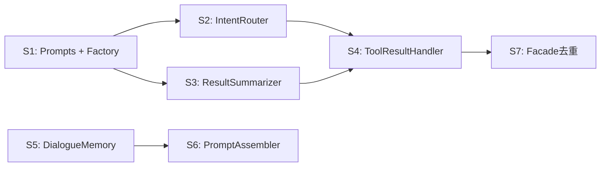

# V3.3 分阶段 Agent 提示词

> 每个阶段独立可测，完成后必须通过 `npm run build` 编译验证 + 功能验证脚本。  
> 每个提示词可以直接复制给一个新 Agent 窗口执行。

---

## 阶段总览

| 阶段 | 名称 | 产出文件 | 依赖 | 预估改动量 |
|:---|:---|:---|:---|:---|
| S1 | 精简 Factory + 创建 Prompt 常量 | `factory.ts`, `prompts.ts` | 无 | 新建 1 文件 + 改 1 文件 |
| S2 | 抽取 IntentRouter | `intent-router.ts` | S1 | 新建 1 文件 + 改 2 文件 |
| S3 | 抽取 ResultSummarizer | `result-summarizer.ts` | S1 | 新建 1 文件 + 改 2 文件 |
| S4 | 抽取 ToolResultHandler + 瘦身 SLE | `tool-result-handler.ts`, `sle.ts` | S2 + S3 | 新建 1 文件 + 改 2 文件 |
| S5 | 抽取 DialogueMemory | `dialogue-memory.ts` | 无 | 新建 1 文件 + 改 3 文件 |
| S6 | 抽取 PromptAssembler + 瘦身 ShadowManager | `prompt-assembler.ts`, `shadow-manager.ts` | S5 | 新建 1 文件 + 改 3 文件 |
| S7 | Facade 去重 | `fast-agent-v3.ts` | S2+S3+S4 | 改 1 文件 |



---

## S1: 精简 Factory + 创建 Prompt 常量

```
# 任务：V3.3-S1 精简 Factory + 创建 Prompt 常量文件

## 项目背景
你正在重构 `openclaw-voice-gateway/src/agent/` 目录。这是一个实时语音 AI 网关插件，采用 SLC/SLE 双模型并联架构。

## 规则
1. 恪守边界：绝不越界修改当前任务之外的任何代码
2. 极简至上：用最简逻辑实现需求
3. 单文件控制在 500 行以内
4. 只提供精准变更的代码 Diff，拒绝全量覆盖
5. 所有修改必须附带验证手段

## 具体任务

### Task 1: 精简 `src/agent/factory.ts`
- 移除 `import { FastAgent } from './fast-agent'` (该文件已删除)
- 移除 switch/case 版本分支，直接返回 `new FastAgentV3(config, workspaceRoot)`
- 最终文件应 ≤ 15 行

### Task 2: 创建 `src/agent/prompts.ts`
从以下 3 个文件中，将所有硬编码的系统 Prompt 提取为命名导出常量：

**来源 1: `sle.ts`**
- L41-L57 的 SLE 核心 Action Protocol prompt → 导出为 `SLE_ACTION_PROTOCOL`
- L233-L240 的意图路由 prompt → 导出为 `INTENT_ROUTER_SYSTEM_PROMPT`
- L275-L281 的会话初始化 prompt → 导出为 `SESSION_INIT_PROMPT`
- L312-L349 的人设提炼 prompt → 导出为 `PERSONA_SYNTHESIZER_PROMPT`
- L373-L401 的结果摘要 prompt → 导出为 `TASK_RESULT_SUMMARIZER_PROMPT`

**来源 2: `slc.ts`**
- L50-L57 的潜意识生成逻辑 → 导出为函数 `buildShadowThought(type: 'internal' | 'idle' | 'waiting' | 'chat', canvasSummary: string): string`

**重要**：本阶段只创建 `prompts.ts` 文件并导出常量/函数，**不修改** `sle.ts` 和 `slc.ts` 的导入（后续阶段切换）。

### 验证方式
1. `cd openclaw-voice-gateway && npx tsc --noEmit` 编译通过
2. 确认 `prompts.ts` 中所有常量内容与源文件中的原始 prompt 完全一致（可以逐段 diff 确认）
3. `factory.ts` 中不再引用 `fast-agent` (V2)
```

---

## S2: 抽取 IntentRouter

```
# 任务：V3.3-S2 从 SLEEngine 中抽取 IntentRouter

## 项目背景
你正在重构 `openclaw-voice-gateway/src/agent/` 目录。这是一个实时语音 AI 网关插件。
当前 `sle.ts` (425行) 是一个上帝模块，混合了 5 种职责。本阶段将意图路由和会话初始化两个方法抽取到独立模块。

## 前置条件
- `src/agent/prompts.ts` 已创建（S1 完成），内含 `INTENT_ROUTER_SYSTEM_PROMPT` 和 `SESSION_INIT_PROMPT`

## 规则
1. 恪守边界：只动 `intent-router.ts`(新建), `sle.ts`, `fast-agent-v3.ts` 三个文件
2. 极简至上，拒绝过度设计
3. 只提供精准变更 Diff
4. 修改后必须可验证

## 具体任务

### Task 1: 创建 `src/agent/intent-router.ts`
从 `sle.ts` 中迁移以下两个方法：

1. `detectIntent()` (sle.ts 约 L230-L265)
   - 接口签名：`async detectIntent(text: string, messages: any[], fullSoul: string): Promise<{ needsTool: boolean; intent?: string }>`
   - 使用 `prompts.ts` 中的 `INTENT_ROUTER_SYSTEM_PROMPT` 替代硬编码 prompt

2. `initializeSession()` (sle.ts 约 L271-L303)
   - 接口签名：`async initializeSession(callId: string, canvasManager: CanvasManager): Promise<void>`
   - 使用 `prompts.ts` 中的 `SESSION_INIT_PROMPT` 替代硬编码 prompt

构造函数：`constructor(private config: PluginConfig)`，内部创建 OpenAI client（复用 sleBaseUrl/sleModel 配置）。

### Task 2: 修改 `sle.ts`
- 删除 `detectIntent()` 方法体
- 删除 `initializeSession()` 方法体
- **不修改** `run()` 和其他方法

### Task 3: 修改 `fast-agent-v3.ts`
- 新增 `private intentRouter: IntentRouter` 成员
- 构造函数中初始化：`this.intentRouter = new IntentRouter(config)`
- 将所有 `this.sle.detectIntent(...)` 调用改为 `this.intentRouter.detectIntent(...)`
- 将所有 `this.sle.initializeSession(...)` 调用改为 `this.intentRouter.initializeSession(...)`

### 验证方式
1. `npx tsc --noEmit` 编译通过
2. 创建验证脚本 `scripts/verify-s2-intent-router.ts`：
   - 导入 IntentRouter，构造实例
   - 调用 `detectIntent("你好", [], "")` 确认返回 `{ needsTool: false }`
   - 调用 `detectIntent("帮我查看doc目录下的文件", [], "")` 确认返回 `{ needsTool: true }`
3. 启动 dev-server (`npx ts-node scripts/dev-server.ts`)，通过 Web 面板发送 "你好"，确认走 Chat Mode（日志应显示 `needsTool: false`）
```

---

## S3: 抽取 ResultSummarizer

```
# 任务：V3.3-S3 从 SLEEngine 中抽取 ResultSummarizer

## 项目背景
你正在重构 `openclaw-voice-gateway/src/agent/` 目录。
当前 `sle.ts` 仍包含结果摘要和人设提炼两个与核心推理无关的方法，本阶段将它们抽取。

## 前置条件
- `src/agent/prompts.ts` 已创建（S1 完成），内含 `TASK_RESULT_SUMMARIZER_PROMPT` 和 `PERSONA_SYNTHESIZER_PROMPT`

## 规则
1. 恪守边界：只动 `result-summarizer.ts`(新建), `sle.ts`, `fast-agent-v3.ts` 三个文件
2. 极简至上，拒绝过度设计
3. 只提供精准变更 Diff
4. 修改后必须可验证

## 具体任务

### Task 1: 创建 `src/agent/result-summarizer.ts`
从 `sle.ts` 中迁移以下两个方法：

1. `summarizeTaskResult()` (sle.ts 约 L369-L423)
   - 签名：`async summarizeTaskResult(rawOutput: string, intent: string): Promise<string>`
   - 使用 `prompts.ts` 中的 `TASK_RESULT_SUMMARIZER_PROMPT` 替代硬编码 prompt
   - fallback 逻辑保持不变（LLM 失败时返回截断的原始输出）

2. `summarizePersona()` (sle.ts 约 L309-L367)
   - 签名：`async summarizePersona(fullContext: string): Promise<string>`
   - 使用 `prompts.ts` 中的 `PERSONA_SYNTHESIZER_PROMPT` 替代硬编码 prompt

构造函数：`constructor(private config: PluginConfig)`，内部创建 OpenAI client。

### Task 2: 修改 `sle.ts`
- 删除 `summarizeTaskResult()` 方法体（注意：`run()` 内部 L156 有调用 `this.summarizeTaskResult()`，改为通过构造函数注入的 `ResultSummarizer` 实例调用）
- 删除 `summarizePersona()` 方法体
- SLEEngine 构造函数新增参数：`resultSummarizer: ResultSummarizer`
- `run()` 方法内 `this.summarizeTaskResult(...)` 改为 `this.resultSummarizer.summarizeTaskResult(...)`

### Task 3: 修改 `fast-agent-v3.ts`
- 新增 `private resultSummarizer: ResultSummarizer` 成员
- 构造函数中：`this.resultSummarizer = new ResultSummarizer(config)`
- 创建 SLEEngine 时注入：`this.sle = new SLEEngine(config, this.resultSummarizer)`
- 将 `this.sle.summarizePersona(...)` 调用改为 `this.resultSummarizer.summarizePersona(...)`

### 验证方式
1. `npx tsc --noEmit` 编译通过
2. 创建验证脚本 `scripts/verify-s3-summarizer.ts`：
   - 导入 ResultSummarizer，构造实例
   - 调用 `summarizeTaskResult("文件列表: a.md, b.md, c.md\n任务耗时: 1.2s", "查看doc目录")` 
   - 确认返回的摘要不包含 "任务耗时" 等噪音
3. 启动 dev-server，通过 Web 面板发送 "查看doc目录下有什么文件"，确认 Tool Mode 下结果摘要正常（Canvas 状态正常转为 READY 且 summary 非空）
```

---

## S4: 抽取 ToolResultHandler + 瘦身 SLE

```
# 任务：V3.3-S4 从 SLEEngine 中抽取 ToolResultHandler，完成 SLE 最终瘦身

## 项目背景
你正在重构 `openclaw-voice-gateway/src/agent/` 目录。
经过 S2（IntentRouter）和 S3（ResultSummarizer）的抽取，`sle.ts` 中的 `run()` 方法仍然混合了"LLM 流式推理"和"工具执行结果处理+Canvas 状态机更新"两个职责。本阶段将工具结果处理逻辑抽取为独立模块。

## 前置条件
- S2 完成：`IntentRouter` 已从 SLE 中独立
- S3 完成：`ResultSummarizer` 已从 SLE 中独立，并通过构造函数注入 SLE

## 规则
1. 恪守边界：只动 `tool-result-handler.ts`(新建), `sle.ts` 两个文件
2. 极简至上，拒绝过度设计
3. 只提供精准变更 Diff
4. **核心改进重点**：统一 Canvas 状态转换入口，消除当前 `sle.ts run()` 中同步/超时/错误三条路径各自重复的 `canvas.task_status.xxx = ...` 代码

## 具体任务

### Task 1: 创建 `src/agent/tool-result-handler.ts`
从 `sle.ts` 的 `run()` 方法中迁移 L139-L218 的工具执行结果处理逻辑。

核心接口：
```typescript
export class ToolResultHandler {
    constructor(
        private executor: DelegateExecutor,
        private summarizer: ResultSummarizer
    ) {}

    /**
     * 处理工具调用结果并更新 Canvas 状态
     */
    async handleToolCalls(
        toolCalls: any[],
        text: string,
        callId: string,
        canvas: CanvasState,
        canvasManager: CanvasManager
    ): Promise<void>;
}
```

**核心改进 — 统一状态转换**：
提取私有方法 `transitionToReady()`，将分散在三条路径（同步成功、超时后台完成、错误）中的 Canvas 更新逻辑统一：
```typescript
private async transitionToReady(
    canvas: CanvasState,
    summary: string,
    canvasManager: CanvasManager,
    callId: string,
    eventName: string = 'CANVAS_CLI_READY'
): Promise<void> {
    canvas.task_status.summary = summary;
    canvas.task_status.status = 'READY';
    canvas.task_status.version = Date.now();
    canvas.task_status.is_delivered = false;
    canvas.task_status.importance_score = 1.0;
    await canvasManager.logCanvasEvent(callId, eventName, { summary });
}
```

### Task 2: 修改 `sle.ts` 的 `run()` 方法
- 构造函数新增参数：`toolResultHandler: ToolResultHandler`
- 将 `run()` 中 L139-L218 的整段 `if (toolCalls.length > 0) { ... }` 替换为：
  ```typescript
  if (toolCalls.length > 0) {
      await this.toolResultHandler.handleToolCalls(
          toolCalls.filter(tc => tc !== undefined),
          text, callId, canvas, canvasManager
      );
  }
  ```
- 瘦身后的 `sle.ts` 应 ≤ 150 行

### Task 3: 修改 `fast-agent-v3.ts` 构造函数
- 创建 ToolResultHandler：`const toolResultHandler = new ToolResultHandler(this.executor, this.resultSummarizer)`
- 注入 SLE：`this.sle = new SLEEngine(config, this.resultSummarizer, toolResultHandler)`

### 验证方式
1. `npx tsc --noEmit` 编译通过
2. 确认 `sle.ts` 行数 ≤ 150
3. 启动 dev-server，发送工具请求（如 "查看doc目录下有什么文件"），验证：
   - Canvas 日志中出现 `CANVAS_PENDING` → `CANVAS_CLI_READY` 的完整流转
   - Watchdog 正常扫描到 READY 状态并触发播报
4. 创建 `scripts/verify-s4-tool-handler.ts`：
   - 验证 `sle.ts` 文件行数 ≤ 150
   - 验证 `tool-result-handler.ts` 中存在 `transitionToReady` 方法
   - 验证 Canvas 状态转换路径在代码中只有一个统一入口
```

---

## S5: 抽取 DialogueMemory

```
# 任务：V3.3-S5 从 ShadowManager 中抽取 DialogueMemory

## 项目背景
你正在重构 `openclaw-voice-gateway/src/agent/` 目录。
当前 `shadow-manager.ts` (364行) 混合了 3 层关注点。本阶段将对话历史的读写管理抽取为独立模块。

注意：本阶段与 S2-S4 (SLE 拆分) 无依赖关系，可以并行执行。

## 规则
1. 恪守边界：只动 `dialogue-memory.ts`(新建), `shadow-manager.ts`, `fast-agent-v3.ts`, `slc.ts`（如有引用变更）
2. 极简至上，拒绝过度设计
3. 只提供精准变更 Diff
4. 修改后必须可验证

## 具体任务

### Task 1: 创建 `src/agent/dialogue-memory.ts`
从 `shadow-manager.ts` 中迁移以下方法：

1. `logDialogue()` (约 L238-L254)
   - 签名：`async logDialogue(callId: string, role: 'user' | 'assistant', content: string): Promise<void>`
   
2. `getHistoryMessages()` (约 L125-L148)
   - 签名：`async getHistoryMessages(callId: string, limit?: number): Promise<Array<{ role: string; content: string }>>`
   - 注意：内部使用了 `ShadowManager.decant()`，改为直接使用 `TextCleaner.decant()`
   
3. `getRecentDialogueContextRaw()` (约 L114-L120，private → public)
   - 签名：`async getRecentDialogueContextRaw(limit?: number, callIdFilter?: string | null): Promise<string>`
   - 内部调用 `this.getHistoryMessages()`

4. `getRecentDialogueContext()` (约 L334-L361)
   - 签名：`async getRecentDialogueContext(limit?: number): Promise<string>`
   - 注意：这个方法内部调用了 `getCurrentCallId()` 和 `this.getScopedState()`
   - **改造方案**：将 callId 和 state 作为参数传入，而非内部获取
   - 新签名：`async getRecentDialogueContext(callId: string, stateMode: string, taskId?: string, limit?: number): Promise<string>`

构造函数：`constructor(private workspaceRoot: string)`

### Task 2: 修改 `shadow-manager.ts`
- 删除上述 4 个方法
- 新增构造函数参数或成员：`dialogueMemory: DialogueMemory`（可选，如果 ShadowManager 内部仍需要调用对话历史功能）
- 如果 `assemblePrompt()` 中调用了 `getRecentDialogueContextRaw()`，暂时保留一个内部的简单转发（因为 PromptAssembler 将在 S6 中独立）
- 静态方法 `decant()` 保持不变

### Task 3: 修改 `fast-agent-v3.ts`
- 新增 `private dialogueMemory: DialogueMemory` 成员
- 构造函数中：`this.dialogueMemory = new DialogueMemory(workspaceRoot)`
- 将所有 `this.shadow.logDialogue(...)` 改为 `this.dialogueMemory.logDialogue(...)`
- 将所有 `this.shadow.getHistoryMessages(...)` 改为 `this.dialogueMemory.getHistoryMessages(...)`

### 验证方式
1. `npx tsc --noEmit` 编译通过
2. 创建 `scripts/verify-s5-dialogue-memory.ts`：
   - 导入 DialogueMemory，构造实例（workspaceRoot 指向测试目录）
   - 调用 `logDialogue('test-call', 'user', '你好')` 写入
   - 调用 `getHistoryMessages('test-call', 5)` 读取
   - 验证返回的消息中包含刚才写入的内容
3. 启动 dev-server，发送消息，确认 `memory/2026-03-20.jsonl` 中仍然正常记录对话
```

---

## S6: 抽取 PromptAssembler + 瘦身 ShadowManager

```
# 任务：V3.3-S6 从 ShadowManager 中抽取 PromptAssembler，完成 ShadowManager 最终瘦身

## 项目背景
你正在重构 `openclaw-voice-gateway/src/agent/` 目录。
经过 S5（DialogueMemory 独立），`shadow-manager.ts` 中仍然混合了 WAL 状态管理和 Prompt 组装两层关注点。本阶段将 Prompt 组装提取为独立模块，并引入文件缓存机制。

## 前置条件
- S5 完成：`DialogueMemory` 已独立，`shadow-manager.ts` 不再包含对话历史方法
- S1 完成：`prompts.ts` 已创建

## 规则
1. 恪守边界：只动 `prompt-assembler.ts`(新建), `shadow-manager.ts`, `fast-agent-v3.ts`, `slc.ts`
2. 极简至上，拒绝过度设计
3. 只提供精准变更 Diff
4. **核心改进重点**：为静态 Prompt 文件（soul.md, user.md 等）引入进程级缓存，减少重复磁盘 IO

## 具体任务

### Task 1: 创建 `src/agent/prompt-assembler.ts`
从 `shadow-manager.ts` 中迁移以下方法：

1. `assemblePrompt()` (约 L260-L321)
   - 签名：`async assemblePrompt(type: 'SLC' | 'SLE', callId: string, state: ShadowState, isNewSession?: boolean): Promise<string>`
   - 注意原方法内部通过 `this.getScopedState()` 获取 state，现改为参数传入

2. `getContextPrompts()` (约 L56-L92)
   - 签名：`async getContextPrompts(callId: string, state: ShadowState, isNewSession?: boolean): Promise<string>`

3. `getCompactPersona()` (约 L97-L108)
   - 签名：`async getCompactPersona(): Promise<string>`

**核心改进 — 文件缓存**：
```typescript
export class PromptAssembler {
    private fileCache: Map<string, string> = new Map();
    private cacheLoaded = false;

    constructor(
        private workspaceRoot: string,
        private dialogueMemory: DialogueMemory
    ) {}

    /**
     * 首次调用时加载所有静态 Prompt 文件到内存
     * soul.md, user.md, AGENTS.md, IDENTITY.md, memory.md 在运行期间几乎不变
     */
    private async ensureCache(): Promise<void> {
        if (this.cacheLoaded) return;
        const files = ['soul.md', 'user.md', 'AGENTS.md', 'IDENTITY.md', 'memory.md'];
        await Promise.all(files.map(async (f) => {
            const content = await readWorkspaceFile(this.workspaceRoot, f);
            this.fileCache.set(f, content || '');
        }));
        this.cacheLoaded = true;
    }

    /** 供外部在文件变更时调用（如热重载场景） */
    invalidateCache(): void {
        this.cacheLoaded = false;
        this.fileCache.clear();
    }
}
```

`assemblePrompt()` 和 `getContextPrompts()` 中原来的 `readWorkspaceFile()` 调用改为从 `this.fileCache` 读取。
但对话历史（`getRecentDialogueContextRaw()`）仍然实时查询 `DialogueMemory`。

### Task 2: 瘦身 `shadow-manager.ts`
- 删除 `assemblePrompt()`, `getContextPrompts()`, `getCompactPersona()` 方法
- 删除 `getRecentDialogueContextRaw()` 的转发（如果 S5 阶段保留了的话）
- 最终只保留：`getScopedState`, `getOrCreateState`, `updateState`, `checkpoint`, `recover`, `decant`(静态)
- 瘦身后 ≤ 150 行

### Task 3: 修改 `fast-agent-v3.ts`
- 新增 `private promptAssembler: PromptAssembler` 成员
- 构造函数中：`this.promptAssembler = new PromptAssembler(workspaceRoot, this.dialogueMemory)`
- 将 `this.shadow.assemblePrompt(...)` 改为 `this.promptAssembler.assemblePrompt(...)`
- 将 `this.shadow.getContextPrompts(...)` 改为 `this.promptAssembler.getContextPrompts(...)`
- 将 `this.shadow.getCompactPersona()` 改为 `this.promptAssembler.getCompactPersona()`
- 注意传参变更：需要将 `callId` 和 `state` 取出后传给 PromptAssembler

### Task 4: 修改 `slc.ts`
- `run()` 方法中 `shadowManager.assemblePrompt('SLC')` 需要更新调用方式
- 方案A（推荐）：SLC 接收 `promptAssembler` 而非 `shadowManager` 来组装 prompt
- 方案B：通过 `fast-agent-v3.ts` 预组装好 prompt 后传给 SLC

选择方案 A 或 B 均可，但需保证 SLC 仍能拿到正确的 SLC 类型 Prompt。

### 验证方式
1. `npx tsc --noEmit` 编译通过
2. 确认 `shadow-manager.ts` 行数 ≤ 150
3. 创建 `scripts/verify-s6-prompt-assembler.ts`：
   - 导入 PromptAssembler，构造实例
   - 连续调用两次 `assemblePrompt('SLC', ...)`
   - 第二次调用时验证缓存命中（通过 `cacheLoaded === true` 或 mock `readWorkspaceFile` 确认只被调用一次）
4. 启动 dev-server，发送 "你好"，确认 SLC 回复正常（prompt 内容正确）
```

---

## S7: Facade 去重

```
# 任务：V3.3-S7 消除 FastAgentV3 中 Watchdog 回调的结构重复

## 项目背景
你正在重构 `openclaw-voice-gateway/src/agent/fast-agent-v3.ts`。
当前 `startWatchdog()` 方法中有两个结构几乎完全相同的回调（`trigger` 和 `idle_trigger`），共占 65 行。模式相同：获取 notifier → 调用 this.process() 收集输出 → 获取 trace → 通过 notifier 投递。

## 前置条件
- S4 完成：SLE 已瘦身，FastAgentV3 的其他变更已稳定

## 规则
1. 恪守边界：只动 `fast-agent-v3.ts` 一个文件
2. 极简至上
3. 只提供精准变更 Diff
4. 修改后必须可验证

## 具体任务

### Task 1: 提取通用方法 `handleWatchdogTrigger()`
```typescript
private async handleWatchdogTrigger(
    callId: string,
    triggerType: '__INTERNAL_TRIGGER__' | '__IDLE_TRIGGER__',
    chunkTypes: string[],
    prefix: string
): Promise<void> {
    const notifier = this.watchdog.getNotifier(callId);
    if (!notifier) return;

    console.log(`[Watchdog][${this.instanceId}] 📣 ${prefix} for ${callId}`);

    let fullOutput = "";
    await this.process(
        triggerType,
        (chunk) => {
            if (chunk.content && chunkTypes.includes(chunk.type)) {
                fullOutput += chunk.content;
            }
        },
        async () => {},
        callId
    );

    const trace = await this.getCurrentTrace(callId);
    if (fullOutput.trim()) {
        await notifier(`${prefix}${fullOutput.trim()}`, trace);
    }
}
```

### Task 2: 重构 `startWatchdog()`
将两个冗长的监听器替换为：
```typescript
this.watchdog.on('trigger', async ({ callId, status }) => {
    status.is_delivered = true;
    await this.logCanvasEvent(callId, 'WATCHDOG_INTERNAL_TRIGGER', { status });
    try {
        await this.handleWatchdogTrigger(callId, '__INTERNAL_TRIGGER__', ['internal', 'chat'], '[INTERNAL]');
        await this.logCanvasEvent(callId, 'WATCHDOG_DELIVERED', { callId });
    } catch (e) {
        console.error(`[Watchdog] Delivery Failed:`, e);
        status.is_delivered = false;
    }
});

this.watchdog.on('idle_trigger', async ({ callId }) => {
    try {
        await this.handleWatchdogTrigger(callId, '__IDLE_TRIGGER__', ['idle', 'chat'], '[IDLE]');
    } catch (e) {
        console.error(`[Watchdog] Idle greeting failed:`, e);
    }
});
```

### 验证方式
1. `npx tsc --noEmit` 编译通过
2. `fast-agent-v3.ts` 行数应从约 306 行减少到约 240-260 行
3. 启动 dev-server：
   - 等待 15 秒不说话 → 确认收到 `[IDLE]` 前缀的闲置问候
   - 发送工具请求后等待后台完成 → 确认收到 `[INTERNAL]` 前缀的任务播报
4. 检查 `canvas.jsonl` 中 `WATCHDOG_INTERNAL_TRIGGER` 和 `WATCHDOG_DELIVERED` 事件的日志格式与之前一致
```

---

## 最终验证清单

当所有 7 个阶段完成后，执行以下最终验收：

```
# 任务：V3.3 最终验收

## 检查项
1. `npx tsc --noEmit` 零 error
2. `npm run build` 编译成功
3. 文件行数检查：
   - sle.ts ≤ 150 行
   - shadow-manager.ts ≤ 150 行
   - fast-agent-v3.ts ≤ 260 行
   - 所有新文件 ≤ 150 行
4. 无遗留 .bak / .v2.ts 文件
5. `prompts.ts` 中包含所有系统 Prompt
6. 启动 dev-server 后全链路测试：
   - Chat Mode: 发送 "你好" → SLC 直达回复
   - Tool Mode: 发送 "查看doc目录" → SLC 垫词 + SLE 工具执行 → Canvas READY → Watchdog 播报
   - Idle Mode: 沉默 15 秒 → 收到闲置问候
7. `canvas.jsonl` 审计日志格式不变
8. `memory/yyyy-mm-dd.jsonl` 对话记录正常
```
