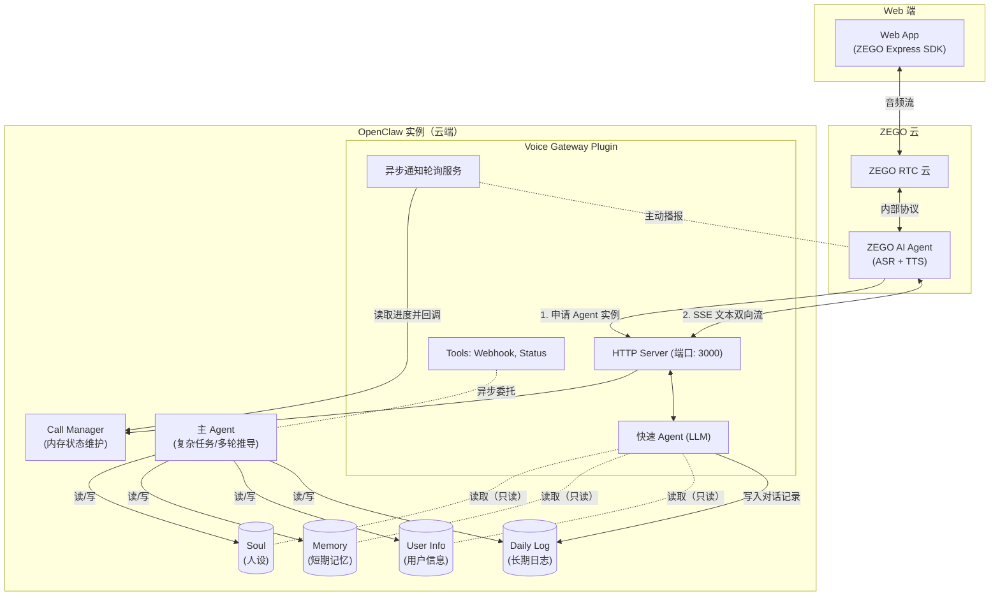
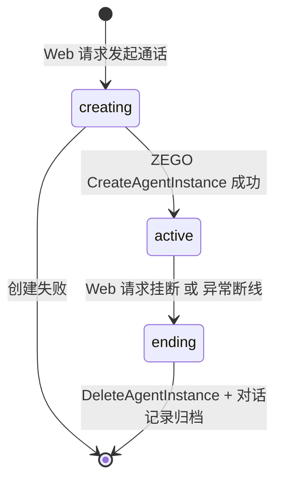

# Voice Gateway Plugin MVP 调研与开发需求文档

> **文档受众**：ZEGO AI Agent 内部开发团队
> **文档目标**：明确 OpenClaw 语音网关 Plugin 的 MVP 研发边界，指导技术调研与一期交付。
>
> **【核心摘要】**
> 本项目产出为 **OpenClaw 的后端语音 Plugin 与极简演示 Web**。主要面向（**短期**）开源生态极客及（**长期**）寻求 AI 全渠道落地的 B 端企业。**核心优势**在于颠覆传统排队模式的“**快慢分离双轨架构**”（毫秒级语聊响应 + 后台深度处理异步播报），其**产品价值**在于证明并提供 ZEGO 强悍的 RTC 与并发打断能力是企业构建顺滑 LUI（全语音/IM）互交入口的最佳实践基础设施。

---

## 1. 项目背景

### 1.1 目标用户/客户
- **P0（短期/本期重点）**：**面向个人开发者的开源项目 MVP**。针对已将 OpenClaw 或类似架构部署在云服务器或个人电脑上的极客用户，期望以最低的接入成本（安装 Plugin + 配置 ZEGO 密钥，在 Web 页面）获得极速的实时语音通话能力。我们将借此在开源社区建立品牌声量。
- **P1（长期商业愿景/本期仅做概念预留）**：**面向 B 端客户的最佳实践**。作为向企业客户推广复杂 AI 系统整合的标杆方案，帮助 B 端企业在其现有 App 中，为所有用户提供与其内部专属 AI 代理（拥有记忆与私有能力）进行实时对话的功能。最终目的是构建 **RTC（实时语音）+ IM（实时文本）** 相结合的全渠道（Omnichannel）互通生态，协助企业级应用完成从 GUI 到 LUI 范式的平滑融合和蜕变。

### 1.2 用户场景与期望体验
用户在桌面或移动端的浏览器中打开测试页面，点击“发起通话”，即可像拨打微信语音一样，与远端部署的 OpenClaw AI 助理进行自然、极低延迟的语音交互。
为了让开发团队直观理解我们要交付的体验，以下是三个核心期望场景：

*   **场景一：极速且顺畅的日常闲聊（体现 Fast Agent 优势）**
    *   **交互过程**：用户：“今天天气怎么样？” -> AI（0.8秒内开口）：“今天北京晴天，25度左右，挺舒服的。” -> 用户中途打断：“那明天呢？” -> AI 立刻停止当前说话，并在不到 1 秒后回答明天的天气。
    *   **期望效果**：对话体感与真人无异，不能出现传统大模型通话中“每次说完都要死等 3 秒”的严重迟滞感，也不能因为复杂的处理阻塞当前的音频流。

*   **场景二：长、短期记忆的无缝继承与主动提取（体现 OpenClaw 灵魂注入）**
    *   **交互过程 1（短期记忆无缝继承）**：用户昨天用微信和 OpenClaw 抱怨了最近在写一份艰难的架构报告。今天打通语音后，用户直接说：“我今天状态好差啊。” -> AI（Fast Agent 直接读取了近期上下文）秒回：“是因为那份架构报告还没写完吗？”
    *   **交互过程 2（长期深层记忆主动检索）**：用户在语音中问：“上次我跟你说的那个去东京旅游时特别好吃的拉面馆叫什么来着？” -> AI（触发快速检索工具）：“稍等，我查一下... 想起来了！是叫做无敌家的那家拉面馆，你说它的汤底特别浓郁。”
    *   **期望效果**：语音网关第一秒能加载近期记忆表现出贴心感；同时面对久远的、未加载到当前 Prompt 的历史片段，AI 能够通过提供专门的短耗时检索工具（类似 grep memory），在几秒内从 OpenClaw 庞大的日志库中翻出回忆。

*   **场景三：异步委托与主动语音插播（体现真正的双打并发实力）**
    *   **交互过程**：
        1. **委托发起**：用户：“帮我爬取并总结一下今天 Github 趋势榜上所有前端开源项目的内容。”
        2. **极速安抚**：AI（Fast Agent，1秒内回复）：“好的，数据量比较大，这需要一些时间，我先在后台帮你处理，您随时问我进度。”
        3. **中途并行**：用户在这期间继续和 AI 聊天：“对了，你还记得我之前常用的那个前端框架叫什么吗？” -> AI 正常秒回历史问题。
        4. **结果主动插播**：5 分钟后，后台主 Agent 处理完毕。即使用户正在发呆，或者正在听 AI 讲别的，耳机里忽然响起提示：“向您汇报一下，您刚才让我查的 Github 前端趋势榜总结好了，主要有三个亮点......”
    *   **期望效果**：复杂任务绝不阻塞当前语音；后台任务完成时，通过 ZEGO 底层的并发打断排队机制，将沉淀好的报告“主动塞回”到用户的耳朵里，从而实现高级自动化的 LUI（语言交互）体验。

### 1.3 客户用法
开发者只需两步即可完成集成：
1. 在其 OpenClaw 实例中通过 `npm install voice-gateway` 安装本 Plugin。
2. 在 OpenClaw 配置文件中填入 ZEGO 的 `appId`、`serverSecret` 等参数，并重启 OpenClaw 服务。
3. 打开 Plugin 提供的配套 Web 页面，即可开始体验。

---

## 2. 需求说明

### 2.1 总体说明

#### 2.1.1 架构说明
本期 MVP 涉及四大关键节点，核心在于 Voice Gateway（后端 Plugin）作为桥梁，衔接 ZEGO RTC 云与 OpenClaw 核心代理系统。

#### 2.1.2 核心流程与时序
**通话生命周期状态机：**

#### 2.1.3 需求列表 (Scope Definition)
| 模块 | 编号 | 需求简述 | 优先级 |
|------|------|----------|--------|
| **基础配置与鉴权** | R-01 | Plugin 配置解析与 ZEGO 密钥挂载，对外提供凭证生成接口 | P0 |
| **基础能力** | R-02 | 提供配套极简 Web H5 测试页面，实现拨打/挂断/状态展示 | P0 |
| **基础能力** | R-03 | 维护 `CallState`，支持向 ZEGO 申请/释放 AgentInstance | P0 |
| **基础能力** | R-04 | 提供 HTTP `/chat/completions` API，实现与 ZEGO 侧 ASR/TTS 的低延迟 SSE 双向文本流 | P0 |
| **人设与短期记忆** | R-05 | （快慢分离架构）通话建立时一次性抓取 OpenClaw Soul 和近期 Memory 组装给快速 Agent；挂断时统一打包归档日志 | P0 |
| **基础工具能力**| R-06 | Fast Agent 支持高频低耗时的极简 API 工具调用（如查询天气、时间获取等），实现在数毫秒内拿到结果并流畅回答 | P0 |
| **长记忆快搜** | R-07 | Fast Agent 提供一个极低延迟的本地文件检索工具（类似 `grep memory`），允许在语音交互中瞬间查询久远的历史对话记录 | P0 |
| **异常兜底** | R-08 | 超时降级处理：LLM 思考或工具执行超时（>900ms）触发兜底文案，防止语音冷场 | P0 |
| **状态安全** | R-09 | 网络断线/Web崩溃的异常兜底监听，确保发送 DeleteAgentInstance，防僵尸实例 | P0 |
| **主Agent联动** | R-10 | **【核心挑战】** 快速 Agent 提供 Webhook 工具，向主 Agent 异步委托慢任务（爬虫、复杂运算等） | P0 |
| **主动播报** | R-11 | **【核心挑战】** 允许用户在语音中长轮询任务进度，且主 Agent 完成任务后，Plugin 需能通过 ZEGO 侧主动播送语音给用户 | P0 |
| **B端:隔离架构** | F-01 | **【P1预留】** 多租户状态隔离与并发架构。单实例需能支撑多终端用户同时独立并发语音接入而保证 Memory 读写互不污染 | Future |
| **B端:客制化** | F-02 | **【P1预留】** 允许不同终端用户通过信令向 ZEGO 动态穿透配置不同的 TTS 音色、专属热词词表与特定 Prompt | Future |
| **B端:IM全渠道** | F-03 | **【P1预留】** 将 ZEGO IM 集成为 OpenClaw 的标准文本通道（Channel），实现客户端纯文本输入与实时 RTC 语音的无缝全渠道（Omnichannel）互通 | Future |
| **ASR优化** | F-04 | ASR 纠错：基于上下文字典自动修正同音字，并热更新 ZEGO ASR 热词表 | Future |
| **记忆引擎** | F-05 | 记忆检索的 RAG 演化：随数据量激增，将 grep 升级为极速极简版的嵌入式局部 RAG 方案 | Future |

---

## 2.2 详细需求点 (重点模块拆解)

### 2.2.1 极简通信与 LLM 桥接 (Fast Agent)
为满足语音通话 < 1s 的延迟要求，Plugin 内置的 LLM 桥接层必须作为“快速 Agent”运行。它**仅**暴露基础响应和低耗时工具。
特别指出，它需要内置一个**极速本地检索工具（Fast Memory Search Tool）**，利用命令（如系统级 grep/ripgrep 或极简 Node.js 本地文件查找）在秒级以内查询久远未加载的长记忆文件（如以往的 DailyLog），而不是经过复杂的 RAG 向量引擎。所有超过数秒响应极限的复杂指令，必须被引导至 Webhook 异步处理。SSE 桥接需保证 Node.js 不出现内存积压。

### 2.2.2 与 OpenClaw 主 Agent 的异步联动 (Webhook 委托)
当用户在语音中说出“帮我查一下昨天关于项目A的邮件并总结”时：
1. **触发委托**：Fast Agent 命中内置的 `delegate_to_main_agent` Function Call，立即使用返回一段安抚语音：“好的，这可能需要一点时间，我已经在后台帮您处理了，您可以随时问我进度。”
2. **后台执行**：通过 OpenClaw 的内部 API 或 Webhook 唤起 Main Agent 执行长耗时任务。
3. **状态隔离**：这期间用户的语音流**不能被阻塞**，用户可以继续和 AI 聊天气或者聊其他简单话题。

### 2.2.3 进度查询与主动播报 (Active Voice Notification)
1. **主动语态通知**：当后台 Main Agent 历经 10 秒完成任务总结后，会将结果写入系统日志或触发回调。
2. **声音抢占**：Plugin 后台必须存在一个监听/轮询机制。一旦捕捉到回调，立刻调用 ZEGO 服务端提供的接口向正在通话的 RTC 房间中插入一段语音：“提示您一下，您刚才让我查的邮件已经总结完了，大致内容是......”
3. **技术要求**：这要求在 Plugin 中不仅要处理被动的 HTTP 响应，还要具备主动调用 ZEGO 服务流控的能力。

---

## 3. 面向内部研发的技术调研重点（强制考察点）

由于 ZEGO 官方底层的 AI Agent 已经提供了强大的异常兜底机制以及诸如支持优先级插播、排队等高阶并发流控能力，**我们在底层 RTC 管道上的风险已经被抹平。** 
因此，当前阶段研发团队的调研重点应当**转变为“调度映射、封装策略与数据契约设计”**。

### 3.1 极速的深层记忆打捞方案 (Search/grep for Fast Agent)
- **痛点**：OpenClaw 原生的长时记忆检索往往是一个重度的、极耗时的向量检索或是复杂的 RAG 工作流。如果在语音通话中，用户仅仅是想回忆一句“你几个月前跟我说的那家拉面馆叫什么”，动用主 Agent 检索甚至引发长达数秒十几秒的僵持，体验极差。
- **考察请求**：开发团队必须调研出一个“平替版”的快搜方案。如何为 Fast Agent 封装一个基于轻量级文件扫描（例如通过 `grep` `fd` 或高效正则直接扫描归档文本）的高速工具（< 2秒返回）？要求能够做到对深层文本日志的极速穿透，绝不能引入笨重的 RAG 组件和数据库引擎。

### 3.2 异步任务协议与回调映射 (Priority Webhook)
- **痛点**：OpenClaw 中的 Main Agent 会处理耗时极长的任务（甚至长达几分钟），当其通过自己系统的机制产生输出或完成事件时，如何能“立刻、零缝隙”地唤醒语音通道？
- **考察请求**：请在动手编码前明确一份方案说明：针对 OpenClaw 的 `DailyLog` 写入或内部事件 webhook，怎么将其封装并转译为 ZEGO AIAgent 的 `Priority Playback`（优先插播/排队播报）请求。需要明确：在各种超时场景下，这个中间态转接层的接口契约长什么样？

### 3.2 Fast Agent 的动态 Prompt 构建算法（核心痛点）
- **痛点**：由于我们采用了快慢分离的“双打架构”，语音专用的 Fast Agent 必须反应极快，其能够承载的上下文（Token Length）往往也是受限的。但 OpenClaw 本身的 `Memory` 与 `Soul` 非常庞大。
- **考察请求**：如何在一瞬间通过启发算法或正则清洗，将动辄几万 Token 的 OpenClaw 庞大数据源中，浓缩抽取出 1000 Token 以内的核心灵魂注入给前端的快速 LLM？如果不研究清楚这点，那么双打架构将会变成徒具其表的空壳，两边的智力会产生严重割裂。

### 3.3 零重度的安全隔离边界
- **痛点**：虽然是供个人极客使用，但如果不做安全规范，很容易出现将核心服务的 `serverSecret` 等高权限凭证泄漏甚至硬编码的随性做法。
- **考察请求**：明确制定出 ZEGO ServerSecret 在 Plugin 中的物理隔离边界与鉴权时序。规定 “后端签发 Token -> 前端只拿临时凭证接入房间” 的绝对底线。

### 3.4 WebH5 的 UI 可观测性（可选）
- **考察请求**：当由于后台任务完成触发了 ZEGO 服务端的插播逻辑时，Web 后台除了混音，是否需要在信令通道给前端抛出一个 Event（例如 `[后台通知：邮件总结完毕]`）？以增强用户的控制感和系统整体的透明度。

### 3.5 B端并发与多租户隔离前瞻 (P1 预研)
- **痛点**：当前 MVP 假定是一个开发者对应一个 OpenClaw 实例。而在 B 端（P1）愿景中，一个 Plugin 实例需要承接成百上千个 App 终端用户的独立并发通话。
- **考察请求**：在设计 MVP 的 `CallManager` 组件时，严禁使用全局单一变量记录通话状态。必须调研并验证：如果未来引入 `userId` 与 `sessionId` 的二维路由映射，能否实现在单个 Node.js 进程内支撑多路并发的独立 SSE 流而不发生串讲、错讲或内存溢出？请确保核心数据结构（如 Map<SessionId, CallState>）一开始就是为多租户隔离准备的。

---

## 4. 附录：当前行业类似架构调研结论（供开发参考）

在研发过程中，请团队参考当今行业内类似语音网关和 Agent 的架构范式，以明确我们的技术先进性和设计定位：

### 4.1 行业现存（开源）类似产品
在 OpenClaw 等相似生态中，目前存在如 Pine Voice 以及官方基于 Twilio 封装的通讯插件。
- **当前主流开源架构**：**单轨直通机制（渠道适配器模式）**
- **特点**：它们单纯将语音视作一种信息传输渠道，由底层的 ASR 获取文本后排着队丢给主平台的主 Agent 去强行处理等待生成结果。
- **缺点**：不具备高并发或主次线程的分离，没有主动的、高优先级的状态打断。这种粗暴的设计在长耗时的逻辑任务前会导致极为严重的通讯断层和迟滞。

### 4.2 本 Plugin 的架构先进性预判 (双打架构 / Barge-in)
我们的架构在形态上更接近 **Retell AI, Bland AI 等高级商业客服底层平台**。
- **特点**：Fast Agent 用来保持 1s 以内的低延迟对讲和语音打断（Barge-in / Listen-while-speaking），而 Main Agent 被置于另一条管线进行异步通知集成。ZEGO 强大的排队打断机制（Concurrent Playback Queue Architecture）包揽了多个流的混音和排队恢复。
- **意义**：这意味着我们正在用简单的外层包装和 ZEGO 成熟的 RTC 底座，将在商业大厂中才能见到的高级语音并发架构“下放”到了极客开源场景。这是整个方案最大的亮点。
