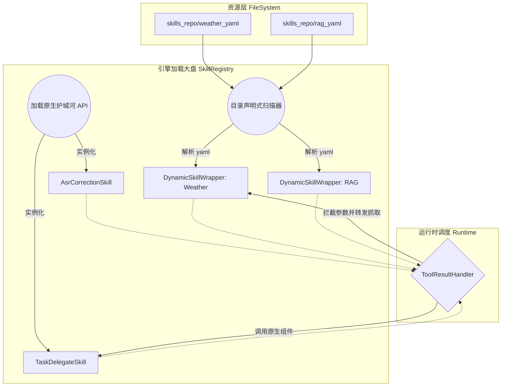
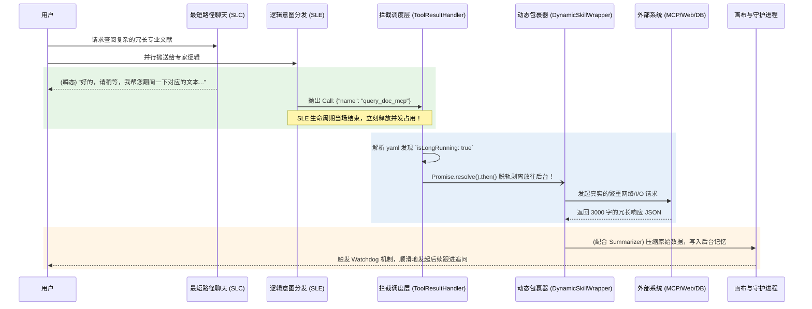

# Fast Agent V3.5 核心演进：声明式动态 Skill 产品与架构设计文档

## 1. 核心设计倒手与原则修正

传统的插件外挂能力往往依赖于针对大模型手动编写 `TypeScript Class`（例如继承基接口 `IFastSkill`）。这不可抗拒地导致了修改繁琐、维护成本高昂，且难以沉淀给非开发人员使用。

系统决定在 V3.5 版本彻底重构，向行业前沿的 **Claude Code / Model Context Protocol (MCP)** 生态看齐：**“能力配置化，技能去编码化”**。我们将放弃在项目中重复堆叠业务逻辑，转而在开放目录通过纯粹的 `YAML + Markdown` 文件声明能力！

---

## 2. 核心架构设计 (Dual-Track Registry)

系统核心采用 **原生底座 (Core Native)** + **外挂声明 (Declarative Wrapper)** 的双轨混合架构。

### 2.1 物理资源呈现模式 (Resource Folders)
任何想赋予给系统的新能力，无论是外网 API（天气预报）、内网命令（执行 CLI）还是本地 MCP 服务器通信，都只需在根目录 `skills_repo/` 建一个文件夹并放置元数据：

```text
skills_repo/
├── weather_mcp/
│   ├── SKILL.md    (必填：以 YAML Frontmatter 定义动作属性与网络端点，主体部分放置 Markdown 以辅助摘要归纳)
│   └── scripts/    (选填：可以放置额外的被调用辅助脚本)
├── local_rag/
│   └── SKILL.md    (定义本地数据库的检索命令)
```

### 2.2 核心架构模型 (Architecture Diagram)



底层的 `SkillRegistry` 在每次系统启动前扫描 `skills_repo/`，利用强大的 `DynamicSkillWrapper` 包装器，将 YAML 文件抹平封装，最终一视同仁地暴供给意图模型。

---

## 3. 流转状态图与异步脱轨机制 (Sequence Guarantee)

面对可能耗时 3 秒以上的网络 I/O，为确保“**不论配置了多复杂的外链，绝不影响主闲聊链路 800ms 内的发声延迟（TTFT）**”：



---

## 4. 关键产品体验落地：语音环境下的“渐进式披露” (Progressive Disclosure)

传统的 Text-based AI（如 ChatGPT 面板）在拿到 RAG 检索的几千字合同后，会洋洋洒洒地将大段引用直接打印在屏幕上。

但在 **OpenClaw RTC（实时语音环境）** 中，一旦 AI 开始机械地照本宣科念出 2000 字冗杂的条文，即便是拟真语音也会引发用户的极度烦躁（信息过载与听觉疲劳）。为此，我们在 V3.5 架构中强制配套了**渐进式披露 (Progressive Disclosure)** 的信息释放流派：

### 核心实现原理：后台喂饭 + 悬念提问

当外挂的 `DynamicSkillWrapper` 从 MCP 接口或者知识库中拉取到了海量的 `Raw Text` 后：

#### 步骤 1: 强行截断（Summarizer 的高度坍塌）
系统**绝对不会**让原始文本直接流入大模型的发声信道。`ResultSummarizer` 会根据夹带在文件夹里的 `prompt.md`，强行把三千字的内容**仅仅提炼出金字塔尖的结论 (Metadata)**。

#### 步骤 2: 背景暗注（Canvas Background Memory）
完整的 3000 字文献明细会被转存写入并塞在此局通话 `Canvas` 的底层上下文中。相当于在这短短的 2 秒内，AI 的“脑子里”已经悄悄背下了这份合同的所有细节，但它**当前的话筒中一字不提**。

#### 步骤 3: 话语权的渐进式让渡 (Interactive Discovery)
系统恢复至 `READY` 时，Watchdog 提取出的提示将引导 AI 说出如下的**“线索式语句 (Breadcrumb)”**：
> 🎙️ **AI (第一层披露):** "我已经为您查阅完了那份劳动法文件。里面一共有大概三条关于赔偿的具体规定。您想听我为您具体展开说说第一条『无故解约』的内容吗？"

此时主动权交还给用户。
只有当用户说出：*“好，你仔细念念第一条”*。
由于背景暗注（Canvas）在第一步早已拥有了详尽文本，SLC（极速聊天） 此时会以 200ms 的极限速度，信手拈来地开始背诵那被点名的一小段详尽条文。

**通过【拉取大量事实】->【折叠隐藏】->【给出一句话钩子】->【等待追问】的设计，我们在 V3.5 中彻底解决了语音交互中的“播音员效应（读稿机器）”，实现了最自然仿生、低心智负担的语音交流体验。**