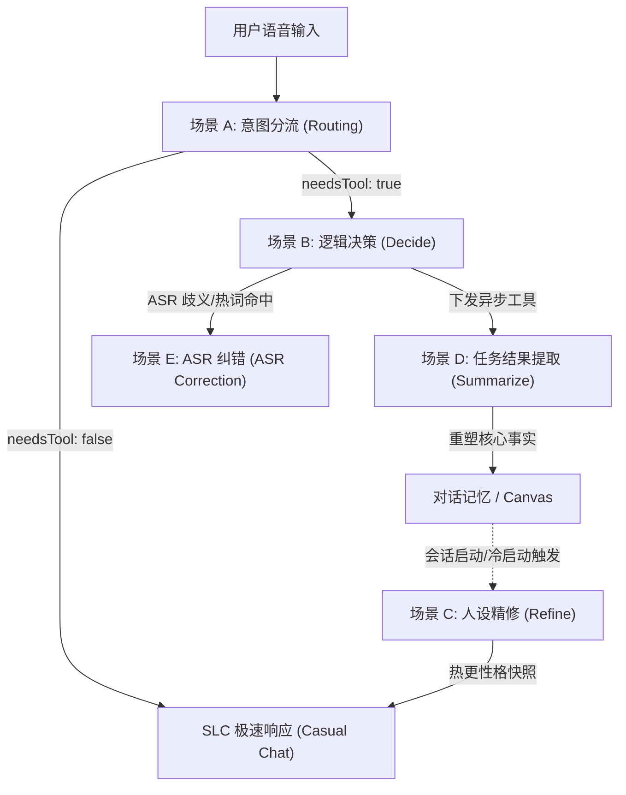

# V3.6 Layered Logic Context Architecture - Requirement Document

## 1. 需求背景 (Requirement Background)
在 Fast Agent V3.5 之前的版本中，SLE (Soul-Logic-Expert) 引擎采用了一种“一揽子” (Monolithic) 的提示词组装策略。每当 SLE 需要执行时，系统会生成一个庞大的 `fullSoul` 字符串，包含了从用户画像、长期记忆到实时画布状态、ASR 纠错协议、工具执行协议等所有信息。

### 1.1 现状缺陷 (Current Limitations)
1.  **上下文污染 (Context Pollution)**：在执行“分流器” (Intent Router) 任务时，LLM 会被迫接收到数千 Token 的协议规范和复杂的 ASR 纠错规则，这稀释了其在意图识别上的“注意力”。
2.  **性能瓶颈 (Performance Bottleneck)**：过大的 Context 导致 TTFT (首字延迟) 增加，且带来不必要的 API 成本支出。
3.  **开发耦合 (Code Coupling)**：目前不同组件（如 `IntentRouter`）需要通过手动字符串切割（如 `split('[核心画布实时状态]')`）来从 `fullSoul` 中提取信息，架构极不优雅。
4.  **幻觉风险 (Hallucinations)**：在非 ASR 场景（如单纯的任务提纯）下加载 ASR 纠错协议，可能导致 LLM 在回复中无端加入解释性废话或错误尝试纠错。

---

## 2. 架构设计 (Architecture Design)

V3.6 核心目标是将“全量灵魂”解耦为“按需 Payload”。通过引入 **任务感知型 Prompt 组装逻辑 (Task-Aware Prompt Assembly)**，让 SLE 在不同阶段扮演不同的专家角色。

### 2.2 组装策略变化 (Payload Distribution)
| 组件 | 旧模式 (V3.5) | 新模式 (V3.6) |
| :--- | :--- | :--- |
| **IntentRouter** | 接收全量 `fullSoul` 并手动切片 | 系统：[分流协议] / 用户：[技能摘要] + [基础环境] + [最近3轮历史] |
| **SLEEngine (Decide)** | 接收全量 `fullSoul` + 意图 Hint | 系统：[逻辑专家人设] + [全量协议] / 用户：[全量画布] + [当前任务引导] |
| **SLEEngine (Summarize)** | 复用 Decision 模式的庞大协议 | 系统：[提纯协议] / 用户：[画布任务输出结果] + [任务意图] |
| **SLEEngine (Refine)** | (V3.6 新增) 仅用于人设精修 | 系统：[精修协议] / 用户：[原始人设组] + [对话记忆快照] |

### 2.3 消息角色分配原则 (Message Role Assignment)
为了最大化模型性能并减少上下文干扰，V3.6 严格遵循以下角色分配准则：

1.  **System Role (稳定性容器)**:
    - 仅承载在本次通话或较长周期内**保持不变**的指令。
    - 包括：角色定义、操作协议 (Action/ASR)、工具的 Schema 定义、全局禁忌准则。
2.  **Context Role (即时状态注入 - 放在 User 消息中)**:
    - 承载**随互动实时漂移**的物理世界状态。
    - 包括：实时画布 (Canvas State)、运行环境 (时间/地理)、上层组件下发的临时指令 (Intent Hint)。
    - **逻辑依据**：将频繁变化的状态作为“外部输入”喂给模型，而不是作为“自我准则”载入系统。这有助于模型将“我是谁（规则）”与“我现在在哪（状态）”清晰区分，减少逻辑混淆。
3.  **History Role (Assistant/User 对话流)**:
    - 仅承载对话历史，确保语境连贯。
    - **组成形式**：由多组 `user` (用户语音) 与 `assistant` (AI 回复) 交替构成的消息数组。

### 2.4 场景驱动的消息组装与流转 (Dynamic Assembly & State Flow)

V3.6 不再预设一个庞大的固定 Payload，而是通过 `PromptAssembler` 建立一个**原子化指令库 (Atomic Pool)**。系统根据当前的“执行场景” (Scenario) 动态调配消息组成与流转关系。

#### 1. 逻辑触发与流转关系 (Flow Topology)



#### 2. 各场景角色构成表 (Detailed Role Distribution)

| 执行场景 | System (指令层: 规定我是谁) | User (注入层: 规定我现在在哪) | Assistant (历史/推理层: 规定我想了什么) |
| :--- | :--- | :--- | :--- |
| **A: 意图分流** | 路由逻辑 + 技能摘要 | 3 轮摘要 + 环境 + 即时语音 | (无) |
| **B: 逻辑决策** | 全量行动协议 + 详细工具库 | 实时画布快照 + **Intent Hint** + 即时语音 | 完整对话历史 + **[Shadow Thought 预占推理]** |
| **C: 人设精修** | 精修/压缩算法指令集 | [人设+记忆] 指令式聚合触发 | (无) |
| **D: 结果提取** | 结构化摘录规则手册 | [目标+数据] 指令式聚合触发 | (无) |
| **E: ASR 纠错** | 纠错规范与热词协议 | 基于[语音]与[背景]的纠错指令 | (无) |

#### 3. 核心继承链 (Context Linkage)
- **意图继承 (Intent Linkage)**：场景 A 捕捉到的微小意图（Intent Hint）指引场景 B 选择工具，并为场景 D 的提取提供“目标基准”。
- **事实继承 (Fact Linkage)**：场景 D 的输出通过 Canvas 同步，最终在场景 C 转化为 AI 的“心智变化”，完成从逻辑到感性的闭环。

---

## 3. 场景化拼装示例 (SLE Prompt Assembly Examples)

### 场景 A：意图路由 (ROUTING Phase)
*   **职责**：极速判定是否需要启动工具链。
*   **使用时机**：每次用户语音输入后
*   **消息序列布局**：
| 顺序 | 角色 | 内容组成 (Payload) |
| :--- | :--- | :--- |
| 1 | **system** | `INTENT_ROUTER_SYSTEM_PROMPT` (核心路由指令) + [可用技能摘要] |
| 2 | **user** | **注入上下文**：+ [基础环境 (时间/地点)] + [最近 3 轮对话摘要] |
| 3 | **user** | **实时触发**：用户的最新语音输入文本 |

**实际请求示例 (JSON Payload):**
```json
{
  "messages": [
    { "role": "system", "content": "INTENT_ROUTER_SYSTEM_PROMPT: 判定用户意图是否需要工具... 可用技能: [asr_correction, weather_query, timer]..." },
    { "role": "user", "content": "[Context] 时间: 2026-03-24 14:30; 摘要: 用户刚才询问了关于上海的天气情况。" },
    { "role": "user", "content": "那北京呢？" }
  ],
  "temperature": 0
}
```

---

### 场景 B：逻辑决策 (DECIDING Phase)
*   **职责**：作为核心逻辑大脑，精准输出 Tool Calls。
*   **使用时机**：意图路由判断需要使用工具；watchdog定时检查（未来）
*   **消息序列布局**：
| 顺序 | 角色 | 内容组成 (Payload) |
| :--- | :--- | :--- |
| 1 | **system** | `LOGIC_EXPERT_IDENTITY` + `SLE_ACTION_PROTOCOL` + `Full Tools Schema`（ASR纠错、openCLaw调用等） |
| 2 | **user** | **注入上下文**：[实时画布快照] + [Current Canvas Tasks Status] + [Intent Hint (来自路由器的建议)] |
| 3 | **history** | **对话回放**：前序 5-10 轮的 `user` / `assistant` 交替消息序列 |
| 4 | **user** | **实时触发**：用户的最新语音输入文本 |

**实际请求示例 (JSON Payload):**
```json
{
  "messages": [
    { "role": "system", "content": "LOGIC_EXPERT_IDENTITY: 你是高效逻辑大脑... ACTION_PROTOCOL: 仅输出 Tool Calls..." },
    { "role": "user", "content": "[Canvas Snapshot] { tasks: [], status: 'idle' }; [Intent Hint] 用户想查询北京天气。" },
    { "role": "user", "content": "帮我查下明天的天气" },
    { "role": "assistant", "content": "好的，我来帮你查询。" },
    { "role": "user", "content": "那北京呢？" },
    { "role": "assistant", "content": "thought: 用户在意图路由阶段已被识别为查询北京天气。当前画布无冲突。执行 weather_query 技能。 \ncall: weather_query(city='北京', date='tomorrow')" }
  ],
  "tools": [{ "type": "function", "function": { "name": "weather_query", "parameters": { ... } } }]
}
```

---

### 场景 C：人设精修 (REFINING Phase - Internal Trigger)
*   **职责**：将冗长的原始人设配置与长期记忆做高密度压缩，生成用于 SLC 极速交互的“性格快照”。
*   **消息序列布局**：
| 顺序 | 角色 | 内容组成 (Payload) |
| :--- | :--- | :--- |
| 1 | **system** | `PERSONA_SYNTHESIZER_PROMPT` |
| 2 | **user** | **指令注入**：基于 [原始人设配置] 与 [长期/短期记忆快照]，生成 SLC 性格快照。 |

**实际请求示例 (JSON Payload):**
```json
{
  "messages": [
    { "role": "system", "content": "PERSONA_SYNTHESIZER_PROMPT: 你负责将长人设文档压缩为 1000 字以内的性格快照..." },
    { "role": "user", "content": "指令注入：请基于以下资源生成快照。\n[人设组]: soul.md的内容...\n[记忆快照]: Rhett 喜欢冰美式，是一名架构师..." }
  ]
}
```

---

## 场景 D： 任务结果提取
*   **职责**：将异步工具输出的原始数据转化为人类可读的“事实摘要”。
*   **消息序列布局**：
| 顺序 | 角色 | 内容组成 (Payload) |
| :--- | :--- | :--- |
| 1 | **system** | `TASK_RESULT_SUMMARIZER_PROMPT` |
| 2 | **user** | **指令注入**：基于 [工具原始输出数据] 与 [任务目标回顾 (Intent Hint)]，提取核心事实摘要。 |

**实际请求示例 (JSON Payload):**
```json
{
  "messages": [
    { "role": "system", "content": "TASK_RESULT_SUMMARIZER_PROMPT: 将原始文本/JSON提取为人类可读的事实摘要..." },
    { "role": "user", "content": "指令注入：\n[任务意图]: 查询北京天气\n[原始输出]: { \"temp\": \"22C\", \"condition\": \"Sunny\", \"uv\": \"high\" }" }
  ]
}
```

---

## 场景 E：ASR纠错 (ASR Correction Phase)
*   **职责**：精准识别 ASR 错误并触发纠错工具。
*   **使用时机**：逻辑决策判断触发；watchdog定时触发
*   **消息序列布局**：
| 顺序 | 角色 | 内容组成 (Payload) |
| :--- | :--- | :--- |
| 1 | **system** | `SLE_ASR_CORRECTION_PROTOCOL` (核心纠错指令) |
| 2 | **user** | **判定指令**：基于 [用户最新语音识别文本]，结合最近对话 [最近 5 轮对话背景]，分析是否需要纠错并输出结果。 |

**实际请求示例 (JSON Payload):**
```json
{
  "messages": [
    { "role": "system", "content": "SLE_ASR_CORRECTION_PROTOCOL: 如果识别文本与背景矛盾，请输出纠错指令..." },
    { "role": "user", "content": "判定指令：基于“我要去上海的天起”，结合最近对话“我明天要去上海出差”，分析是否需要纠错。" }
  ]
}
```

---

## 4. 预期收益 (Expected Benefits)
1.  **准确性提升**：消除无关协议干扰后，工具调用的误触率预计降低 30%。
2.  **延迟优化**：路由阶段的 Prompt 大小缩减 70%，大幅提升首字返回速度。
3.  **高内聚低耦合**：`PromptAssembler` 成为唯一的 Payload 工厂，外部组件不再需要理解 `fullSoul` 的内部字符串结构。

---

