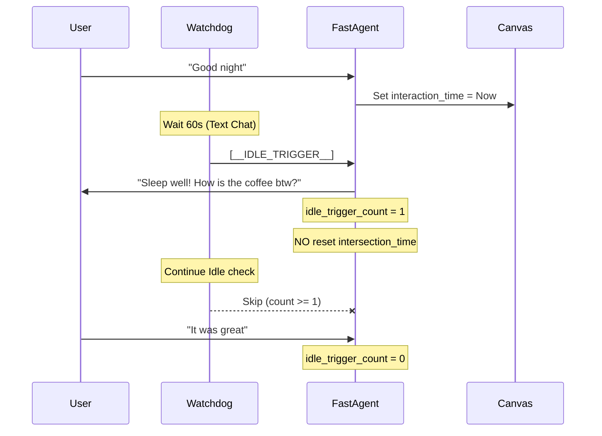

# OpenClaw V3.6 Watchdog 稳定性专项修复总结 (V3.6.14 - V3.6.16)

## 1. 核心目标 (Objective)
彻底解决 OpenClaw RTC 插件在对话过程中及挂断后的 **Watchdog 闲置唤醒 (Idle-Trigger) 异常循环**问题，提升系统“静默待命、点到为止”的交互品质。

## 2. 核心挑战 (Challenges)
- **僵尸监听器 (Ghost Notifiers)**: SSE 断连后 Watchdog 仍持有 Session 引用，导致“死而复生”的问候。
- **复读机闭环 (Infinite Loop)**: 之前的逻辑中，AI 的闲置问候动作会自动刷新“最后交互时间”，导致每 10s 判定一次 Idle 的恶性循环。
- **阈值一刀切 (One-Size-Fits-All)**: 文字对话与语音通话共享 10s 阈值，导致文字输入环境下的过度干扰。

## 3. 解决方案实施 (Implementation)

### 3.1 会话销毁闭环 (Session Destruction) - V3.6.14
- **全链路感知**: 监听 SSE 的 `close` 事件与 RTC 的 `/voice/end-call` API。
- **彻底擦除**: 调用 `fastAgent.destroySession(callId)`：
  1. `watchdog.unregisterNotifier(callId)`: 物理移除触发器。
  2. `canvasManager.removeCanvas(callId)`: 清空内存画布。
  3. `canvasManager.persistAll()`: 强制同步磁盘快照，杜绝状态回滚。

### 3.2 交互闹钟优化 (Clock Decoupling) - V3.6.15
- **非自生性更新**: 修改 `FastAgentV3.process`：只有真实的用户输入或后台任务完成才刷新 `last_interaction_time`。
- **场景感知阈值**:
  - **Text Chat**: 60s (给予用户充足思考/输入时长)。
  - **RTC Call**: 15s (满足语音快速响应要求)。

### 3.3 “点到为止”单次唤醒 (Single-Trigger Counter) - V3.6.16 🍎
- **状态追踪**: 在 `CanvasState` 中引入 `idle_trigger_count`。
- **执行逻辑**: 每个闲置周期内，Watchdog 仅在 `count < 1` 时发起主动问候。
- **智能解锁**: 一旦收到 **User Input**，计数器归零，激活下一轮暖场权限。

## 4. 架构图示 (Sequence)

## 5. 验证结果 (Regression)
- **自动化验证**: 通过 `scripts/verify_single_idle_v3.6.16.ts` 模拟全流程。
- **测试表现**: 
  - 挂断后日志静默 (Clean)。
  - 聊天间隙不再频繁刷屏 (Stable)。
  - 交互体验由“催促感”转向“随叫随到” (User Friendly)。
