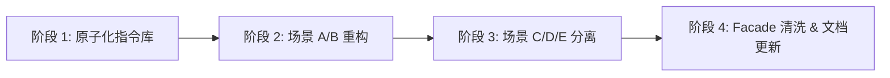

# V3.6 Layered Logic Context - 完整技术实施方案

> **版本**: V3.6.0
> **基线**: V3.5.x (当前 `src/agent` 代码)
> **核心目标**: 将"全量灵魂" (Monolithic `fullSoul`) 解耦为"按需 Payload" (Task-Aware Prompt Assembly)

---

## 0. 现状 Gap 分析

通过对照 V3.6 设计文档与当前代码，识别出以下核心差距：

### 0.1 当前架构病灶

| 病灶 | 当前代码 (V3.5) | V3.6 目标 |
| :--- | :--- | :--- |
| **SLE 一揽子 Prompt** | [sle.ts:46-53](file:///Users/rhettbot/scratch/openClaw-RTC-plugin/openclaw-voice-gateway/src/agent/sle.ts#L46-L53): `sleMessages = [{ role: 'system', content: fullSoul + SLE_ACTION_PROTOCOL + SLE_ASR_CORRECTION_PROTOCOL }]` —— 将所有协议无差别打包 | SLE 只在"场景 B: 逻辑决策"时携带全量协议; ASR纠错有独立场景 E |
| **IntentRouter 手动切片** | [intent-router.ts:37](file:///Users/rhettbot/scratch/openClaw-RTC-plugin/openclaw-voice-gateway/src/agent/intent-router.ts#L37): `fullSoul.split('[核心画布实时状态 (Canvas State)]')[1]` —— 用字符串 split 从 fullSoul 中"抠"数据 | 场景 A 由 PromptAssembler 独立组装，不接触 fullSoul |
| **PromptAssembler 只分 SLC/SLE 两档** | [prompt-assembler.ts:42](file:///Users/rhettbot/scratch/openClaw-RTC-plugin/openclaw-voice-gateway/src/agent/prompt-assembler.ts#L42): `assemblePrompt(type: 'SLC' \| 'SLE', ...)` —— 粗粒度二分法 | 五大场景 (A/B/C/D/E) 各自有独立的 Payload 组装方法 |
| **ResultSummarizer 消息角色错乱** | [result-summarizer.ts:53-58](file:///Users/rhettbot/scratch/openClaw-RTC-plugin/openclaw-voice-gateway/src/agent/result-summarizer.ts#L53-L58): `messages: [{ role: 'system', content: TASK_RESULT_SUMMARIZER_PROMPT(...) }]` —— Prompt+数据 全塞 system | 场景 D: system=纯协议, user=注入数据 |
| **Persona Refine 无独立场景** | [result-summarizer.ts:27-32](file:///Users/rhettbot/scratch/openClaw-RTC-plugin/openclaw-voice-gateway/src/agent/result-summarizer.ts#L27-L32): 同上 | 场景 C: 独立的 system/user 分离 |
| **fullSoul 全局拼接污染** | [fast-agent-v3.ts:227-240](file:///Users/rhettbot/scratch/openClaw-RTC-plugin/openclaw-voice-gateway/src/agent/fast-agent-v3.ts#L227-L240): fullSoul 由 PromptAssembler + Canvas 状态硬拼接, 所有消费者共享同一个 | 每个场景从 PromptAssembler 获取专用 Payload |

### 0.2 变更范围评估

| 文件 | 变更类型 | 复杂度 |
| :--- | :--- | :--- |
| `prompt-assembler.ts` | **重构核心** - 新增场景化组装方法 | 🔴 高 |
| `sle.ts` | **重构** - 消费场景 B 专用 Payload | 🟡 中 |
| `intent-router.ts` | **重构** - 消费场景 A 专用 Payload, 消除 split | 🟡 中 |
| `result-summarizer.ts` | **重构** - 场景 C/D 消息角色分离 | 🟡 中 |
| `fast-agent-v3.ts` | **适配** - 移除 fullSoul 拼接, 改为场景驱动调度 | 🟡 中 |
| `prompts.ts` | **扩充** - 新增场景 E 独立协议常量 | 🟢 低 |
| `types.ts` | **扩充** - 新增场景枚举类型 | 🟢 低 |

---

## 1. 分阶段实施路线



---

## 阶段 1：PromptAssembler 原子化指令库 (Atomic Pool)

### 1.1 目标
将 `PromptAssembler` 从粗粒度的 `SLC/SLE` 二分法，升级为面向五大场景的**原子化指令工厂**。引入 `SLEScenario` 类型枚举，新增场景化组装方法。

### 1.2 变更清单

**文件: `types.ts`** — 新增场景枚举
```typescript
/** V3.6 SLE 执行场景枚举 */
export type SLEScenario = 'ROUTING' | 'DECIDING' | 'REFINING' | 'SUMMARIZING' | 'ASR_CORRECTION';
```

**文件: `prompt-assembler.ts`** — 核心重构

保留现有 `assemblePrompt('SLC', ...)` 路径不变（SLC 不受 V3.6 影响），新增以下方法：

```typescript
/**
 * [V3.6.0] 场景化 SLE Payload 工厂
 * 根据场景按需组装 messages 数组，遵循 System/User/History 三级角色分配
 */
async assembleSLEPayload(
    scenario: SLEScenario,
    callId: string,
    params: {
        text?: string;            // 用户最新语音
        intentHint?: string;      // 路由器意图提示
        canvasSnapshot?: string;  // 画布实时快照
        dialogueHistory?: any[];  // 对话历史消息
        taskOutput?: string;      // 工具原始输出 (场景 D)
        taskIntent?: string;      // 任务意图回顾 (场景 D)
        fullPersonaContext?: string; // 全量人设上下文 (场景 C)
    }
): Promise<Array<{ role: string; content: string }>>
```

内部逻辑按场景分发：
- **ROUTING**: system=[路由协议+技能摘要], user=[3轮摘要+环境], user=[即时语音]
- **DECIDING**: system=[逻辑专家身份+全量行动协议], user=[画布快照+IntentHint], history=[对话历史], user=[即时语音]
- **REFINING**: system=[人设精修协议], user=[原始人设+记忆快照]
- **SUMMARIZING**: system=[提纯规则手册], user=[任务意图+原始输出]
- **ASR_CORRECTION**: system=[纠错协议], user=[语音文本+对话背景]

### 1.3 单元测试验证
创建 `verify_v3.6_phase1.ts`:
- ✅ `assembleSLEPayload('ROUTING', ...)` 返回 messages 中 **不包含** `SLE_ACTION_PROTOCOL`
- ✅ `assembleSLEPayload('DECIDING', ...)` 返回 messages 中 **包含** `LOGIC_EXPERT_IDENTITY`
- ✅ `assembleSLEPayload('SUMMARIZING', ...)` 返回 messages 中 system **不包含** 任何 ASR 纠错内容
- ✅ `assembleSLEPayload('ASR_CORRECTION', ...)` 返回 messages 中 system **不包含** `SLE_ACTION_PROTOCOL`
- ✅ 所有场景前 messages 顺序符合 V3.6 角色构成表
- ✅ 旧接口 `assemblePrompt('SLC', ...)` **行为不变** (零回归)

---

## 阶段 2：场景 A (意图路由) 与 场景 B (逻辑决策) 重构

### 2.1 目标
- `IntentRouter` 彻底消除 `fullSoul.split(...)` 手动切片，改为消费 `assembleSLEPayload('ROUTING', ...)`
- `SLEEngine` 消费 `assembleSLEPayload('DECIDING', ...)`，不再接收 `fullSoul` 字符串

### 2.2 变更清单

**文件: `intent-router.ts`** — 场景 A 改造

当前签名：
```typescript
async detectIntent(text: string, messages: any[], fullSoul: string): Promise<{ needsTool: boolean; intent?: string }>
```

改为：
```typescript
async detectIntent(text: string, messages: any[], promptAssembler: PromptAssembler, callId: string): Promise<{ needsTool: boolean; intent?: string }>
```

内部实现：
```typescript
// ❌ 删除: fullSoul.split('[核心画布实时状态 (Canvas State)]')[1]
// ✅ 新增:
const routingMessages = await promptAssembler.assembleSLEPayload('ROUTING', callId, {
    text,
    dialogueHistory: messages.slice(-3)
});
const response = await this.openai.chat.completions.create({
    model: sleModel,
    messages: routingMessages as any,
    response_format: { type: 'json_object' },
    max_tokens: 50,
    temperature: 0
});
```

**文件: `sle.ts`** — 场景 B 改造

当前签名：
```typescript
async run(messages: any[], text: string, intentHint: string, fullSoul: string, callId: string, ...): Promise<...>
```

改为：
```typescript
async run(messages: any[], text: string, intentHint: string, promptAssembler: PromptAssembler, callId: string, canvasSnapshot: string, ...): Promise<...>
```

内部实现：
```typescript
// ❌ 删除: sleMessages = [{ role: 'system', content: fullSoul + SLE_ACTION_PROTOCOL + SLE_ASR_CORRECTION_PROTOCOL }]
// ✅ 新增:
const decidingMessages = await promptAssembler.assembleSLEPayload('DECIDING', callId, {
    text,
    intentHint,
    canvasSnapshot,
    dialogueHistory: messages.slice(0, -1)
});
// decidingMessages 已包含正确的 system/user/history/user 四层结构
```

> [!IMPORTANT]
> 注意：`SLE_ASR_CORRECTION_PROTOCOL` **不再**注入到场景 B 中。ASR 纠错在场景 E 中独立处理。但 `correct_asr_hotword` 工具的 Schema 仍然在 tools 列表中保留。

**文件: `fast-agent-v3.ts`** — Facade 适配

核心变更点（概念性）：
- 删除 L227-L240 的 `fullSoul` 拼接 IIFE
- `detectIntent()` 和 `sle.run()` 改为传递 `this.promptAssembler` 和场景所需的原子化参数
- Canvas 快照改为独立变量：`const canvasSnapshot = JSON.stringify({ env: canvas.env, task_status: canvas.task_status })`

### 2.3 单元测试验证
创建 `verify_v3.6_phase2.ts`:
- ✅ `IntentRouter.detectIntent()` 不再接收 `fullSoul` 参数
- ✅ 路由请求的 messages 中 **不包含** `SLE_ACTION_PROTOCOL` / `SLE_ASR_CORRECTION_PROTOCOL`
- ✅ `SLEEngine.run()` 的 system 消息中 **不包含** ASR 纠错协议
- ✅ `SLEEngine.run()` 的 system 消息中 **包含** `LOGIC_EXPERT_IDENTITY` + `SLE_ACTION_PROTOCOL`
- ✅ 构造一个 mock 对话场景，验证端到端 Routing → Deciding 链路不报错
- ✅ `npx tsc --noEmit` 编译通过

---

## 阶段 3：场景 C (人设精修) / D (结果提取) / E (ASR 纠错) 分离

### 3.1 目标
将 `ResultSummarizer` 中的两个方法 (`summarizePersona`, `summarizeTaskResult`) 改为消费 `assembleSLEPayload` 的标准化消息格式。新增 ASR 纠错独立场景。

### 3.2 变更清单

**文件: `result-summarizer.ts`** — 场景 C/D 改造

```typescript
// 场景 C: 人设精修
async summarizePersona(promptAssembler: PromptAssembler, callId: string, fullContext: string): Promise<string> {
    const messages = await promptAssembler.assembleSLEPayload('REFINING', callId, {
        fullPersonaContext: fullContext
    });
    // ❌ 删除: messages: [{ role: 'system', content: PERSONA_SYNTHESIZER_PROMPT }, { role: 'user', content: fullContext }]
    // ✅ assembleSLEPayload 已按 V3.6 规范组装好 system/user 分离的 messages
    const response = await this.openai.chat.completions.create({ model: sleModel, messages: messages as any, ... });
    ...
}

// 场景 D: 结果提取
async summarizeTaskResult(promptAssembler: PromptAssembler, callId: string, rawOutput: string, intent: string): Promise<...> {
    const messages = await promptAssembler.assembleSLEPayload('SUMMARIZING', callId, {
        taskOutput: rawOutput,
        taskIntent: intent
    });
    // ❌ 删除: messages: [{ role: 'system', content: TASK_RESULT_SUMMARIZER_PROMPT(intent, output) }]
    // ✅ system = 纯提纯协议; user = [任务意图 + 原始输出]
    ...
}
```

**文件: `prompts.ts`** — 拆分 TASK_RESULT_SUMMARIZER_PROMPT

当前 `TASK_RESULT_SUMMARIZER_PROMPT(intent, output)` 将数据混入 system 指令。
V3.6 需拆分为：
- `TASK_RESULT_SUMMARIZER_SYSTEM` — 纯协议 (system role)
- 数据注入由 `assembleSLEPayload('SUMMARIZING', ...)` 将 intent+output 放入 user role

**文件: `sle.ts` 或新增 `asr-correction-engine.ts`** — 场景 E: ASR 纠错独立

当前 ASR 纠错协议混在 SLE 的 system prompt 中。V3.6 要求：
- 当 SLE 检测到 ASR 工具调用后，单独发起场景 E 的 LLM 请求
- 或者，保留现有 `correct_asr_hotword` 工具调用机制，但 **纠错协议不再注入 DECIDING 场景**

> [!TIP]
> 推荐方案：保持现有 tools 机制不变，ASR 纠错仍通过 LLM 原生的 tool_calls 触发。V3.6 的改进点仅在于**不再将 ASR 协议塞入场景 B 的 system 中**，减少无关上下文对工具选择的干扰。场景 E 的独立 LLM 调用预留为 V3.7 的增强点。

### 3.3 单元测试验证
创建 `verify_v3.6_phase3.ts`:
- ✅ `summarizePersona()` 发送的 messages 符合 V3.6 场景 C 格式: `{ system: 协议, user: 人设+记忆 }`
- ✅ `summarizeTaskResult()` 发送的 messages 中 system **不包含** 任何业务数据（intent/output）
- ✅ `SLEEngine.run()` 的 system 消息中 **不包含** `SLE_ASR_CORRECTION_PROTOCOL`（场景 B 去 ASR 化）
- ✅ 旧得 `TASK_RESULT_SUMMARIZER_PROMPT(intent, output)` 函数可安全删除或标记 deprecated
- ✅ `npx tsc --noEmit` 编译通过

---

## 阶段 4：Facade 清洗、零回归验证 & 文档更新

### 4.1 目标
- 彻底移除 `fast-agent-v3.ts` 中的 `fullSoul` 概念
- 全链路端到端回归测试
- 更新 `overview.md` 反映 V3.6 架构变更

### 4.2 变更清单

**文件: `fast-agent-v3.ts`** — 最终清洗

1. 删除 L227-L240 的 `fullSoul` IIFE 
2. 重构 `process()` 方法：
   - 路由阶段调用 `intentRouter.detectIntent(text, messages, this.promptAssembler, callId)`
   - 决策阶段调用 `sle.run(messages, text, intentHint, this.promptAssembler, callId, canvasSnapshot, ...)`
   - 人设刷新调用 `resultSummarizer.summarizePersona(this.promptAssembler, callId, fullContext)`
3. 确保 `promptAssembler` 从构造函数传递给所有消费者（或特定场景调用时传入）

**文件: `prompt-assembler.ts`** — 清理遗留方法

- `getContextPrompts()` 方法标记为 `@deprecated`（如果仍有外部引用保留兼容）
- 或完全移除，因其职责已被 `assembleSLEPayload` 取代

**文件: `overview.md`** — 架构文档更新

在架构图 §3 中新增 V3.6 说明：
- PromptAssembler 从"SLC/SLE 二分法"升级为"五大场景原子化工厂"
- 新增 `SLEScenario` 类型说明
- 更新数据流图

### 4.3 回归测试矩阵
创建 `verify_v3.6_final.ts`:
- ✅ 模拟完整用户对话周期：user 输入 → 路由判定 → SLE 决策 → 工具执行 → 结果提取 → SLC 播报
- ✅ 模拟 ASR 纠错触发：验证纠错词通过 tool_calls 正确下发
- ✅ 模拟人设精修触发：验证 `REFINING` 场景 messages 格式正确
- ✅ 验证 `fullSoul` 变量在整个代码库中不再存在 (`grep` 验证)
- ✅ `npx tsc --noEmit` 编译通过
- ✅ 更新后的 `overview.md` 包含 V3.6 架构说明

---

## 2. 各阶段 Coding Agent 提示词

### 阶段 1 Agent 提示词

```
## 项目背景
你正在开发 OpenClaw RTC 插件的 V3.6 版本 —— "层级化逻辑上下文架构" (Layered Logic Context)。
该项目是一个基于 ZEGO RTC 的实时语音交互网关，核心代码在 openclaw-voice-gateway/src/agent/ 目录下。

V3.6 的核心目标：将 SLE 引擎的"一揽子 Prompt" 解耦为"按需 Payload"。
目前 PromptAssembler 只有粗粒度的 SLC/SLE 两种模式，需要升级为支持 5 种场景的原子化工厂。

## 必读参考文档/代码
1. **V3.6 设计文档** (必读): `openclaw-voice-gateway/doc/design/3.6/v3.6-layered-logic-context.md`
   - 重点关注 §2.3 消息角色分配原则、§2.4 场景驱动组装、§3 各场景拼装示例
2. **当前 PromptAssembler**: `openclaw-voice-gateway/src/agent/prompt-assembler.ts`
   - 理解现有 assemblePrompt('SLC' | 'SLE', ...) 和 getContextPrompts() 的工作方式
3. **当前 prompts.ts**: `openclaw-voice-gateway/src/agent/prompts.ts`
   - 理解所有现有的 Prompt 常量定义
4. **类型定义**: `openclaw-voice-gateway/src/agent/types.ts`
5. **overview.md**: 根目录的 overview.md，理解整体架构约束（单文件≤150行, Prompt 必须在 prompts.ts）

## 开发计划

### 步骤 1: 扩充类型定义
在 `types.ts` 中新增：
```typescript
export type SLEScenario = 'ROUTING' | 'DECIDING' | 'REFINING' | 'SUMMARIZING' | 'ASR_CORRECTION';
```

### 步骤 2: 在 prompts.ts 中拆分 TASK_RESULT_SUMMARIZER_PROMPT
将现有的 `TASK_RESULT_SUMMARIZER_PROMPT(intent, output)` 函数拆分为：
- `TASK_RESULT_SUMMARIZER_SYSTEM`: 纯协议常量（不含业务数据），作为 system 角色使用
- 保留原有函数但标记 @deprecated，保证编译兼容

### 步骤 3: 在 PromptAssembler 中新增 assembleSLEPayload 方法
新增方法签名如下：
```typescript
async assembleSLEPayload(
    scenario: SLEScenario,
    callId: string,
    params: {
        text?: string;
        intentHint?: string;
        canvasSnapshot?: string;
        dialogueHistory?: any[];
        taskOutput?: string;
        taskIntent?: string;
        fullPersonaContext?: string;
    }
): Promise<Array<{ role: string; content: string }>>
```

按照 V3.6 设计文档 §2.4 和 §3 的场景构成表实现五个场景的消息组装：

**场景 A (ROUTING)**:
- messages[0]: { role: 'system', content: INTENT_ROUTER_SYSTEM_PROMPT(skillsSummary) }
- messages[1]: { role: 'user', content: [Context] 时间 + 3轮摘要 }
- messages[2]: { role: 'user', content: params.text }

**场景 B (DECIDING)**:
- messages[0]: { role: 'system', content: LOGIC_EXPERT_IDENTITY + SLE_ACTION_PROTOCOL + Full Tools Schema 说明 }
- messages[1]: { role: 'user', content: [Canvas Snapshot] + [Intent Hint] }
- messages[2..N-1]: 对话历史 (params.dialogueHistory)
- messages[N]: { role: 'user', content: params.text }

**场景 C (REFINING)**:
- messages[0]: { role: 'system', content: PERSONA_SYNTHESIZER_PROMPT }
- messages[1]: { role: 'user', content: params.fullPersonaContext }

**场景 D (SUMMARIZING)**:
- messages[0]: { role: 'system', content: TASK_RESULT_SUMMARIZER_SYSTEM }
- messages[1]: { role: 'user', content: 注入任务意图和原始输出 }

**场景 E (ASR_CORRECTION)**:
- messages[0]: { role: 'system', content: SLE_ASR_CORRECTION_PROTOCOL }
- messages[1]: { role: 'user', content: 纠错判定指令 + 用户语音 + 近5轮背景 }

注意事项：
- 保留现有 assemblePrompt('SLC', ...) 完全不变
- 保留现有 assemblePrompt('SLE', ...) 暂不修改（阶段 2 再替换消费者）
- 新方法需要复用 ensureCache() 获取已缓存的文件内容
- 环境信息（时间等）复用现有的时间格式化逻辑
- 获取对话历史摘要复用 this.dialogueMemory 的方法

### 步骤 4: 单元测试
创建 `openclaw-voice-gateway/verify_v3.6_phase1.ts`:
- 构造 mock 的 PromptAssembler（mock workspaceRoot 和 dialogueMemory）
- 分别调用 5 个场景，验证每个场景返回的 messages 数组：
  1. 角色分配正确（system/user/assistant）
  2. 场景间 Prompt 不交叉污染（如 ROUTING 不含 ACTION_PROTOCOL）
  3. 旧接口 assemblePrompt('SLC', ...) 行为不变
- **强制闭环**：脚本末尾必须调用 `process.exit(0)`

运行命令验证：
```bash
npx tsc --noEmit
npx tsx verify_v3.6_phase1.ts
```
```

---

### 阶段 2 Agent 提示词

```
## 项目背景
你正在开发 OpenClaw RTC 插件的 V3.6 版本 —— "层级化逻辑上下文架构"。
本阶段是 V3.6 的第二阶段，聚焦于将 IntentRouter (场景 A) 和 SLEEngine (场景 B) 改为消费阶段 1 构建的 assembleSLEPayload 方法。

**前置工作已完成**：PromptAssembler 已新增 assembleSLEPayload(scenario, callId, params) 方法，支持 ROUTING/DECIDING 等场景的独立消息组装。

## 必读参考文档/代码
1. **V3.6 设计文档**: `openclaw-voice-gateway/doc/design/3.6/v3.6-layered-logic-context.md`
   - 重点关注 §3 场景 A 和 场景 B 的实际请求示例
2. **核心修改文件**:
   - `openclaw-voice-gateway/src/agent/intent-router.ts` — 场景 A 消费者
   - `openclaw-voice-gateway/src/agent/sle.ts` — 场景 B 消费者
   - `openclaw-voice-gateway/src/agent/fast-agent-v3.ts` — Facade 适配
   - `openclaw-voice-gateway/src/agent/prompt-assembler.ts` — 阶段 1 已完成的新方法
3. **类型定义**: `openclaw-voice-gateway/src/agent/types.ts`
4. **overview.md**: 理解单文件≤150行等约束

## 开发计划

### 步骤 1: 重构 IntentRouter.detectIntent (场景 A)

当前签名：
```typescript
async detectIntent(text: string, messages: any[], fullSoul: string): Promise<{ needsTool: boolean; intent?: string }>
```

改为：
```typescript
async detectIntent(text: string, messages: any[], promptAssembler: PromptAssembler, callId: string): Promise<{ needsTool: boolean; intent?: string }>
```

核心变更：
- 构造函数中需要确保 IntentRouter 不再需要 fullSoul
- 删除 `fullSoul.split('[核心画布实时状态 (Canvas State)]')[1]` 这行手动切片代码
- 改为调用 `promptAssembler.assembleSLEPayload('ROUTING', callId, { text, dialogueHistory: messages.slice(-3) })`
- 将返回的 messages 直接传入 OpenAI API

### 步骤 2: 重构 SLEEngine.run (场景 B)

当前签名：
```typescript
async run(messages: any[], text: string, intentHint: string, fullSoul: string, callId: string, ...): Promise<...>
```

改为：
```typescript
async run(messages: any[], text: string, intentHint: string, promptAssembler: PromptAssembler, callId: string, canvasSnapshot: string, ...): Promise<...>
```

核心变更：
- 删除 L46-L53 的 sleMessages 拼接（全量 fullSoul + ACTION + ASR 协议）
- 改为调用 `promptAssembler.assembleSLEPayload('DECIDING', callId, { text, intentHint, canvasSnapshot, dialogueHistory: messages.slice(0, -1) })`
- **关键**: 删除 L59-L64 的潜意识指令注入逻辑 —— 该逻辑已移入 assembleSLEPayload 的 DECIDING 场景中（由 intentHint 参数注入 user 消息）
  - 不对！如果 intentHint 是通过 user 消息注入（作为 Canvas Snapshot 的一部分），则 SLEEngine 中不需要再额外 push system 消息。
- 工具列表 (SkillRegistry.getAllSchemas()) 和 parallel_tool_calls 逻辑保持不变
- 流式处理逻辑保持不变

### 步骤 3: 适配 FastAgentV3.process (Facade)

核心变更（在 fast-agent-v3.ts 中）：

1. **删除 fullSoul IIFE**（L227-L240）。替换为：
   ```typescript
   // 准备 Canvas 快照（独立变量，不再拼接到 fullSoul 中）
   const canvasSnapshot = JSON.stringify({
       env: canvas.env,
       task_status: canvas.task_status,
       last_spoken_fragment: canvas.context.last_spoken_fragment || '无'
   });
   ```

2. **路由调用改造**（L247）：
   ```typescript
   // ❌ 旧: const detection = await this.intentRouter.detectIntent(text, managedMessages, fullSoul);
   // ✅ 新:
   const detection = await this.intentRouter.detectIntent(text, managedMessages, this.promptAssembler, callId);
   ```

3. **SLE 调用改造**（所有 this.sle.run 调用点）：
   ```typescript
   // ❌ 旧: this.sle.run(managedMessages, text, intentHint, fullSoul, callId, ...)
   // ✅ 新:
   this.sle.run(managedMessages, text, intentHint, this.promptAssembler, callId, canvasSnapshot, ...)
   ```
   注意 fast-agent-v3.ts 中有 3 处 sle.run 调用（L268, L315, L358），都需要改。

4. **保留 Shadow State 更新和对话记录逻辑不变**。

### 步骤 4: 单元测试
创建 `openclaw-voice-gateway/verify_v3.6_phase2.ts`:
- Mock OpenAI API（LLM 返回固定的 JSON 或 tool_calls）
- 验证 IntentRouter.detectIntent 不再需要 fullSoul 参数
- 验证 SLEEngine.run 不再需要 fullSoul 参数
- 验证 Routing 场景发送的 messages 不含 SLE_ACTION_PROTOCOL
- 验证 Deciding 场景发送的 messages 不含 SLE_ASR_CORRECTION_PROTOCOL
- 验证 `npx tsc --noEmit` 编译通过
- **强制闭环**：脚本末尾必须调用 `process.exit(0)`

运行命令验证：
```bash
npx tsc --noEmit
npx tsx verify_v3.6_phase2.ts
```
```

---

### 阶段 3 Agent 提示词

```
## 项目背景
你正在开发 OpenClaw RTC 插件的 V3.6 版本 —— "层级化逻辑上下文架构"。
本阶段是 V3.6 的第三阶段，聚焦于将 ResultSummarizer（场景 C 人设精修 / 场景 D 结果提取）和 ASR 纠错（场景 E）改为消费标准化的 assembleSLEPayload。

**前置工作已完成**：
- 阶段 1: PromptAssembler 已新增 assembleSLEPayload 支持 5 种场景
- 阶段 2: IntentRouter 和 SLEEngine 已改为消费 ROUTING/DECIDING 场景 Payload

## 必读参考文档/代码
1. **V3.6 设计文档**: `openclaw-voice-gateway/doc/design/3.6/v3.6-layered-logic-context.md`
   - 重点关注 §3 场景 C、场景 D、场景 E 的拼装示例
2. **核心修改文件**:
   - `openclaw-voice-gateway/src/agent/result-summarizer.ts` — 场景 C 和 D 消费者
   - `openclaw-voice-gateway/src/agent/prompts.ts` — TASK_RESULT_SUMMARIZER_SYSTEM 常量
   - `openclaw-voice-gateway/src/agent/fast-agent-v3.ts` — refreshCompactPersona 适配
   - `openclaw-voice-gateway/src/agent/tool-result-handler.ts` — summarizeTaskResult 调用适配
   - `openclaw-voice-gateway/src/agent/prompt-assembler.ts` — 理解 assembleSLEPayload 的参数

## 开发计划

### 步骤 1: 确认 prompts.ts 中的 TASK_RESULT_SUMMARIZER_SYSTEM 已存在
阶段 1 应已从 TASK_RESULT_SUMMARIZER_PROMPT 中拆出纯协议部分。确认该常量存在。
如未完成，在 prompts.ts 中新增：
```typescript
export const TASK_RESULT_SUMMARIZER_SYSTEM = `# 角色
你是一个精准的信息提炼专家...
（仅保留协议部分，不含 ${intent} / ${output} 插值）`;
```

### 步骤 2: 重构 ResultSummarizer.summarizePersona (场景 C)

当前签名：
```typescript
async summarizePersona(fullContext: string): Promise<string>
```

改为：
```typescript
async summarizePersona(promptAssembler: PromptAssembler, callId: string, fullContext: string): Promise<string>
```

内部改造：
```typescript
const messages = await promptAssembler.assembleSLEPayload('REFINING', callId, {
    fullPersonaContext: fullContext
});
const response = await this.openai.chat.completions.create({
    model: sleModel,
    messages: messages as any,
    max_tokens: 1500,
    temperature: 0.3
});
```

### 步骤 3: 重构 ResultSummarizer.summarizeTaskResult (场景 D)

当前签名：
```typescript
async summarizeTaskResult(rawOutput: string, intent: string): Promise<{ direct_response: string; extended_context: string }>
```

改为：
```typescript
async summarizeTaskResult(promptAssembler: PromptAssembler, callId: string, rawOutput: string, intent: string): Promise<{ direct_response: string; extended_context: string }>
```

内部改造：
```typescript
const messages = await promptAssembler.assembleSLEPayload('SUMMARIZING', callId, {
    taskOutput: safeOutput.substring(0, 3000),
    taskIntent: safeIntent
});
const resp = await this.openai.chat.completions.create({
    model: this.config.fastAgent?.sleModel || this.config.llm.model,
    messages: messages as any,
    response_format: { type: 'json_object' },
    temperature: 0.1,
    max_tokens: 500
});
```

### 步骤 4: 适配 FastAgentV3.refreshCompactPersona
将 `this.resultSummarizer.summarizePersona(fullContext)` 调用改为：
```typescript
this.resultSummarizer.summarizePersona(this.promptAssembler, callId, fullContext)
```

### 步骤 5: 适配 ToolResultHandler 中的 summarizeTaskResult 调用
ToolResultHandler 目前调用：
```typescript
const summaryResponse = await this.summarizer.summarizeTaskResult(rawResult, intent);
```
需要确保 ToolResultHandler 能访问 promptAssembler 和 callId。
方案：在 ToolResultHandler 构造函数中注入 promptAssembler：
```typescript
constructor(
    private executor: DelegateExecutor,
    private summarizer: ResultSummarizer,
    private workspaceRoot: string,
    private callManager?: CallManager,
    private promptAssembler?: PromptAssembler  // V3.6 新增
)
```
调用改为：
```typescript
const summaryResponse = await this.summarizer.summarizeTaskResult(this.promptAssembler!, callId, rawResult, intent);
```

### 步骤 6: ASR 纠错场景 E 确认
确认 SLEEngine 的 DECIDING 场景（阶段 2 已完成）不再包含 SLE_ASR_CORRECTION_PROTOCOL。
ASR 纠错仍通过 LLM 原生 tool_calls 机制触发（correct_asr_hotword 工具保留在 tools schema 中），
场景 E 的独立 LLM 调用预留为将来版本的增强点，本阶段无需额外开发。

### 步骤 7: 单元测试
创建 `openclaw-voice-gateway/verify_v3.6_phase3.ts`:
- Mock OpenAI API
- 验证 summarizePersona 发送的 messages 格式符合 V3.6 场景 C (system=协议, user=人设+记忆)
- 验证 summarizeTaskResult 发送的 messages 格式符合 V3.6 场景 D (system=纯协议无数据, user=intent+output)
- 验证 ToolResultHandler 能正确传递 promptAssembler
- 验证 `npx tsc --noEmit` 编译通过
- **强制闭环**：脚本末尾必须调用 `process.exit(0)`

运行命令验证：
```bash
npx tsc --noEmit
npx tsx verify_v3.6_phase3.ts
```
```

---

### 阶段 4 Agent 提示词

```
## 项目背景
你正在开发 OpenClaw RTC 插件的 V3.6 版本 —— "层级化逻辑上下文架构"。
本阶段是 V3.6 的最终阶段，负责 Facade 清洗、全链路零回归验证和文档更新。

**前置工作已完成**：
- 阶段 1: PromptAssembler 已新增 assembleSLEPayload 支持 5 种场景
- 阶段 2: IntentRouter 和 SLEEngine 已改为消费 ROUTING/DECIDING Payload
- 阶段 3: ResultSummarizer 已改为消费 REFINING/SUMMARIZING Payload

## 必读参考文档/代码
1. **V3.6 设计文档**: `openclaw-voice-gateway/doc/design/3.6/v3.6-layered-logic-context.md`
2. **全部 agent 目录代码**: `openclaw-voice-gateway/src/agent/` 下的所有文件
3. **overview.md**: 根目录的 overview.md

## 开发计划

### 步骤 1: 全量 fullSoul 审计
运行以下命令确认 fullSoul 相关代码已全部清除：
```bash
grep -rn "fullSoul" openclaw-voice-gateway/src/
```
如果发现残留引用，逐一清除。

### 步骤 2: 清理 PromptAssembler 遗留方法
- 检查 `getContextPrompts()` 方法是否仍有外部调用
  - 如果 `refreshCompactPersona` 中仍在使用，保留但标记 `@deprecated`（此方法用于获取全量原始上下文给场景 C，与 assembleSLEPayload 是互补关系）
  - 如果完全无引用，删除
- 检查旧的 `assemblePrompt('SLE', ...)` 分支是否仍有调用
  - 理想情况：SLE 分支已无消费者，可删除 `else` 分支代码
  - 保留 `assemblePrompt('SLC', ...)` 不变

### 步骤 3: 代码质量检查
- 确认所有文件行数符合约束：逻辑模块 ≤ 150 行, Facade ≤ 260 行
- 如果 prompt-assembler.ts 因新增方法超出行数限制，考虑将场景逻辑拆分为 helper 函数
- 运行 `npx tsc --noEmit` 确认编译通过

### 步骤 4: 全链路回归测试
创建 `openclaw-voice-gateway/verify_v3.6_final.ts`:

**测试 1: 场景隔离性验证**
- 构造 PromptAssembler，分别调用 5 个场景
- 断言每个场景的 messages 不包含其他场景的 Prompt（交叉污染检测）

**测试 2: Facade 链路模拟**
- Mock OpenAI API
- 模拟一次完整的 process() 调用（用户输入 → 路由 → 决策 → 结果提取）
- 验证无 fullSoul 概念残留
- 验证所有 LLM 请求的 messages 格式符合 V3.6 规范

**测试 3: ASR 去污验证**
- 验证 DECIDING 场景的 system 消息中不含 SLE_ASR_CORRECTION_PROTOCOL
- 验证 correct_asr_hotword 工具仍然在 tools schema 中

**测试 4: grep 审计**
- 在测试脚本中运行 grep 检查，确认 `fullSoul` 在 src/ 目录下无残留出现

**强制闭环**：脚本末尾必须调用 `process.exit(0)`

运行命令验证：
```bash
npx tsc --noEmit
npx tsx verify_v3.6_final.ts
```

### 步骤 5: 更新 overview.md
在项目根目录的 overview.md 中进行以下更新：

1. 在 §3 核心架构部分新增 V3.6 说明：
   ```
   3. **Core Infrastructure**:
       *   **PromptAssembler**: ~~带有层级缓存的指令组装器~~ → 
           V3.6 升级为**场景化原子指令工厂 (Scenario-Driven Atomic Factory)**，
           通过 `assembleSLEPayload(scenario)` 方法为 5 大执行场景 (ROUTING/DECIDING/REFINING/SUMMARIZING/ASR_CORRECTION) 
           按需组装专用 Payload，消除 fullSoul 全局拼接导致的上下文污染。
   ```

2. 新增架构约束到 §5 开发约束：
   ```
   4. **消息分层**: 遵循 V3.6 System/User/History 三级角色分配原则。System 仅承载稳定指令，User 承载即时状态注入。
   5. **场景隔离**: 严禁在 ROUTING 场景中注入 ACTION_PROTOCOL 或 ASR 纠错协议。
   ```
```

---

## 3. 风险与注意事项

> [!WARNING]
> **编译兼容性**：阶段 2 修改了 `detectIntent` 和 `sle.run` 的函数签名，必须同步更新 `fast-agent-v3.ts` 中的所有调用点（3 处 `sle.run`，1 处 `detectIntent`），否则 TypeScript 会编译失败。

> [!CAUTION]
> **prompt-assembler.ts 行数控制**：新增 5 个场景的组装逻辑后，文件可能超过 150 行限制。阶段 1 实施时需注意将每个场景的组装逻辑控制在精简范围内，或考虑使用 helper 函数映射表。

> [!NOTE]
> **ASR 纠错策略决策**：V3.6 设计文档定义了独立的场景 E (ASR Correction)。但当前 ASR 纠错已通过 LLM 原生 tool_calls 机制工作良好。本方案选择**最小化改动路线**：仅从 DECIDING 场景中移除 ASR 协议，保留 tool_calls 机制。完整的场景 E 独立 LLM 调用预留为 V3.7 增强点。
