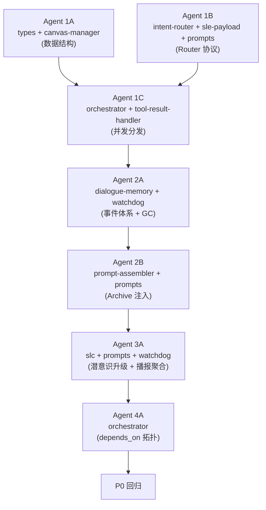

# V3.7 Multi-tasking 实施计划 (Implementation Plan) [Status: IMPLEMENTED]

> **设计文档**: [3.7-multitask.md](file:///Users/rhettbot/scratch/openClaw-RTC-plugin/openclaw-voice-gateway/doc/design/3.7/3.7-multitask.md)
> **当前基线**: V3.6.x（单任务画布 + 标量 Router）

---

## 整体分解策略



| Agent | Phase | 核心文件 | 可并行 | 前置依赖 |
| :--- | :--- | :--- | :--- | :--- |
| **1A** | Phase 1 | `types.ts`, `canvas-manager.ts`, `canvas-storage.ts` | ✅ 可与 1B 并行 | 无 |
| **1B** | Phase 1 | `intent-router.ts`, `sle-payload-assembler.ts`, `prompts.ts` | ✅ 可与 1A 并行 | 无 |
| **1C** | Phase 1 | `agent-orchestrator.ts`, `tool-result-handler.ts`, `fast-agent-v3.ts`, `sle.ts` | ❌ | 1A + 1B |
| **2A** | Phase 2 | `dialogue-memory.ts`, `watchdog.ts` | ✅ 可与 2B 并行 | 1C |
| **2B** | Phase 2 | `prompt-assembler.ts`, `sle-payload-assembler.ts`, `prompts.ts` | ✅ 可与 2A 并行 | 1C |
| **3A** | Phase 3 | `slc.ts`, `prompts.ts`, `watchdog.ts`, `shadow-manager.ts` | ❌ | 2A + 2B |
| **4A** | Phase 4 | `agent-orchestrator.ts` | ❌ | 3A |

---

## Agent 1A：数据结构基座迁移

### 🎯 背景与目标
OpenClaw RTC 插件是一个基于 ZEGO RTC 链路的实时语音交互网关。它使用双模型并联架构（SLC 交互层 + SLE 逻辑层）处理用户的语音指令。当前系统是**单任务模型**——`CanvasState` 中只有一个 `task_status` 对象，新任务到来会覆盖旧任务状态。

V3.7 版本要求支持**多任务并发**：用户可以同时下达多个指令（如"读取 report.txt 并整理 PDF"），系统需要在 Canvas 中并行追踪多个任务的生命周期。

本任务的目标是将底层数据结构从单对象切换为数组，同时保证所有下游消费者的兼容性。

### 📚 必读参考
- **设计文档**: `openclaw-voice-gateway/doc/design/3.7/3.7-multitask.md` → 第 3.1 节 (Canvas 数据结构升级)
- **现有类型定义**: `src/agent/types.ts` (43 行) — 当前 CanvasState 定义
- **现有画布管理**: `src/agent/canvas-manager.ts` (144 行) — appendCanvasAudit / markAsDelivered / resetTaskStatus 等方法
- **现有磁盘持久化**: `src/agent/canvas-storage.ts` — saveSnapshot / syncFromDisk
- **现有 Watchdog**: `src/agent/watchdog.ts` — 消费 canvas.task_status 的心跳逻辑

### 📋 详细改动

#### 1. `src/agent/types.ts`
```typescript
// 新增 TaskItem 接口（设计文档 3.1 节定义）
export interface TaskItem {
    id: string;              // 唯一任务 ID (如 "t_01")
    name: string;            // 任务名称
    status: 'PENDING' | 'READY' | 'COMPLETED' | 'FAILED' | 'CANCELLED';
    stage?: string;          // 执行子阶段 (如 "MOVING_FILES")
    progress?: string;       // 进度百分比或进度短描
    summary: string;
    direct_response?: string;  // SLC 可直接播报的净化摘要
    extended_context?: string; // 追问时查阅的扩展上下文
    importance_score: number;  // Watchdog 播报分级阈值 (1-10)
    is_delivered: boolean;
    created_at: number;
    completed_at?: number;   // 完结时间戳 (供 TTL 清理)
}

// 修改 CanvasState: task_status → tasks[]
export interface CanvasState {
    env: { time: string; weather: string };
    tasks: TaskItem[];   // [3.7] 替代原 task_status
    context: {
        last_spoken_fragment: string;
        interrupted: boolean;
        last_interaction_time: number;
        is_busy: boolean;
        idle_trigger_count?: number;
    };
}
```
- **迁移策略**: 保留旧的 `task_status` 类型定义但标记为 `@deprecated`，便于渐进迁移
- **ID 生成规则**: `t_${Date.now()}_${random(4位)}` 保证唯一性

#### 2. `src/agent/canvas-manager.ts`
以下方法需要改造（保持对外方法签名向后兼容）：

| 旧方法 | 新方法 | 说明 |
| :--- | :--- | :--- |
| `getCanvas()` 初始化 | `tasks: []` 替代 `task_status: {...}` | 初始化空数组 |
| `appendCanvasAudit(callId, data)` | `updateTask(callId, taskId, data)` | 按 taskId 精确更新 `tasks[]` 中的目标 TaskItem |
| `resetTaskStatus(callId)` | `createTask(callId, name): string` | 在 `tasks[]` 中 push 新项，返回新 taskId |
| `markAsDelivered(callId)` | `markAsDelivered(callId, taskId)` | 仅标记指定任务 |
| — | `getTask(callId, taskId): TaskItem` | 新增：精确获取单个 TaskItem |
| — | `cancelTask(callId, taskId)` | 新增：将指定任务状态设为 CANCELLED |
| — | `getUndeliveredTasks(callId): TaskItem[]` | 新增：获取所有 `is_delivered=false` 的任务 |

- **向后兼容**: 旧代码中的 `canvas.task_status.summary` 等访问需全部重构为通过 taskId 查找。全局搜索 `task_status` 确保无遗漏。

#### 3. `src/agent/canvas-storage.ts`
- 确保 `saveSnapshot` / `syncFromDisk` 正确序列化/反序列化 `tasks[]` 数组结构
- **磁盘迁移**: 如果读取旧格式（含 `task_status`），自动转换为 `tasks: [旧status转为TaskItem]`

### ✅ 验证脚本: `verify_sript/verify_v3.7_1a_canvas.ts`
```
测试要点:
1. 创建 Canvas，连续调用 createTask 3 次，断言 tasks.length === 3
2. 对 task[1] 调用 updateTask 更新 summary，断言 task[0] 和 task[2] 不受影响
3. cancelTask(task[1].id)，断言 task[1].status === 'CANCELLED' 且其他任务不变
4. getUndeliveredTasks 返回正确数量
5. markAsDelivered(task[0].id)，断言仅 task[0].is_delivered === true
6. 持久化到磁盘再恢复，断言所有 tasks 数据完整
7. 旧格式磁盘文件读取后自动迁移为 tasks[]
8. 必须显式调用 process.exit(0)
```

---

## Agent 1B：Router 协议升级

### 🎯 背景与目标
当前 `IntentRouter.detectIntent()` 返回 `{ needsTool: boolean; intent?: string; isAnswerInCanvas?: boolean }`，是**标量决策**——只判断"是否需要工具"。V3.7 需要升级为**多意图数组**输出，支持 `NEW_TASK`（新增工具调用）、`CANCEL_TASK`（取消正在执行的任务）、`CLARIFY`（歧义时要求用户澄清）三种意图类型。

**关键约束**: 此任务仅改造 Router 协议层，不涉及 Orchestrator 的消费逻辑（消费方由 Agent 1C 负责）。

### 📚 必读参考
- **设计文档**: `3.7-multitask.md` → 第 3.2 节 (SLE 意图分解协议)，特别是 **Router Output Schema 终态契约**附录
- **设计文档**: `3.7-multitask.md` → 场景 2.1-2.5 中所有 SLE 输出预期的 JSON 示例
- **现有 Router**: `src/agent/intent-router.ts` (60 行) — `detectIntent()` 方法
- **现有 Payload 组装**: `src/agent/sle-payload-assembler.ts` (80 行) — ROUTING 场景分支
- **现有 Prompt**: `src/agent/prompts.ts` → `INTENT_ROUTER_SYSTEM_PROMPT` 函数

### 📋 详细改动

#### 1. `src/agent/types.ts` (追加，可与 Agent 1A 同时合入)
```typescript
// Router 输出协议（设计文档 3.2 节附录定义）
export type IntentType = 'NEW_TASK' | 'CANCEL_TASK' | 'CLARIFY';

export interface IntentItem {
    intent_id: string;
    type: IntentType;
    tool?: string;           // NEW_TASK 时必填
    task_name?: string;      // NEW_TASK 时必填
    query?: string;          // NEW_TASK 时必填
    target_task_id?: string; // CANCEL_TASK 时必填
    depends_on?: string;     // 可选，串联依赖（Phase 4 使用）
    message?: string;        // CLARIFY 时必填
}

export interface RouterResult {
    intents: IntentItem[];
    isAnswerInActiveCanvas: boolean;
    isAnswerInArchiveMemory: boolean;
    matched_task_ids: string[];
}
```

#### 2. `src/agent/intent-router.ts`
- **返回类型**: `detectIntent()` 返回 `Promise<RouterResult>`（替代旧的 `{ needsTool, intent, isAnswerInCanvas }`）
- **max_tokens**: 从 **50** 提升至 **300**（多意图 JSON 需要约 150-190 tokens）
- **JSON 解析**: 适配新的 `intents[]` 数组结构
- **兼容降级**: 如果模型返回旧格式 `{needsTool, intent}`，自动适配为 `RouterResult`:
  ```typescript
  // 降级映射示例
  if (parsed.needsTool !== undefined) {
      return {
          intents: parsed.needsTool 
              ? [{ intent_id: 'legacy_1', type: 'NEW_TASK', tool: 'openClaw', query: text, task_name: parsed.intent || 'unknown' }]
              : [],
          isAnswerInActiveCanvas: parsed.isAnswerInCanvas || false,
          isAnswerInArchiveMemory: false,
          matched_task_ids: []
      };
  }
  ```

#### 3. `src/agent/prompts.ts` → `INTENT_ROUTER_SYSTEM_PROMPT`
当前该函数生成 Router 的 system prompt。需要更新以下部分：
- **Rules 区域**: 新增规则 — "4. 如果用户追问的信息存在于 Archive Memory 索引中，设置 isAnswerInArchiveMemory=true，不要触发新的工具调用"
- **Output 格式**: 更新为完整的 `intents[]` 数组 Schema（替代旧的 `{needsTool, intent}` 格式）
- **新增规则**: `CANCEL_TASK`（用户说"算了别弄了"等取消语义）和 `CLARIFY`（存在多个相似 PENDING 任务时的歧义消解）

#### 4. `src/agent/sle-payload-assembler.ts` → ROUTING 场景改造
- **新增静态方法** `formatCanvasForRouting(tasks: TaskItem[]): string`:
  - 将 `tasks[]` 转为人类可读文本，每个任务一行
  - 格式: `[{id}] {name} ({status中文映射}): {summary前50字}...`
  - PENDING 任务追加 `阶段 {stage}, 进度 {progress}`
  - 空数组返回 `(无活跃任务)`
- **ROUTING system 消息模板更新**: 在 system prompt 末尾拼接 `【Active Canvas 活跃画布】` 和 `【Archive Memory 最近归档记忆索引】` 两个区块
  - 注意：此阶段 Archive Memory 先用硬编码 `(无)` 占位，Phase 2 (Agent 2B) 再接入真实数据
- **ROUTING user 消息简化**: 仅包含用户原文输入，不再拼接 Canvas JSON

### ✅ 验证脚本: `verify_sript/verify_v3.7_1b_router.ts`
```
测试要点:
1. formatCanvasForRouting([]) → 断言返回 "(无活跃任务)"
2. formatCanvasForRouting([{id:'t_01', name:'读报告', status:'COMPLETED', summary:'结论是...'}]) 
   → 断言包含 "[t_01]" 和 "(已完成)" 和 "结论是"
3. formatCanvasForRouting + PENDING 任务 → 断言包含 "进度"
4. 构造 ROUTING Payload（空画布），断言:
   - messages[0].role === 'system'
   - messages[0].content 包含 "活跃画布" 和 "(无活跃任务)"
   - messages[0].content 不包含 "{" 或 "}" (验证无 JSON 泄漏)
5. 构造 ROUTING Payload（含 2 个任务的画布），断言 system 消息中包含 "[t_01]" 和 "[t_02]"
6. 模拟解析新格式 Router JSON 输出，断言类型匹配 RouterResult 接口
7. 测试降级兼容：传入旧格式 {needsTool: true, intent: "x"}，断言能转为 RouterResult
8. 必须显式调用 process.exit(0)
```

---

## Agent 1C：Orchestrator 并发分发 + CANCEL + DECIDING 隔离

### 🎯 背景与目标
当前 `AgentOrchestrator.orchestrate()` 使用线性 `if/else` 处理单一的 `needsTool` 标志。当 Router 判断需要工具时，仅启动一个 SLE DECIDING 实例。V3.7 需要升级为：

1. **基于 `intents[]` 的并发分发**：多个 `NEW_TASK` 意图并行启动各自的 SLE DECIDING
2. **CANCEL_TASK 物理中断**：通过 `AbortController` 终止正在执行的后台任务
3. **混合编排**：当 `intents[]` 非空且 `isAnswerInActiveCanvas=true` 时，同时派发新任务 + 提取画布状态
4. **DECIDING 上下文隔离**：每个 DECIDING 实例只能看到自己对应的 TaskItem 切片，不能看到全局 Canvas

**关键前提**: Agent 1A 和 1B 的改动必须已合入。

### 📚 必读参考
- **设计文档**: `3.7-multitask.md` → 第 3.5 节 (AgentOrchestrator 并发分流与 DECIDING 隔离)
- **设计文档**: `3.7-multitask.md` → 场景 2.1 步骤 1-2 和场景 2.2 步骤 1-2 的完整 Payload 快照
- **现有 Orchestrator**: `src/agent/agent-orchestrator.ts` (197 行) — `orchestrate()` 方法
- **现有 ToolResultHandler**: `src/agent/tool-result-handler.ts` (169 行) — `handleToolCalls()` 方法
- **现有 SLE 引擎**: `src/agent/sle.ts` (168 行) — `run()` 方法的 `canvasSnapshot` 参数
- **现有入口**: `src/agent/fast-agent-v3.ts` (236 行) — `handleWatchdogTrigger()`

### 📋 详细改动

#### 1. `src/agent/tool-result-handler.ts`
- 新增成员: `private abortControllers: Map<string, AbortController> = new Map()`
- **长耗时任务注册**: 在 `handleToolCalls()` 的异步后台执行分支中，为每个 taskId 创建 `AbortController` 并注册到 Map
- **新增方法**: `abortTask(taskId: string): boolean`
  - 从 Map 中查找 controller
  - 调用 `controller.abort()`
  - 清理 Map 条目
  - 返回是否成功终止
- **Progressive Monitor 改造**: 检测到 Canvas 中对应 task `status === 'CANCELLED'` 时，自动停止后续处理

#### 2. `src/agent/agent-orchestrator.ts`
核心重构 `orchestrate()` 方法。**新流程**:

```
Input: RouterResult (来自 Agent 1B 改造后的 IntentRouter)

Step 1: CANCEL 处理
  for intent in intents where type === 'CANCEL_TASK':
    → canvasManager.cancelTask(callId, intent.target_task_id)
    → toolResultHandler.abortTask(intent.target_task_id)

Step 2: CLARIFY 处理
  if any intent.type === 'CLARIFY':
    → 将 intent.message 直接作为 SLC 回复返回 (不走 LLM)

Step 3: NEW_TASK 并发分发
  for each intent where type === 'NEW_TASK':
    a. taskId = canvasManager.createTask(callId, intent.task_name)
    b. canvasSnapshot = 仅该 taskId 对应的 TaskItem JSON (DECIDING 隔离!)
    c. 异步启动: sleEngine.run(..., intent.query, ..., canvasSnapshot, ..., taskId)
    // 注意: 不等待完成，fire-and-forget + Watchdog 兜底

Step 4: 混合状态提取 (isAnswerInActiveCanvas / isAnswerInArchiveMemory)
  if matched_task_ids.length > 0:
    → 从 canvas.tasks 或 archive memory 中提取对应 TaskItem
    → 组装为 directResponse 传给 SLC

Step 5: SLC 垫词生成
  → 聚合 "正在执行的新任务名称列表" + "matched_task 状态信息"
  → 调用 SLC 生成一次性回复
```

#### 3. `src/agent/sle.ts`
- `run()` 方法中所有 `canvas.task_status` 的访问需改为通过 `taskId` 参数查找 `canvas.tasks[]`:
  ```typescript
  // 旧: canvas.task_status.summary
  // 新: canvas.tasks.find(t => t.id === taskId)?.summary || ''
  ```
- `canvasSnapshot` 参数的内容由 Orchestrator 控制（仅传入当前 intent 的 TaskItem 切片 JSON 而非全量）

#### 4. `src/agent/fast-agent-v3.ts`
- `handleWatchdogTrigger` 适配新的多任务 trigger 参数:
  - 旧: `triggerText, callId`
  - 新: `triggerText, callId, taskIds: string[]`（待播报的任务 ID 列表）
- 播报成功后调用 `canvasManager.markAsDelivered(callId, taskId)` 逐个标记

### ✅ 验证脚本: `verify_sript/verify_v3.7_1c_orchestrator.ts`
```
测试要点:
1. Mock Router 返回 2 个 NEW_TASK intents
   → 断言 canvas.tasks.length >= 2
   → 断言每个 task 有独立 id 且 status === 'PENDING'
2. Mock Router 返回 CANCEL_TASK { target_task_id: 't_xx' }
   → 断言对应 task status === 'CANCELLED'
   → 断言 AbortController 被调用
3. Mock Router 返回 intents + isAnswerInActiveCanvas=true + matched_task_ids=['t_02']
   → 断言 SLC 收到的 directResponse 包含 t_02 的状态信息
4. 验证 DECIDING 隔离：Mock SLE.run()，捕获传入的 canvasSnapshot 
   → 断言仅包含当前 intent 对应的单个 TaskItem（非全局 tasks 数组）
5. Mock Router 返回 CLARIFY { message: "您是指..." }
   → 断言直接返回 message 作为回复，不调用 SLE
6. 必须显式调用 process.exit(0)
```

---

## Agent 2A：DialogueMemory 事件体系 + Watchdog GC

### 🎯 背景与目标
V3.7 的任务生命周期不止于"完成和播报"——完成的任务需要在一定时间后**归档到长线记忆库**，从 Canvas 热区中清除。同时 DialogueMemory 需要支持结构化事件记录（当前仅支持 `{role, content}` 非结构化对话）。

### 📚 必读参考
- **设计文档**: `3.7-multitask.md` → 第 3.4 节 (Watchdog GC 守护 - 冷热分离) + 第 3.6 节 (DialogueMemory 事件体系)
- **现有 DialogueMemory**: `src/agent/dialogue-memory.ts` (105 行)
- **现有 Watchdog**: `src/agent/watchdog.ts` (145 行)
- **现有 Canvas Manager**: `src/agent/canvas-manager.ts` (Agent 1A 改造后)

### 📋 详细改动

#### 1. `src/agent/dialogue-memory.ts`
- **新增方法** `logEvent(callId: string, eventType: string, payload: any): Promise<void>`
  - 写入格式: `{ timestamp: Date.now(), callId, event: eventType, payload }`
  - 追加到与对话日志相同的 `.jsonl` 文件（保持单一数据源）
- **新增方法** `getRecentArchivedTasks(limit?: number): Promise<Array<{id: string, name: string, summary: string, archived_at: number}>>`
  - 从 `.jsonl` 中筛选 `event === 'TASK_ARCHIVED'` 的记录
  - 按时间倒序，返回最近 `limit` 条（默认 5）
  - 用于 Agent 2B 的 PromptAssembler 注入

#### 2. `src/agent/watchdog.ts`
**心跳扫描循环改造** (嵌套循环: 外层 callId → 内层 tasks[]):
```
每轮心跳:
  for each callId in activeCanvases:
    canvas = canvasManager.getCanvas(callId)
    pendingBroadcasts: TaskItem[] = []
    
    for each task in canvas.tasks:
      // === 聚合播报逻辑 ===
      if task.status in ['COMPLETED','FAILED'] && !task.is_delivered && task.summary:
        pendingBroadcasts.push(task)
      else if task.status === 'READY' && task.importance_score >= 5 && !task.is_delivered:
        pendingBroadcasts.push(task)
      else if task.status === 'PENDING' && task.importance_score >= 8:
        pendingBroadcasts.push(task)
      
      // === GC 归档逻辑 ===
      if task.status in ['COMPLETED','FAILED'] && task.is_delivered 
         && task.completed_at && (now - task.completed_at > TTL_2_MINUTES):
        dialogueMemory.logEvent(callId, 'TASK_ARCHIVED', { id: task.id, name: task.name, summary: task.summary })
        canvas.tasks.splice(indexOf task)  // 从活跃区移除
    
    // 聚合播报：一次性触发
    if pendingBroadcasts.length > 0:
      emit('trigger', { callId, tasks: pendingBroadcasts })  // 聚合!
```

### ✅ 验证脚本: `verify_sript/verify_v3.7_2a_memory_gc.ts`
```
测试要点:
1. logEvent(callId, 'TASK_ARCHIVED', {id:'t_01', name:'读报告', summary:'结论是...'})
   → 读取 .jsonl 最后一行 → 断言包含 event === 'TASK_ARCHIVED'
2. 写入 3 条 TASK_ARCHIVED → getRecentArchivedTasks(2) → 断言返回 2 条且是最新的
3. 模拟 3 个 COMPLETED (is_delivered=true, completed_at = 当前时间 - 3分钟) 任务
   → 执行 GC 逻辑 → 断言 tasks.length === 0
   → 断言 .jsonl 中新增了 3 条 TASK_ARCHIVED 事件
4. 模拟 2 个 COMPLETED (is_delivered=false) 任务
   → 触发 Watchdog 心跳 → 断言 emit 了一次 trigger 事件（含 2 个 tasks）
5. 混合场景：1 个待播报 + 1 个待 GC 
   → 断言播报和 GC 互不干扰
6. 必须显式调用 process.exit(0)
```

---

## Agent 2B：PromptAssembler Archive 注入

### 🎯 背景与目标
当 Canvas 中的任务被 Watchdog GC 归档后，用户可能还会追问归档的内容（如"刚才报告的结论是什么"）。为了让 Router 能判断 `isAnswerInArchiveMemory: true` 并截断不必要的工具重调，需要在 ROUTING 的 System Prompt 中注入 Archive Memory 索引。

### 📚 必读参考
- **设计文档**: `3.7-multitask.md` → 第 3.3 节 (PromptAssembler 读写分离注水策略)
- **设计文档**: `3.7-multitask.md` → 场景 2.4 的完整 ROUTING Payload 示例
- **现有 PromptAssembler**: `src/agent/prompt-assembler.ts` (125 行)
- **现有 SLEPayloadAssembler**: `src/agent/sle-payload-assembler.ts` (80 行)
- **Agent 2A 的成果**: `dialogue-memory.ts` 中的 `getRecentArchivedTasks()` 方法

### 📋 详细改动

#### 1. `src/agent/sle-payload-assembler.ts` → ROUTING 场景
- 新增参数 `archiveIndex?: string` 传入 ROUTING 分支
- ROUTING system 消息模板最终形态:
  ```
  ${INTENT_ROUTER_SYSTEM_PROMPT(skills)}
  
  【Active Canvas 活跃画布】:
  ${formatCanvasForRouting(canvas.tasks)}
  
  【Archive Memory 最近归档记忆索引】:
  ${archiveIndex || '(无)'}
  ```
- **Archive 索引格式化规则**:
  - 每条: `[Task ID: {id}] "{name}" ({N分钟前归档})\n摘要: {summary前100字}`
  - 超过 5 条时截断并标注 `...还有 N 条更早的记录`

#### 2. `src/agent/prompt-assembler.ts`
- `assembleSLEPayload()` 的 ROUTING 分支中:
  - 调用 `this.dialogueMemory.getRecentArchivedTasks(5)` 获取归档索引
  - 格式化为文本字符串
  - 传入 `SLEPayloadAssembler` 的 `archiveIndex` 参数
- **依赖注入**: PromptAssembler 构造函数需要接收 `DialogueMemory` 实例

#### 3. `src/agent/prompts.ts`
- `INTENT_ROUTER_SYSTEM_PROMPT` 增加第 4 条规则:
  ```
  "4. 如果用户追问的信息已在【Archive Memory】中找到匹配的任务摘要，
  设置 isAnswerInArchiveMemory=true 并将匹配的 taskId 写入 matched_task_ids。
  绝对禁止重新调用工具！"
  ```

### ✅ 验证脚本: `verify_sript/verify_v3.7_2b_archive_inject.ts`
```
测试要点:
1. 预写入 2 条 TASK_ARCHIVED 事件到 memory .jsonl
2. 构造 ROUTING Payload → 断言 system 消息包含 "Archive Memory" 区块
   → 断言包含归档任务的 ID 和摘要文本
3. 构造无归档的 ROUTING Payload → 断言 Archive 区域显示 "(无)"
4. 断言 ROUTING 的 user 消息中不包含 JSON 格式的 Canvas 数据（纯文本输入）
5. 断言 system prompt 中包含"禁止重新调用工具"相关规则
6. 必须显式调用 process.exit(0)
```

---

## Agent 3A：SLC 潜意识升级 + Watchdog 播报聚合

### 🎯 背景与目标
SLC（交互魂魄引擎）负责生成直接面向用户的语音回复。当前 SLC 的潜意识注入使用单一字符串 `directResponse`，V3.7 需要将其升级为支持多任务状态的聚合注入。

设计文档 3.3 节定义了 SLC 在 4 个场景下的完整 Message 矩阵：

| 场景 | assistant (潜意识 Pre-fill) |
| :--- | :--- |
| 2.1 新发子任务 | `PROGRESS_REPORT(空或新增标记)` |
| 2.2 混合并行回答 | `chat(matched_tasks 提取)` |
| 2.3 聚合监控播报 | `RESULT_DELIVERY(completed_tasks)` |
| 2.4 深潜记忆命中 | `chat(archive_matched_tasks 提取)` |

### 📚 必读参考
- **设计文档**: `3.7-multitask.md` → 第 3.3 节 (SLC Message 矩阵表)
- **现有 SLC**: `src/agent/slc.ts` (186 行) — `run()` 方法的 `directResponse` 参数
- **现有 Prompts**: `src/agent/prompts.ts` → `buildShadowThought()` 函数 (L217-240)
- **现有 Watchdog**: `src/agent/watchdog.ts` (Agent 2A 改造后的 trigger 事件)
- **现有 FastAgent**: `src/agent/fast-agent-v3.ts` — `handleWatchdogTrigger()`

### 📋 详细改动

#### 1. `src/agent/prompts.ts` → `buildShadowThought`
签名改造:
```typescript
// 旧: buildShadowThought(type: ShadowThoughtType, canvasSummary: string): string
// 新:
export function buildShadowThought(type: ShadowThoughtType, tasks: TaskItem[]): string
```

内部逻辑按 type 分支:
- **`RESULT_DELIVERY`**: 遍历 tasks，拼接: `"后台任务已完成：1. {t1.name}: {t1.direct_response || t1.summary}；2. {t2.name}: {t2.direct_response || t2.summary}。合并自然播报。"`
- **`PROGRESS_REPORT`**: 聚合 PENDING 任务: `"正在为您处理: 1. {name} ({progress || '执行中'})"`
- **`chat` / 其他**: 聚合 matched 任务的事实信息: `"参考信息: [{id}] {name}: {summary前80字}"`
- **兼容降级**: 如果 `tasks` 为空数组，使用旧的降级逻辑（通用安抚语）

#### 2. `src/agent/slc.ts`
- `run()` 方法参数: `directResponse: string` 改为 `tasks: TaskItem[]`
- 潜意识注入调用新版 `buildShadowThought(type, tasks)`
- 所有调用 `slc.run()` 的上游代码需要适配新签名:
  - `agent-orchestrator.ts`: 传入 matched_task_ids 对应的 TaskItem 数组
  - `fast-agent-v3.ts` (Watchdog trigger): 传入 pendingBroadcasts 的 TaskItem 数组

#### 3. `src/agent/watchdog.ts` (在 Agent 2A 基础上微调)
- `trigger` 事件的回调签名: `(callId: string, tasks: TaskItem[]) => void`
- 播报成功后，对每个 task 调用 `canvasManager.markAsDelivered(callId, task.id)`

#### 4. `src/agent/fast-agent-v3.ts`
- `handleWatchdogTrigger(callId, tasks: TaskItem[])` — 适配新签名
- 调用 `slcEngine.run(...)` 时传入 `tasks` 参数

### ✅ 验证脚本: `verify_sript/verify_v3.7_3a_slc_shadow.ts`
```
测试要点:
1. buildShadowThought('RESULT_DELIVERY', [task_completed_1, task_completed_2]) 
   → 断言输出包含两个任务的名和摘要，且格式自然
2. buildShadowThought('PROGRESS_REPORT', [task_pending]) 
   → 断言输出包含进度信息
3. buildShadowThought('chat', [task_with_extended_context]) 
   → 断言输出包含参考信息
4. buildShadowThought('idle', []) 
   → 断言降级为通用安抚语（不报错）
5. 模拟 Watchdog 触发含 2 个 COMPLETED 任务
   → Mock SLC.run → 断言传入的 tasks 数组长度为 2
   → 断言播报后两个任务的 is_delivered 被设为 true
6. 必须显式调用 process.exit(0)
```

---

## Agent 4A：depends_on 拓扑执行

### 🎯 背景与目标
设计文档 2.5 节 M2 定义了任务依赖串联机制：用户说"先读取 report.txt，然后根据里面的内容帮我发封邮件"时，Router 输出的第二个 intent 带有 `depends_on: "req_1"`。Orchestrator 需要构建 DAG（有向无环图）并按拓扑顺序执行。

**异常策略**:
- 前置任务 FAILED → 下游任务自动 CANCELLED + SLC 告知用户
- 前置任务等待超 120s → 下游任务 FAILED

### 📚 必读参考
- **设计文档**: `3.7-multitask.md` → 第 2.5 节 M2 (Task Dependency) + 异常策略约定
- **Agent 1C 的成果**: `src/agent/agent-orchestrator.ts` 中的并发分发引擎

### 📋 详细改动

#### 1. `src/agent/agent-orchestrator.ts`
在并发分发引擎（Agent 1C Step 3）中增加依赖解析:

```
Step 3 (改进版): NEW_TASK 并发 + 依赖分发

// 分类
immediateIntents = intents.filter(i => !i.depends_on)
dependentIntents = intents.filter(i => i.depends_on)

// 立即启动无依赖的
for each intent in immediateIntents:
    taskId = createTask + startSLE (同 Agent 1C)

// 注册依赖监听
for each depIntent in dependentIntents:
    taskId = createTask(depIntent.task_name) // 先创建但不执行，status=PENDING
    
    // 监听前置任务完成
    watchForCompletion(depIntent.depends_on, {
        onCompleted: (predecessorTask) => {
            // 前置完成，将其产出数据注入当前 intent 的 context
            startSLE(depIntent, predecessorTask.summary)
        },
        onFailed: () => {
            canvasManager.cancelTask(callId, taskId)
            // SLC 告知: "因为第一步异常，后续动作已取消"
        },
        timeout: 120_000  // 120s 超时
        onTimeout: () => {
            canvasManager.updateTask(callId, taskId, { status: 'FAILED' })
        }
    })
```

### ✅ 验证脚本: `verify_sript/verify_v3.7_4a_depends.ts`
```
测试要点:
1. Mock 2 个 intents: req_1(无依赖) + req_2(depends_on req_1)
   → 断言 req_1 立即启动，req_2 等待
   → Mock req_1 完成后，断言 req_2 启动
   → 断言 req_2 收到了 req_1 的 summary 作为上下文
2. Mock req_1 FAILED → 断言 req_2 自动 CANCELLED
3. Mock req_1 超时(模拟 120s) → 断言 req_2 标记 FAILED
4. 三级依赖链: A → B → C，A 完成后 B 启动，B 完成后 C 启动
5. 必须显式调用 process.exit(0)
```

---

## P0 回归审计清单 (步骤 3)

// turbo
执行: `./ctl.sh test`

### 审计检查点

| # | 检查项 | 验证方法 | 预期结果 |
| :--- | :--- | :--- | :--- |
| 1 | Canvas 多任务持久化 | 检查 `states/canvas_snapshot.json` | `tasks` 字段为数组 |
| 2 | Router JSON 解析 | 检查 `.llm_requests.log` 中 ROUTING 场景 | 响应包含 `intents` 数组 |
| 3 | DECIDING 隔离 | 检查 `.llm_requests.log` 中 DECIDING 的输入 | Canvas Snapshot 仅含单个 TaskItem |
| 4 | Watchdog 聚合播报 | 检查 `Async-Result-Delivery` 日志 | 单次触发包含多个任务 |
| 5 | Archive 注入 | 归档追问场景的 ROUTING 输入 | system 消息含 "Archive Memory" 区块 |
| 6 | CANCEL 中断 | 发 CANCEL_TASK 后检查 Canvas | 目标 task.status === 'CANCELLED' |
| 7 | GC 归档 | TTL 过期后检查 Canvas | tasks 数组清空 + .jsonl 含 TASK_ARCHIVED |
| 8 | 旧格式兼容 | 使用旧 canvas_snapshot.json 启动 | 自动迁移为 tasks[] 无报错 |

---

## 异常自愈表 (步骤 4)

| 错误现象 | 可能根因 | 修复动作 |
| :--- | :--- | :--- |
| `canvas.task_status is undefined` | 下游代码未迁移到 `tasks[]` | 全局搜索 `task_status`，替换为 `tasks[]` 适配 |
| Router 返回旧格式 `{needsTool}` | Prompt 未更新或 max_tokens 不够 | 检查 `prompts.ts` OUTPUT 格式 + `intent-router.ts` max_tokens=300 |
| 多个任务互相覆盖 summary | `updateTask` 未按 taskId 精确定位 | 检查 `canvas-manager.ts` 中的 `tasks.find(t => t.id === taskId)` |
| Watchdog 逐条播报 | 缺少聚合缓冲区 | 检查 `watchdog.ts` 心跳中 `pendingBroadcasts` 收集逻辑 |
| Archive 区域始终 "(无)" | `getRecentArchivedTasks` 未调用或路径错误 | 检查 `prompt-assembler.ts` ROUTING 分支 |
| DECIDING 看到全局 Canvas | Orchestrator 传了全量 JSON | 检查 `orchestrate()` 中 canvasSnapshot 组装逻辑 |
| `buildShadowThought` TypeError | 旧调用者传了 string 而非 TaskItem[] | 全局搜索 `buildShadowThought` 调用点适配 |

---

## 步骤 5：交付与文档管理

完成所有 Phase + P0 回归后：
1. **更新测试报告**: `test-case/p0_regression_suites.md` 附加 V3.7 多任务回归结果
2. **更新 overview.md**:
   - 第 3 节 CanvasManager 描述更新为 `tasks[]` 数组管理 + 多任务生命周期
   - 新增 `CANCEL_TASK` 和 `depends_on` 机制描述
   - 新增 `DialogueMemory.logEvent` 和 `TASK_ARCHIVED` 事件说明
   - Phase plan 附录
3. **标记设计文档**: `3.7-multitask.md` 头部标注 `Status: IMPLEMENTED`
