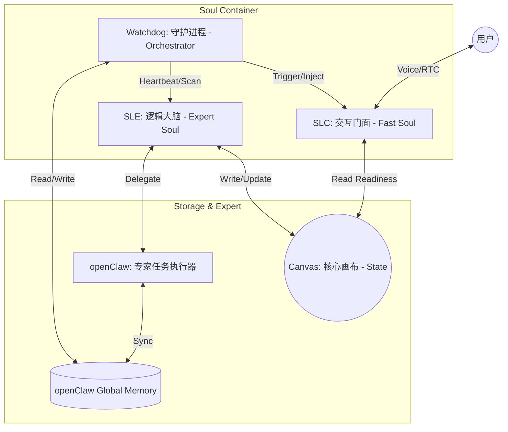
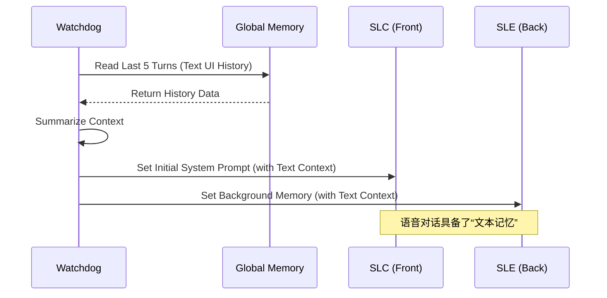
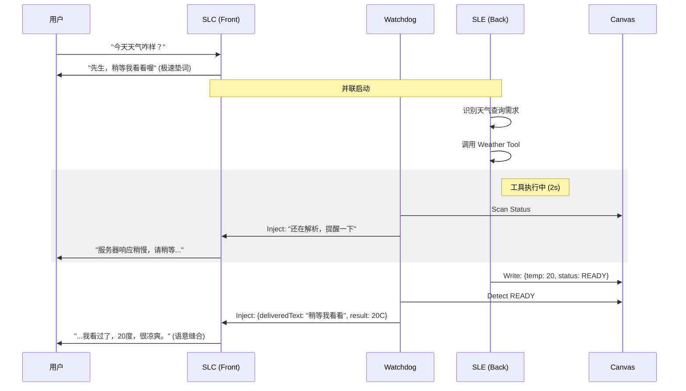

# Fast Agent V3: 核心方案架构设计

## 1. 架构总览 (System Architecture)

Fast Agent V3 采用“感知与决策分离”的架构逻辑，通过 **SLC (交互层)** 与 **SLE (逻辑层)** 的彻底解耦，配合 **Canvas (状态中转)**、**Watchdog (调度中心)** 以及 **Global Memory (全局记忆池)**，实现极速、自然且具备全量背景感知的语音交互。

### 1.1 系统框架图 (Framework Diagram)



### 1.2 核心组件职责升级

#### **SLC (Soul-Light-Chat: 交互魂魄)**
*   **角色定位**：系统的唯一“麦克风”，负责极速响应、情绪共鸣与语意缝合。
*   **模型选型**：专用响应模型（如 qwen-turbo），追求 TTFT < 600ms。
*   **核心逻辑**：
    *   **Layered Prompting**：Core Soul (稳定人设) + Skill (场景规则) 的分层组合。
    *   **不作为原则**：原则上不直接调用工具（除基础画布读取），仅通过“垫词”买时间，等待 SLE 反馈。
    *   **影子注入**：接收 Watchdog 的指令，从历史 deliveredText 自然缝合。
*   **职责补充**：不直接处理记忆，仅通过 Watchdog 拼装的上下文快照获取 **“全量对话背景”**，确保语气与之前的文本交互连贯。

#### **SLE (Soul-Logic-Expert: 逻辑魂魄)**
*   **角色定位**：幕后的大脑，负责复杂逻辑推演、工具调用与多轮次 openClaw 交互。
*   **模型选型**：高智力模型（如 qwen-plus）。
*   **核心逻辑**：
    *   **画布生产**：将处理结果总结后写入 Canvas，标记 `READY` 状态。
    *   **重要性评估**：判定当前进展是否足以“拍一拍”SLC 进行用户播报。输出 `Importance Score`。
*   **职责补充**：在工具调用和逻辑推演中引用 **“全局历史背景”**，避免做重复的确认或执行过时的指令。

#### **Canvas (核心画布: 状态中转站)**
*   **角色定位**：系统的“黑板”，作为 SLC 和 SLE 之间的物理隔离层 and 数据总线。
*   **同步协议**：使用 `status: READY/PENDING` 机制解决读写竞态。只有标记为 `READY` 的单元才允许 SLC 读取。

#### **Watchdog (守护进程: 调度中心)**
*   **角色定位**：系统的协调者与维持者。
*   **核心职责**：
    *   **VAD 感知调度**：在用户不说话且 AI 获得发言权时，将 Canvas 更新推送给 SLC。
    *   **提示词拼装服务**：负责实时拼装 SLC 和 SLE 的 System Prompt、User Prompt。基于 Core Soul、Memory、Skill 及 Canvas 状态动态重构。
    *   **心跳与主动诱导 (Heartbeat & Internal Trigger)**：
        *   **心跳机制**：每 500ms 扫描一次 Canvas 状态。
        *   **Internal Trigger**：当 `status: READY` 且 VAD 为空闲时，若 SLC 未处于活跃对话，Watchdog 向 SLC 推送一个虚拟的 `__INTERNAL_TRIGGER__` 文本事件，诱导其开始消费画布数据并生成回复。
    *   **入站加载 (Inbound Injection)**：在语音通话建立（Call Session Start）时，从 `Global Memory` 提取最近 3-5 轮文本交互背景，注入 SLC/SLE 初始态。
    *   **出站同步 (Outbound Append)**：在每轮语音交互结束后的 `post_process` 阶段，剥离潜意识思考，将干净的语音对白实时同步到 `Global Memory`。
    *   **全量时序对齐**：负责将语音 Trace 与 文本 History 按时间戳进行线性对齐并生成摘要。
    
#### **openClaw (专家助理)**
*   **角色定位**：执行物理层复杂任务（读写文件、Shell 指令等），作为 SLE 的强力插件。

---

## 2. 核心时序图 (Core Interaction Flow)

### 2.1 会话建立及记忆加载 (Session Start)


### 2.2 任务处理与记忆持久化 (Post-Process)


---

# 场景示例与全息验证用例 (Scenario Examples & Verification Cases)

本章既是用户预期的完整定义，也是开发阶段的自动化/人工验证用例。

## 1. 极速交互与感官验证 (Phase 1: Sensory Response)
| 场景 ID | 业务描述 | 用户/触发 | SLC 垫词 | SLE/画布动作 | 最终缝合回复 | 验证指标 |
| :--- | :--- | :--- | :--- | :--- | :--- | :--- |
| **CHAT-01** | 用户发起闲聊 | “今天天气不错” | “是啊，” | SLE 判断纯闲聊，不写画布 | “...先生，今天确实是个出门的好日子。” | TTFT < 600ms |
| **CHAT-02** | 用户情绪识别 | “有点难过” | “啊？...” | SLE 识别情绪并标记至画布 | “...怎么了？愿意和我说说吗？” | 共情一致性 |
| **SILENCE-01** | AI 主动暖场 | (沉默 10s) | — | Watchdog 触发 P2 暖场 | “说起来，刚才您提到的那本书...” | 主动性验证 |
| **ALARM-01** | 主动提醒 | (7:00 任务) | — | SLE/Memory 判断提醒 | “先生，刚好七点了，该去准备晚餐了。” | 准时度 |

## 2. 任务缝合与简单工具验证 (Phase 2: Task Stitching)
| 场景 ID | 业务描述 | 用户输入 | SLC 第一反应 | SLE/画布动作 | SLC 最终回扣回复 | 验证指标 |
| :--- | :--- | :--- | :--- | :--- | :--- | :--- |
| **TOOL-01** | 查询天气 | “天气咋样？” | “稍等我看看喔” | SLE 写画布: `READY, temp: 20` | “...我看过了，今天 20 度，很凉爽。” | **回扣成功** |
| **TOOL-02** | 设置闹钟 | “定 7 点闹钟” | “好的，没问题” | SLE 调 openClaw -> `COMPLETED` | “...闹钟已设好，明天 7 点我会叫您。” | **逻辑闭环** |
| **TOOL-03** | 创建文档 | “建个 test 文档” | “明白，这就办” | SLE 调 openClaw -> `COMPLETED` | “...办妥了，名为 test 的文件已创建。” | **执行确认** |

## 3. 复杂任务与异步插播验证 (Phase 3: Complex & Async)
| 场景 ID | 业务描述 | 用户/触发 | SLC 中间同步 | SLE/画布状态 | SLC 总结回复 | 验证指标 |
| :--- | :--- | :--- | :--- | :--- | :--- | :--- |
| **TASK-01** | 查询多文件 | “查下 doc 目录” | “我正翻阅目录...” | SLE 写入: `READY, files: 5` | “...结果出来了，doc 下有 5 个文件。” | **进度流畅度** |
| **TASK-02** | openClaw 追问 | “查checklist” | “稍等我看看” | openClaw -> `NEED_CLARIFY` | “...没找到 checklist，是不是 check_list？” | **交互纠错** |
| **ASYNC-01** | 异步调研完成 | (openClaw 完成) | — | SLE 总结并推送 P1 通知 | “先生，刚才主脑的调研做好了，要听吗？” | **VAD 不抢话** |
| **ASYNC-02** | 调研详情播报 | “好的，说下” | “调研结论是...” | SLC 读取画布中的 Long Summary | “结论是 xxxx（摘要 100 字）” | **信息密度** |

---

# 技术实现协议与风险规避 (Technical Protocols & Risk Mitigation)

## 1. 交互一致性保障：分层提示词架构 (Layered Prompting)
为防止加载 Skill 时发生人设偏差或语气突变，SLC 采用分层注入机制：
- **Core Soul Layer (核心灵魂层)**：定义 Jarvis 的基本语气、称谓（先生）、口头禅及核心价值观。此层具有最高优先级，作为输出的“最终滤镜”。
- **Skill Plugin Layer (场景插件层)**：仅包含逻辑、规则、事实数据。不带语气修饰词，由守护进程将 Core Soul 与其拼合。

## 2. SLC 动态生成与缝合协议 (SLC Dynamic Stitching Protocol)
此协议是解决“断裂感”的核心，通过在 `assistant` 角色中注入临时指令，引导 SLC 进行语意衔接，且不污染 `system` 人设。

### 2.1 临时 Assistant 指令注入
当守护进程通知 SLC 播报结果时，在 **Assistant Prefill** 或 **临时 Assistant 消息** 中注入引导：
- **注入模板**：`(潜意识思考: 刚才我已替主脑开了个头说了: "${deliveredText}"。现在画布显示结果是: "${canvasData}"。我必须保持 Jarvis 的优雅口吻，从锚点自然接续，严禁道歉或复读。)...`
- **注入时机**：**仅针对本次请求**。推理一旦结束，该注入块即从活跃上下文窗口中逻辑挂起。

### 2.2 潜意识思考与持久化过滤 (Persistence & Filtration)
- **物理持久化 (Logger)**：为了便于复盘和策略优化，所有包含临时注入消息（含潜意识思考指令）的完整对话记录必须实时写入 `workspace/logs/fast_agent_v3.trace.jsonl`。这是系统的“黑匣子”数据。
- **上下文过滤 (Context Filter)**：在后续请求（下一轮对话）拼装 `messages` 历史时，系统必须执行静态过滤逻辑：
  - **过滤原则**：识别并剥离所有符合 `(潜意识思考: ...)` 模式的文本片段。
  - **结果预期**：传递给下一次 LLM 的历史 Context 中，只包含干净、优雅 Jarvis 正式对白（例如：“...我看过了，先生，闹钟已为您设好。”）。

### 2.3 SLC 提示词拼装服务 (Conceptual)
- **核心逻辑**：由守护进程驱动，使用 LLM 动态对 SLC 的 System Prompt 进行重构。
- **拼装原理**：语气 = `Core Soul`；内容权重 = `Skill` + `Canvas Summary`。
- **实时性**：在每轮开始前，基于 `deliveredText` 更新助理回复的“锚点引导”。

## 3. 画布 (Canvas) 数据结构协议
### 3.1 标准 JSON 结构
```json
{
  "env": { "time": "19:23", "weather": "Sunny" },
  "task_status": {
    "status": "READY", 
    "version": 1710678200123,
    "current_progress": 1.0,
    "importance_score": 0.8,
    "is_delivered": false,
    "summary": "闹钟已设好，明天 7 点。"
  },
  "context": {
    "last_spoken_fragment": "刚才说到一半的是...",
    "interrupted": false
  }
}
```
### 3.2 读写原则
- **防重复播报**：SLC 消费成功后，由 Watchdog/SLC 将 `is_delivered` 置为 `true`。
- **原子性更新**：SLE 更新任务时必须递增 `version` (时间戳)，SLC 仅消费比上一次处理过的 `version` 更大的数据。
- **写逻辑 (SLE)**：在产生更新时，先标记单元为 `PENDING`，完成写入及总结后标记为 `READY`。
- **读逻辑 (SLC/WD)**：Watchdog 扫描 `status: READY` 且 `importance_score > 0.7` 的单元发起 P1 通知。

## 4. 守护进程调度优先级与 VAD 感知
- **P0 (Immediate)**：紧急通知、情绪危机。立即介入，**不压制**（用户体验较差，仅用于告警）。
- **P1 (Next_Turn/VAD_Safe)**：任务反馈结果。
    - **VAD 压制**：监测到用户正在说话时强行压制播报，直到用户停顿 800ms 以上再发起。
    - **进度完结原则**：SLE 标记为 `READY` 且 `version` 更新后，Watchdog 才触发通知。
- **P2 (Idle_Only)**：暖场、非紧迫总结。仅在系统长时间（10s+）处于静默期时发起。

## 5. 中断与断点续存协议 (Interrupt & Resume Protocol)
### 5.1 播报追踪 (Fragment Tracking)
- **机制**：SLC 在推流时实时记录已下发文本片段。
- **中断感知 (Interrupt Awareness)**：当用户打断 AI 说话时，依据 ZEGO AI Agent 状态结果回调（如 `stop_speaking` 事件）：
    1.  **自动停止**：由 ZEGO AI Agent 协议层执行物理层音频/TTS 的硬停止（本系统无需下发 STOP 命令）。
    2.  **上报断点**：根据 ZEGO 回调上报的已播报字节/文本，将其最后播报的文本片段写回 Canvas 的 `last_spoken_fragment`。
    3.  **状态同步**：设置 `interrupted: true`。

### 5.2 智能恢复逻辑
- **下轮提示注入**：在下一次 SLC 推理时，潜意识块注入：
    - `(潜意识思考: 刚才我正说到“${last_spoken_fragment}”就被先生打断了。根据他最新的一句话，我应该接续刚才的内容，还是切换话题？)...`

## 6. SLE 重要性评分逻辑 (Importance Scoring)
- **判定模块**：由 LLM 驱动，基于场景规则 md 文件对当前任务进展进行 0-1 评分。
- **调度标准**：`importance_score > 0.7` 触发 P1 通知；`importance_score < 0.3` 仅更新画布而不通知。